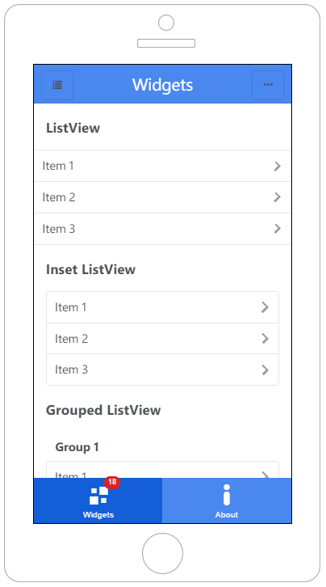
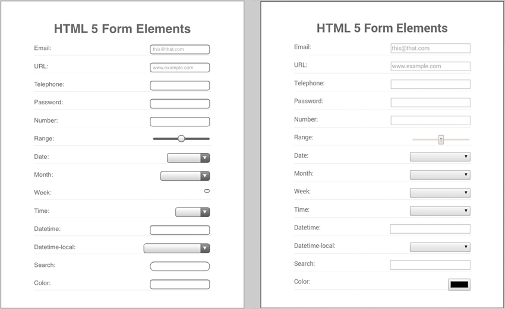
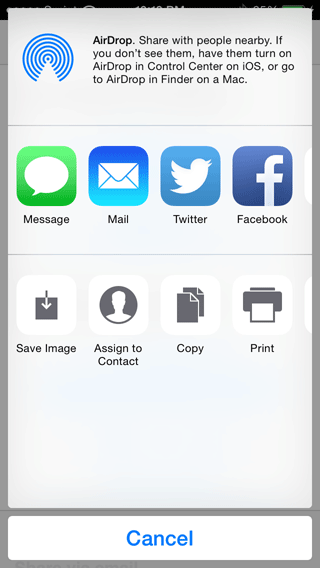
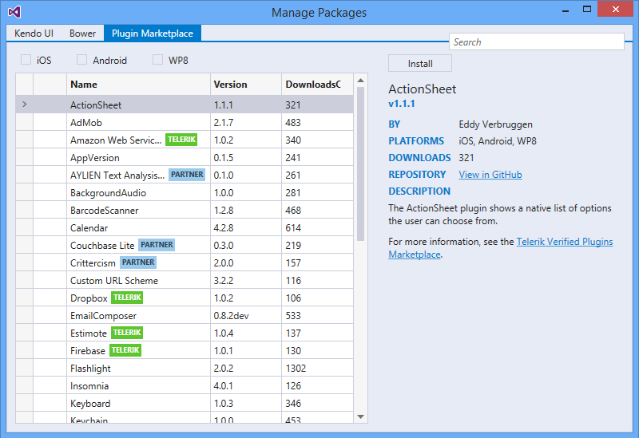

## 20 Kendo UI Mobile and Telerik AppBuilder Tips and Tricks

Allow me to admit right off the bat that I'm a sucker for "tips and tricks" blog posts. Even if I only take advantage of one or two ideas, it's one or two more than I knew a few minutes ago. I hope you feel the same way after you read through this list of tips and tricks for using [Telerik AppBuilder](http://telerik.com/appbuilder) and the [Kendo UI Mobile](http://www.telerik.com/kendo-ui) JavaScript framework to build hybrid mobile (a.k.a. PhoneGap/Cordova) apps.

What follows is a series of common mistakes, easy to miss functionality, and otherwise high value features that are sometimes missed when you develop hybrid apps. Some are specific to AppBuilder, others to Kendo UI, and the rest apply to when you use them both together. Let's get started!

### Kendo UI Mobile Tips

> Kendo UI is Telerik's popular JavaScript framework and can be used to develop gorgeous and performant hybrid mobile apps.

**1) Go with a flat UI.**

While you have the option to utilize platform-specific UI rendering with Kendo UI, the trend has been to go flat - and for good reason. It not only provides a consistent UX across platforms, but also speeds up the performance of your hybrid app due to dropping gradients (which put an undue burden on device hardware). It's easy use the built-in Kendo UI flat theme when you initialize your app:

`var app = new kendo.mobile.Application($(document.body), { skin: 'flat' });`

You can even override the default flat theme with one of your own using the [mobile theme builder](http://demos.telerik.com/kendo-ui/mobilethemebuilder).

Finally, be sure to check out [kendoflatthemes.com](http://kendoflatthemes.com/) for more pre-built flat theme examples.

**2) How to pass variables from an inline function call:**

With Kendo UI's declarative syntax, it's not immediately apparent how you pass a variable to a function. Take this Kendo UI button for example:

	<a data-role="button" id="button" data-click="onClick">Button</a>

If I wanted to pass a variable to the `onClick` function, I would use `data-` attributes, like so:

	<a data-role="button" id="button" data-click="onClick" data-id="123" data-user="Joe">Button</a>

...which may then be retrieved in the corresponding `onClick` function:

	function onClick(e) {
		var data = e.button.data();
		var id = data.id;
		var user = data.user;
	}

**3) How to determine which mobile platform you are on:**

Ever want to figure out which mobile OS your app is running on - or even whether it's a phone or a tablet? Instead of sniffing user agents, simply use `kendo.support.mobileOS` ([full documentation here](http://docs.telerik.com/kendo-ui/api/javascript/kendo#fields-support.mobileOS)).

**4) How to make sure your app is touch-friendly:**

Be sure to add the `data-role="touch"` attribute to any element you want to make tappable ([check out the docs](http://docs.telerik.com/kendo-ui/mobile/touch) for more details).

Using a Kendo UI drawer? You will probably want to [turn off "swipe to open"](http://docs.telerik.com/kendo-ui/api/javascript/mobile/ui/drawer#configuration-swipeToOpen), just to make sure you don't conflict with other Kendo UI widget events.

Feel like certain interactions inside of your app don't respond to taps well enough? You can now set the "move threshold sensitivity constant" for how touches are handled in Kendo UI. The default value is fine for most apps, but if you want to customize it, you can do so when you initialize your app:

	var app = new kendo.mobile.Application(document.body, {
	    transition: 'slide', skin: 'flat',
	    init: function() {
           //don't do this for android, causes more issues than it fixes
       	   kendo.UserEvents.defaultThreshold(kendo.support.mobileOS.device === 'android' ? 0:20);
	    }
	});

**5) How to go "back" in your history:**

Always use `#:back` as your href for a button that you want to use to take you back to the previous view in the stack. For example:

	<a data-role="button" href="#:back">Go Back</a>

**6) Trust in HTML 5 form elements.**

When building forms in mobile apps, you should use HTML 5 form elements whenever possible (e.g. input types like email, date, numeric, select, etc) instead of using the more complex Kendo UI counterparts (e.g. NumericBoxTextBox, DropDownList, etc). There is of course nothing wrong with the Kendo UI widgets, but if you don't need any specific functionality from them, you might as well save on the overhead.

For example, take a look at native HTML 5 element support in iOS 8 (left) and Android 4.4 (right):

**7) Don't include a reference to more than one copy of jQuery or Kendo UI!**

If you are experiencing any kind odd behavior with your app, double check to make sure you aren't including those libraries more than once! (You might be surprised how often this happens.)

**8) Don't initialize a Kendo UI widget twice!**

Another common pitfall we see are developers who initialize Kendo UI widgets more than once (which is very easy to do). For example, it's possible to initialize a Kendo UI ListView in your markup with: `<ul data-role="listview">` yet also do it in code with:

	$("#listView").kendoListView({
	    //...
	});

*Hint: We most commonly see this when developers are applying a data source to a ListView.*

### Telerik AppBuilder Tips

> AppBuilder is a set of tools and services that make developing cross-platform mobile apps for iOS, Android, and Windows Phone easier than ever.

**9) How to check if you're running an app in the device simulator:**

The AppBuilder device simulator is great, but one thing it doesn't do is simulate your custom Cordova plugins. Therefore, in code, avoid custom plugin calls by checking to see if you're running in the simulator first with: `window.navigator.simulator`. For example:

	if (window.navigator.simulator == false) {
	       window.plugins.socialsharing.shareViaEmail (
	       'The message',
	       'The subject',
	       ['to@person1.com', 'to@person2.com'],
	       ['cc@person1.com'],
	       null,
	       ['http://www.telerik.com/'],
	       this.onSuccess,
	       this.onError
	   );
	}

**10) Go native when possible.**

If you're concerned about UI and app performance (who isn't?), you should be aware of the plethora of custom Cordova plugins available for you on the [Verified Plugins Marketplace](http://plugins.telerik.com/). Most notably, take a look at:

- Using the [Spinner](http://plugins.telerik.com/plugin/spinner) plugin to replace Kendo UI's loader [show](http://docs.telerik.com/kendo-ui/api/javascript/mobile/ui/loader#methods-show) and [hide](http://docs.telerik.com/kendo-ui/api/javascript/mobile/ui/loader#methods-hide) methods.
- Taking advantage of hardware view transition rendering with the [Native Page Transitions](http://plugins.telerik.com/plugin/native-page-transitions) plugin (which also provides different transition options and a native drawer).
- Using the [SocialSharing plugin](http://plugins.telerik.com/plugin/socialsharing) to expose the native sharing widgets on your device:

**11) How to access the same project across multiple AppBuilder clients:**

A common situation: you start an app in one of our "offline" clients ([Extension for Visual Studio](http://www.telerik.com/appbuilder/visual-studio-extension) or [Command-Line Interface](http://www.telerik.com/appbuilder/command-line-interface)) and you want to continue development in one of our cloud-based clients ([In-browser Client](http://www.telerik.com/appbuilder/in-browser-client) or [Windows Client](http://www.telerik.com/appbuilder/windows-client)) - or vice versa!

> When moving from offline to the cloud, before you push your app to a Git-based repository, make sure your app lives in a top-level folder. For example, take a [look at this directory structure](https://github.com/tjvantoll/city-search-challenge) where the "app" directory contains the AppBuilder project.

Once you have your app synced to a Git-based repository (learn about the cloud-based version control offerings [here](http://docs.telerik.com/platform/appbuilder/version-control/integrated-version-control)), you can [follow our docs](http://docs.telerik.com/platform/appbuilder/creating-your-project/collaborating/develop-across-clients) on how to share a project between all of our clients.

**12) Start with a sample app.**

We have a lot, [and I mean a lot](http://www.telerik.com/appbuilder/sample-apps), of sample apps for you to look at when starting a new project. And they are all cloneable in AppBuilder! Likewise, when using the CLI, try `appbuilder sample clone --help` to see a list of sample projects that you may clone.

**13) Simulator, Companion Apps, Native Emulators, Physical Devices, Oh My!**

When testing your app, it's important to know the difference between simulation, the AppBuilder Companion Apps, native emulation, and running an app on a real device. There are pros and cons for all four, which Jen Looper outlines well in [this TDN post](http://developer.telerik.com/featured/looking-glass-adventures-mobile-app-simulation-emulation-device-testing/). The tl;dr is:

- AppBuilder Device Simulator - fast, easy to use, full debugging support, but least accurate visual representation of your app.
- [AppBuilder Companion Apps](http://www.telerik.com/appbuilder/companion-app) - fast, easy, and visually accurate, but lacks the in-depth debugging tools of the simulator.
- Native Emulators - slower to start and require configuration, but useful to test custom plugins (especially when you don't have the device in-hand).
- Physical Device - requires some setup (drivers, provisioning profiles for iOS), but provides the most complete app experience.

> For more information on configuring the native emulators, see our TDN posts for [iOS](http://developer.telerik.com/featured/using-xcode-ios-simulator-hybrid-mobile-apps-telerik-appbuilder/), [Android](http://developer.telerik.com/featured/using-android-emulator-hybrid-mobile-apps-telerik-appbuilder/), and [Windows Phone](http://developer.telerik.com/featured/using-windows-phone-8-emulator-hybrid-mobile-apps-telerik-appbuilder/).

**14) Set the appropriate target SDK for Android.**

One of the easiest performance-boosting tips for your hybrid apps on Android is to be sure you are setting the appropriate target SDK level in your Android manifest. [Open your Android Manifest](http://docs.telerik.com/platform/appbuilder/configuring-your-project/edit-configuration) and you'll probably have a line that looks like this:

	<uses-sdk android:minSdkVersion="8" />

...which you can change to:

	<uses-sdk android:minSdkVersion="8" android:targetSdkVersion="21" />

This not only forces your Android 4.x and 5.x devices to use the faster Chrome web view, but also takes advantage of performance improvements in the web view of Android 5.x.

**15) Enable Android hardware acceleration (or don't).**

When you enable hardware acceleration, you are offloading rendering to the GPU as opposed to the CPU. While the term "hardware acceleration" sounds like a no-brainer to utilize, there are plenty of potential pitfalls you need to avoid (such as out-of-sync transitions and occasional high memory consumption). You can turn this property on and off in the [Android properties](http://docs.telerik.com/platform/appbuilder/configuring-your-project/project-properties-general) in AppBuilder - just make sure to test your app on a physical Android device if you do enable it.

### Tips for Using Kendo UI and AppBuilder Together

> Good alone, better together, right? Using Kendo UI and AppBuilder together is a logical decision - and here are some tips that will aid your development when it comes to developing hybrid mobile apps:

**16) Don't initialize your app until `deviceready` is called.**

When calling `var app = new kendo.mobile.Application(document.body, {...` make sure you are wrapping this in the Cordova `deviceready` event, like so:

	document.addEventListener('deviceready', function () {
		navigator.splashscreen.hide();	    
		app = new kendo.mobile.Application(document.body, { skin: 'flat' });
	}, false);

By waiting until the `deviceready` event is called, you can be assured that Cordova is fully loaded and any subsequent device API calls will be handled correctly.

**17) Use jQuery 2.x**

If you're developing a hybrid mobile app, there is no reason to NOT use [jQuery 2](http://jquery.com/) since your app web views will all be compatible. But there are plenty of reasons to use it:

- Performance improvements (up to 5%, depending on the app).
- Smaller core, for faster load times.
- Future-proofing yourself for the inevitable end of the 1.x branch.

**18) Don't use a CDN!**

When developing for the web it's commonplace to use a CDN for your JavaScript/CSS assets. And Kendo UI offers [CDN access](http://docs.telerik.com/kendo-ui/install/cdn) as well. But you shouldn't use them in a hybrid app. Why? You then have to manage offline situations and performance will be slightly degraded if your device has to use the network to download a big library. Keep it simple and keep all of your CSS and JavaScript assets local whenever possible.

**19) Learn about (and use) the AppBuilder Package Manager.**

When managing your frameworks and libraries, it's tempting to go the old route of individually adding JS and CSS files to your app. It's 2015 though, so it's time to grow up and use the AppBuilder Package Manager!

Available in all of the AppBuilder clients, you can use the Package Manager to easily switch between versions of Kendo UI, add packages from Bower, and add custom Cordova plugins from the Verified Plugins Marketplace.

> With regards to Kendo UI in particular, you can switch between Kendo UI Core and Kendo UI Professional as well (use the latter if you have a license and need access to the [Professional and/or data visualization widgets](http://www.telerik.com/kendo-ui#more-widgets)).

**20) Use native scrolling (when it makes sense).**

There are times when taking advantage of native scrolling makes sense and other times when you should rely on using the default Kendo UI emulated scrolling.

**Advantages of Native Scrolling:**

- The native scroller is much faster than JavaScript and CSS-based scrolling solutions.
- Most mobile platforms automatically hide address bars and tab bar components when a user scrolls (which is enabled when using the native scroller).
- On Android 2.2, HTML 5 form elements can get wonky when JavaScript-based scrolling is used, but work great with native scrolling.

**Disadvantages of Native Scrolling:**

- If you are using Kendo UI features which depend on JavaScript-based scrolling (i.e. pull to refresh, press to load more, etc), those won't work with native scrolling.
- Tablet-specific widgets such as popover and splitview are not supported.
- The native scrolling "hint" is visible over the header/footer contents.
- The Kendo UI drawer widget does not support content scrolling when using a native scroller.
- If you scroll down in one view and navigate to another, the scroll position is saved. The scroll position can be reset by calling the [scrollTo](https://developer.mozilla.org/en-US/docs/Web/API/Window.scrollTo) function in the view [after-show](http://docs.telerik.com/kendo-ui/api/javascript/mobile/ui/view#events-afterShow) event.

You can use native scrolling globally when initializing your app like so:

	new kendo.mobile.Application(document.body, { useNativeScrolling: true });

Alternatively, you can add it to a single Kendo UI view with the `data-` attribute of: `data-use-native-scrolling="true"`.

### Other Tips and Tricks?

Do you have any Kendo UI or Telerik AppBuilder tips to share? If so, sound off in the comments!

