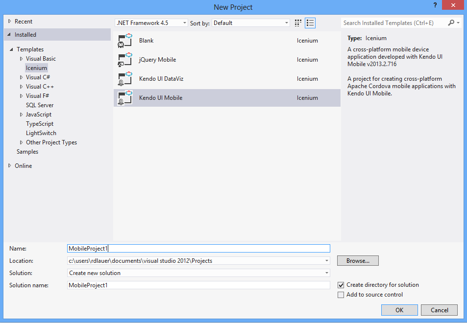
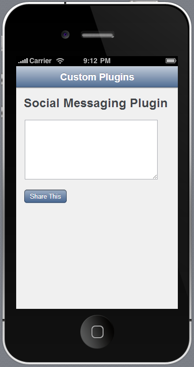
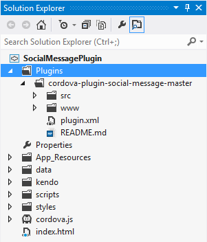
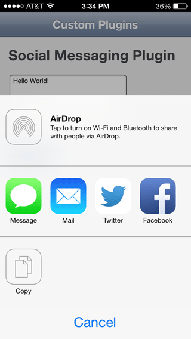

## Using Custom Cordova Plugins with the Icenium Extension for Visual Studio

It can be difficult these days to build a hybrid mobile app without using a custom Cordova plugin. While Cordova 3.0 does ship with a myriad of plugins, sometimes you need just one more thing to finish off your app. Whether it's social media integration, in-app payments, or even speech recognition - you will probably want to tie in to a native device feature that is just outside the scope of what is included with Cordova. In this post I hope to show you how you can easily add a custom plugin to your Icenium project, using the new [Icenium Extension for Visual Studio](http://cdn.icenium.com/live/vs/Icenium.vsix).

### Icenium Extension for Visual Studio?

If you are thinking to yourself, "wait a minute, what is this Icenium Extension for Visual Studio all about?", I welcome you to the latest release of Icenium! You can [read all about the details](http://www.icenium.com/blog/icenium-team-blog/2013/09/23/announcing-the-icenium-extension-for-visual-studio), but in a nutshell, we now offer an extension that allows you to develop hybrid mobile apps for iOS and Android directly within Visual Studio! If you don't have the extension yet, you can [download it here](http://cdn.icenium.com/live/vs/Icenium.vsix). Please note that this is a beta version, which means we have A LOT more coming with this extension in the future.

### What is a Cordova Plugin?

A plugin by definition is a piece of software that adds specific functionality to another piece of software. So, Cordova plugins add features to Cordova. Simple enough! Now as of Cordova 3.0, the core Cordova framework has been trimmed down and actually ships without ANY plugins. That's right, even "core" features such as geolocation and file storage have been separated out and need to be installed separately. That's not a problem for Icenium users though, as all of those legacy plugins are included by default! Another big change with Cordova 3.0 is the fact that all plugins must be plugman-compatible.

### What is this Plugman Thing?

If you have read anything about Cordova 3.0, you probably have heard the term "plugman" at some point. [Plugman](https://github.com/apache/cordova-plugman) is actually a specification for how plugins need to be structured to be used in Cordova from now on. This is great, because it provides us with more consistency moving forward with plugins. In the short term, though, this can be rough, because the majority of custom plugins out there now do not conform to this specification. This is very much a known issue though and is on the radar of everyone involved with Cordova (so expect improvements over the next year!).

Luckily there are still quite a few plugins we can use right now, so let's learn about how to utilize one of these custom plugins with an Icenium project we create within Visual Studio.

### The How To

I'm going to assume you have already downloaded and installed the [Icenium Extension for Visual Studio](http://cdn.icenium.com/live/vs/Icenium.vsix). So lets start up Visual Studio 2012 and create a new Icenium project:

If you look at the newly installed Icenium templates, you'll see some familiar friends! In my case I'm going to create a new [Kendo UI Mobile](http://www.kendoui.com/mobile.aspx) project.

The default Kendo UI Mobile project gives us a full example app. We don't need a lot of this stuff for this demo though, so lets replace our existing **index.html** file with the following code:

	<!DOCTYPE html>
	<html>
	    <head>
	        <title></title>
	        <meta charset="utf-8" />
	        <link href="kendo/styles/kendo.mobile.all.min.css" rel="stylesheet" />
	        <link href="styles/main.css" rel="stylesheet" />
	
	        
	        
	        
	        
	    </head>
	    <body>
	
	        

	            
	            

	                

	                    
	                

	            

	
	            

	                
	                <h1>Social Messaging Plugin</h1>
	
	                
<textarea id="txt" cols="30" rows="7"></textarea>

	                
	                
<button id="btn" data-role="button">Share This</button>

	
	            

	
	        

	
	    </body>
	</html>

We'll make this a simple app and replace everything in the existing **app.js** file with this:

	var app = new kendo.mobile.Application(document.body, { transition: "slide" });

What's going on here? Not a lot really. We have an application with only one view, but it does have a header with a nav bar and a title so we can take advantage of the native styling that comes with Kendo UI Mobile. We're also initializing our Kendo UI Mobile app with one easy line of javascript. Lets go ahead and run our app in the simulator now, just to see what happens.

### Using the Icenium Device Simulator

Using the **ICENIUM** menu option, choose, **Run [project] in Simulator**. This will bring up the familiar Icenium device simulator. (Did you know you can also just use the classic Visual Studio Start button to do the same thing?)

When you run the simulator you should see something like this:

At this point we have a functioning app. It doesn't do much, but it works! What we want to do now is add a custom plugin. For the purposes of this demo, lets say we want to allow our users to post to a social media account, SMS, or email. Luckily for us, there is a nice iOS custom plugin written to do just this, the [Social Message Plugin for Apache Cordova](https://github.com/leecrossley/cordova-plugin-social-message).

Now, before we do anything, we want to verify that this is a plugman-compatible plugin. How do you do this? You can either scan the documentation to make sure the developer has noted compatibility with Cordova 3.0+, or you can look at the source and locate the **plugin.xml** file. This file should be constructed in a way that matches the [plugman specification](https://github.com/alunny/cordova-plugin-spec). But at a quick glance, I usually just check for an xml tag like this:

	<platform name="ios">

...which tells us that this plugin works with iOS. We are satisfied that this plugin is plugman-compatible, so what's next?

From the [github repo for this plugin](https://github.com/leecrossley/cordova-plugin-social-message) you will want to click the **Download Zip** button to get a zip archive of the plugin source. Expand that archive and grab the directory that contains the plugin assets (specifically, the directory that contains the www, src, plugin.xml, and README.md files). Drag that directory to Visual Studio and drop it right on the **Plugins** directory in your Icenium project. This will copy all of these assets into your Visual Studio project. When you are done, your Plugins directory should look something like this:

Believe it or not, we are almost done! The one other configuration we need to do is add a reference to the plugin's javascript asset within our application. In this case we want to look at that **plugin.xml** file again because we need to know what the name of the javascript file will be when this application gets compiled by Icenium. It's this build process that actually adds the plugin and moves the appropriate javascript file to a location accessible by your app.

When we open up **plugin.xml** we can see this chunk of XML:

    <js-module src="www/socialmessage.js" name="SocialMessage">
        <clobbers target="socialmessage" />
    </js-module>

When you see the **target** attribute, you know you're on to something. What we need to do then, is add that target to our **index.html** file, because THAT is the name of the javascript file that will exist when we build our app. Add this to your **index.html** file:

	

If you get a warning from Visual Studio that complains about the file not existing, that's correct, it doesn't exist (and won't exist until we actually build this app in Icenium to run on a device!). You can safely ignore this warning.

Now that we have the plugin set up, lets add a little bit of code to actually do something. In our app we have a simple text entry field with a button that will let our users post something to Twitter, Facebook, SMS, or even just email. In order to wire up the tap of a button to the social messaging plugin, we'll need to add this little bit of code to our **app.js** file:

	$(function() {
	    $("#btn").click(function () {
	        window.socialmessage.send($("#txt").val());
	    });
	});

That's it for our code. Simple, no? At this point you may be tempted to fire up the simulator to test out the plugin. Unfortunately plugins cannot be executed in the simulator because of the fact that the app has to be compiled and delivered to a device to test. No worries though, as we can still do this with Visual Studio!

### Testing the Plugin

From the **ICENIUM** menu choose, **Build [project] in Cloud**. Under the iOS device choose **Build (with provision)**. You will then want to choose a valid provision from the dropdown list provided. I highly recommend using an Ad Hoc distribution profile, if possible. Why? Because you then have the ability to install the app on your phone with a QR code reader instead of manually installing it with iTunes.

If you don't have any existing provisioning profiles in that list, you will need to set up a new one through the [Apple developer portal](https://developer.apple.com/). We have some more [detailed instructions for you](http://docs.icenium.com/code-signing-your-app/scenarios-and-tutorials/create-dev-cryptographic-id) in the Icenium docs. (And if that's not enough, in the coming weeks we will be providing specific instructions in the Icenium blog.)

Click the **Build** button and wait as your app is compiled in the cloud. While the build is finishing, make sure you have the free [Icenium Ion](https://itunes.apple.com/us/app/icenium-ion/id527547398?mt=8) app installed on your iOS device. You will also want to make sure you have your favorite [QR code reader](https://itunes.apple.com/us/app/qr-reader-for-iphone/id368494609?mt=8) installed.

Once the build is complete, open up your QR code reader and scan the provided QR code. Like magic, your app will be installed!

Now that you have the app installed on your device, you can open it up, enter some text, and tap on the share button. What should now show up is the native iOS share drawer. Go ahead and play around and tap on any of the icons provided to share what you just wrote with the world!

### Conclusion

Hopefully this post has given you an idea of how easy it can be to add a custom plugin to your Icenium project created with Visual Studio. The number of Cordova plugins becoming plugman-compatible is increasing every day. As of right now the best place to find plugman compatible plugins is [plugins.cordova.io](http://plugins.cordova.io) - but you can also look at the [PhoneGap plugins github repo](https://github.com/phonegap/phonegap-plugins) and scan the archives for a plugin that works with Cordova 3.0. Best of luck with your development, and remember, if you have any comments on the new Icenium Extension for Visual Studio, please [send us your feedback](http://feedback.telerik.com/Project/87)!
