## Telerik AppManager: Your New App Management and Distribution Tool

Imagine yourself a mobile app developer. You have started developing an iOS or Android app and want to securely send an app to your beta testers. Or maybe you're ready to deliver the finished product to your client, but you don't want to go through the public app stores. *What options do you have?*

Imagine yourself a developer or IT administrator in a larger organization. You have a set of apps that you have developed in-house and want to securely delegate access to these apps to a specific set of individuals or groups in your organization. Again, you don't want to go through the public app stores and the existing Mobile Application Management (MAM) providers are too expensive, too heavy, and too difficult to learn. *What options do you have?*

**Today I'm proud to announce the availability of our new service: [Telerik AppManager](http://www.telerik.com/appmanager).** AppManager allows you to securely distribute hybrid and native mobile apps to your end users. Maybe they are testers, maybe they are your clients, maybe they are your employees. It doesn't matter - our solution allows you to simply and securely deliver your mobile apps to your specified users via a private app store that YOU control. No more cumbersome, hacked-together solutions for app distribution, now you can distribute your iOS and Android apps from one easy to use portal - all part of the new [**Telerik Platform**](http://www.telerik.com/platform).

### But What Is It Exactly?

There are two pieces to Telerik AppManager: The AppManager portal is part of the Telerik Platform (and available today as a beta to all Telerik Platform subscribers!). The portal is where you upload your apps, manage descriptive data about your app (i.e. release notes, screenshots, OS requirements), and manage your distribution groups (the people who will install the apps on their mobile devices).

The other piece is the Telerik AppManager mobile app. Available for free today in the iOS App Store and [Google Play](https://play.google.com/store/apps/details?id=com.telerik.AppManager), **the AppManager mobile app is your private app store**. After you upload your apps and specify which of your users can download the apps, your users will then securely login to the AppManager mobile app and view/download only those apps that they have permission to install.

### Integrated with Telerik AppBuilder

It gets even better! Are you a [Telerik AppBuilder](http://www.telerik.com/appbuilder) user? We provide one-click (well, maybe two-click!) publishing from AppBuilder to AppManager. You can take your existing AppBuilder projects and create iOS and Android versions that you push to AppManager - all without leaving the Telerik Platform!

### And I Should Use Telerik AppManager Because...?

You are an iOS or Android mobile developer (hybrid or native) who wants to quickly and securely deliver an app to your testers and/or clients. You are tired of the hacked-together solutions. Or maybe you are an IT administrator who wants to do the same, but also deliver your apps to one or more distinct groups of individuals in your organization. **With Telerik AppManager you have full control over the distribution of your mobile apps without the shackles of the public app stores.**

### Ok, I'm Interested! How Do I Use It?

Glad you asked! The first step, if you haven't done so already, is to [create a Telerik Platform account](https://platform.telerik.com). If this is your first exposure to the Telerik Platform, please take a look at our [release blog post](http://blogs.telerik.com/platform/posts/14-02-06/telerik-platform-101) as that will fill you in on the details.

*If you don't want to go through the short tutorial below, you can [try AppManager for free](https://platform.telerik.com/gettingstarted/appmanager) right now!*

Ready? Great. At this point you should have a Telerik Platform account and are ready to learn how to use AppManager. The first thing we need to do is get an app (any iOS or Android app will do) into AppManager. Now while you can certainly upload your own mobile apps and distribute them using AppManager, I am going to show you an *even easier* way by **pushing an app directly from AppBuilder to AppManager**:

#### Moving an App from AppBuilder to AppManager

After logging in to [platform.telerik.com](https://platform.telerik.com), I'm going to go ahead and open up an existing AppBuilder project (please note that you can easily start a new AppBuilder project and follow along with this as well!). I'd like to push a build of this project out to my group of app testers using AppManager.

The first thing I'm going to do after I open my project is click on **Publish** inside of AppBuilder, which brings up the following dialog box:

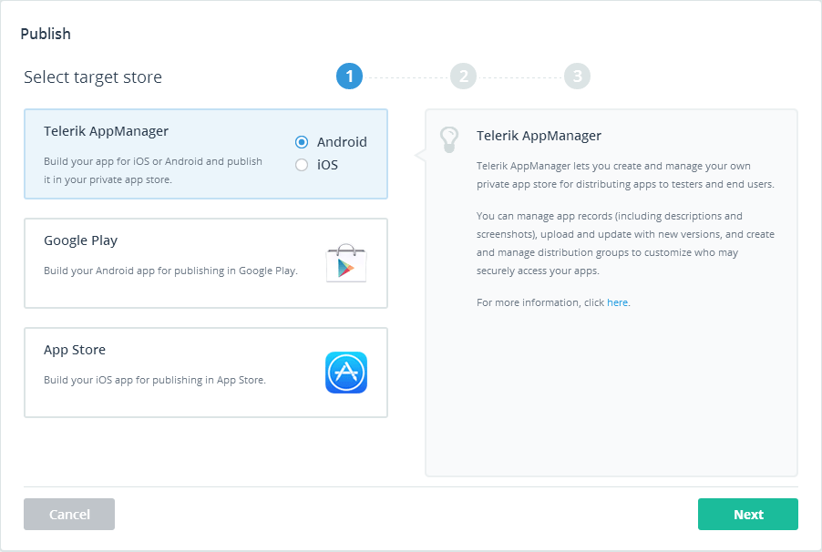

Now I'm going to click on **Telerik AppManager** and in this case I'm going to make an Android version of my app. Since I'm building for Android, I'll want to choose the correct [cryptographic identity](http://docs.telerik.com/platform/appbuilder/code-signing-your-app/configuring-code-signing-for-android-apps/create-cryptographic-identity) and then click on **Publish**:

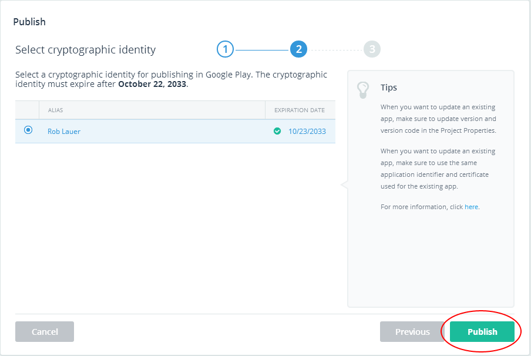

And when my build is complete and the Android app is successfully delivered to AppManager, I can simply click on the **Open** button to move right over to AppManager, without leaving the Telerik Platform.

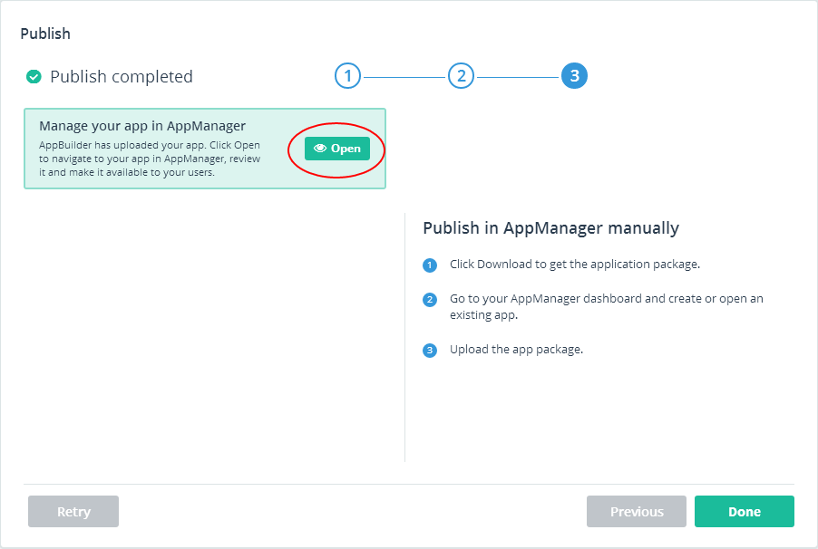

#### The AppManager Portal

When you open up the AppManager portal, you'll first be presented with a list of your apps. Again, if you choose to NOT use AppBuilder to create your first app, you'll have to manually upload an app using the **Add New App** button presented on your **Apps** view:

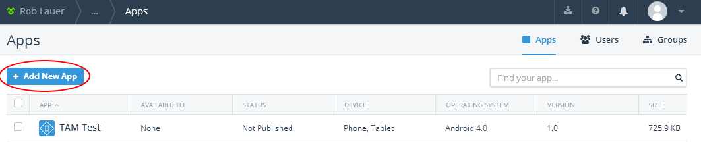

Now there is a lot going on in your **Apps** view. You can filter and sort the grid provided to your heart's content. You can also click on an app to **view** more information about it, **manage** the app to update some of the meta data fields, **update** to a new version of the app, **delete** the app completely, and also **publish** it to your users!

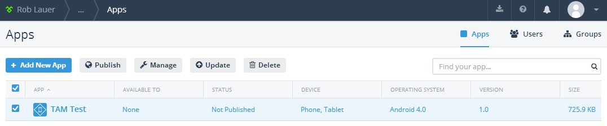

I'm going to click on **Manage** first because I want to make sure I fill out some additional fields like app description and also add some screenshots, so my app testers know exactly what they will be using when they download and install the app.

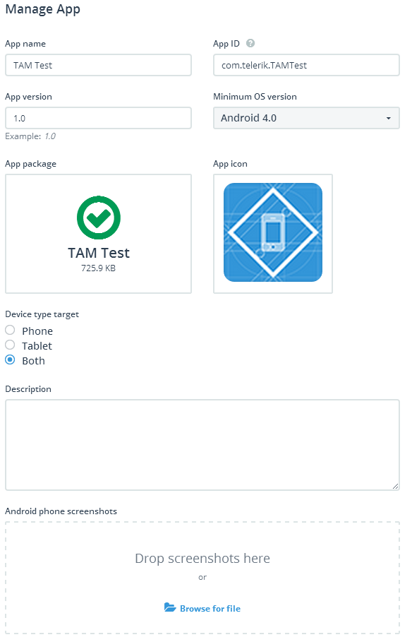

Now that I've added some text and added some screenshots, I'm presented with a **Distribution** box at the bottom. What is this all about?

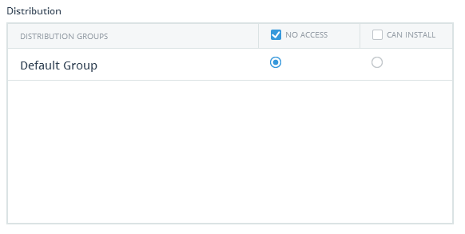

**This is how you associate an app with a group of people who you want to install the app.** *For the moment, I'm going to ignore the distribution section, save my changes, and take a closer look at our user and group management in AppManager.*

#### AppManager Users

A key component of your app distribution process is of course, your users. Now when I say "users" I mean your testers and/or your internal employees - they are the people who will download and install your apps on their mobile devices. I'm going to click on the **Users** menu option to view and manage my users.

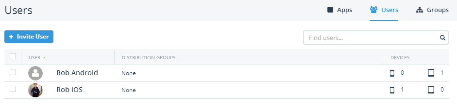

As you can see, I've already invited two users and they have registered their iOS and Android devices successfully. You'll of course want to invite new users to join you, and you can do so by clicking on the **Invite User** button and entering their email address (you don't have to worry about associating them with a group just yet if you don't want to).

Once you have one or more users invited and registered, you'll need to add them to a **distribution group**.

#### AppManager Distribution Groups

In case it wasn't already clear, distribution groups are simply groups of your users. I'm going to click on the **Groups** menu option to view and manage my groups.

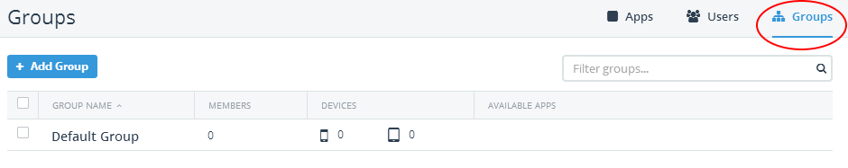

I have a **Default Group** which is really just an example group for me to use. I'm going to go ahead and create a new group and call it **App Testers**:

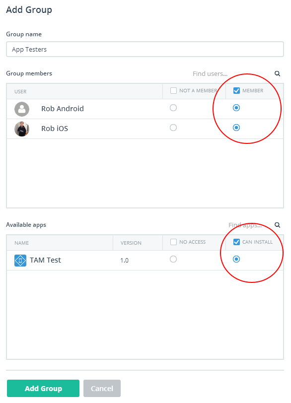

You'll see that when I add a group (and when I manage an existing group) I can add users to the group. I can also authorize this group to download and install my app! *Remember that you may also assign one or more groups to an app by managing the app itself from the main app list!*

I'm going to navigate back to my **Apps** view, click on the app I want to manage to open up my full view of the app. At the top of this page you'll see a message in red indicating that **this app has not been published**. Yikes! What does that mean? Well, it means that the app has not yet been published to your distribution groups.

#### Publishing an App to Distribution Groups

The next logical step is that I want my users to be able to download and install this app on their own mobile devices, so I'm going to click on the **Publish** button in AppManager to bring up this dialog:

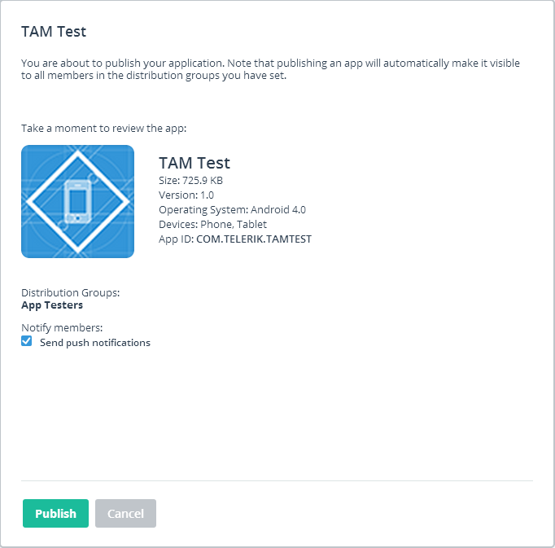

This provides me an opportunity to do a final review of the app and also optionally **send a push notification to my users**! That's right, you can conveniently notify your users that a new app is available for them to install via a push notification. I'm going to go ahead and click the **Publish** button, and that is where my experience in the AppManager portal ends, and where my user's experience in the AppManager mobile app begins!

#### Using the AppManager Mobile App

When your users are invited to join your AppManager account, they register their mobile device and are prompted to download and install the AppManager mobile app for either iOS or Android. **This app acts like a private app store for your users.** Your users will start up the app and authenticate themselves using the credentials that they set up while registering.

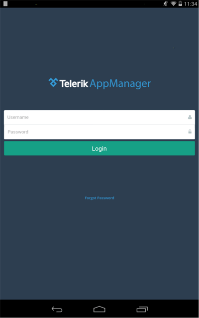

Next they will be presented with a list of apps for which they are authorized to download and install (in my case there is only one app):

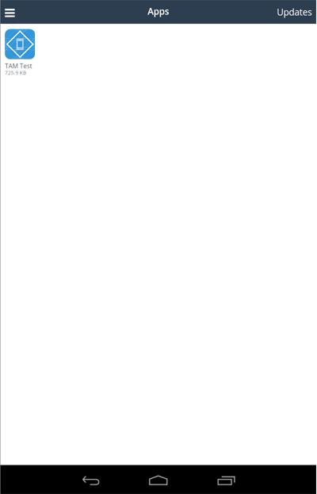

And finally they can **view an app, install it, rate it, and open it** - all from within the AppManager mobile app!

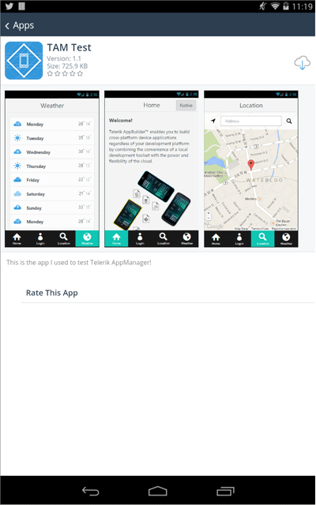

We purposefully made the AppManager mobile app as simple and intuitive as possible for your users - but we will also be expanding on this functionality to provide you with more opportunities to interact with your users, gather feedback, and more efficiently manage your apps.

### Updating Your Apps

What about when you inevitably want to send an updated version of an app to your users? AppManager has you covered as well. You can of course, submit a new version of an app directly from AppBuilder (in the same way we posted our first version above). You may also manually upload a new version by clicking on the **Update** button:

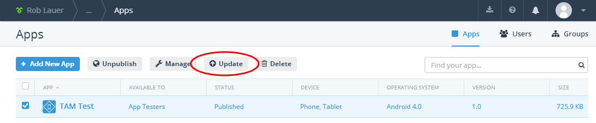

From here you can edit all of the data associated with the app - and more importantly - **specify a new version number, upload the app package, and add some information about what is new in this version**. Once you're done with the update you can publish this new version to your users again, so they have the latest and greatest!

### Where Do We Go From Here?

We just went through what [Telerik AppManager](http://www.telerik.com/appmanager) is, how you get an app into AppManager, how you set up your users and groups, and how you publish and distribute an app to those users. **This is just one of many scenarios where AppManager shows its value - and this is quite literally just the beginning!** We have big plans for AppManager and  the Telerik Platform so please stay tuned and [sound off on our feedback portal](http://feedback.telerik.com/Project/129) or participate in the [AppManager forum](http://www.telerik.com/forums/appmanager) if you have any ideas or suggestions you want to pass along. Thanks for reading and enjoy AppManager and the Telerik Platform!

<a href="https://platform.telerik.com/gettingstarted/appmanager">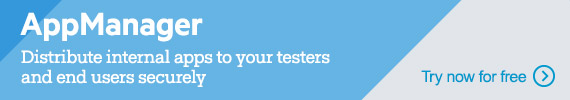</a>