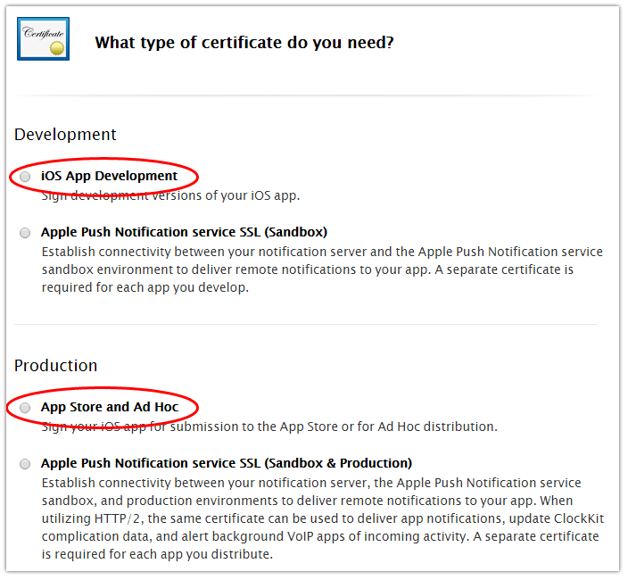
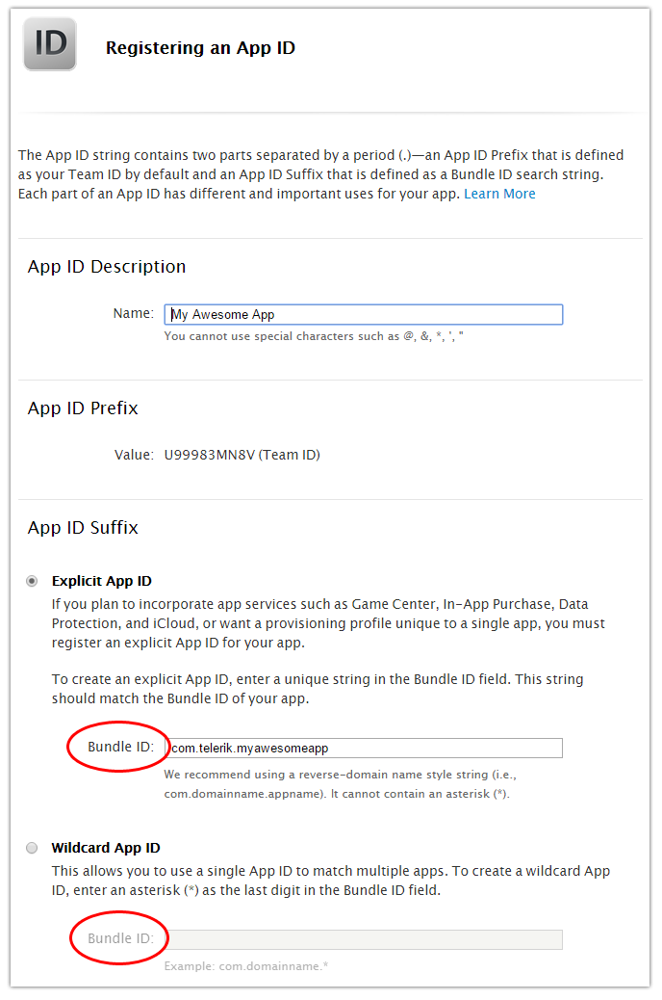
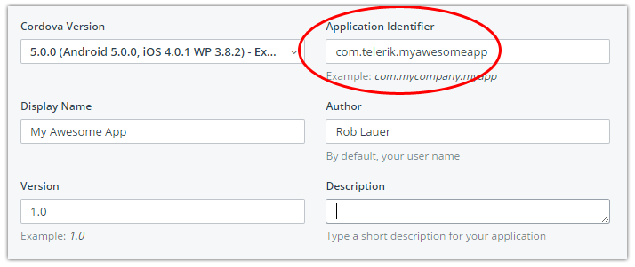
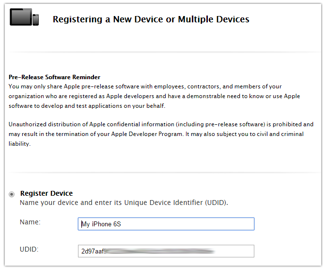
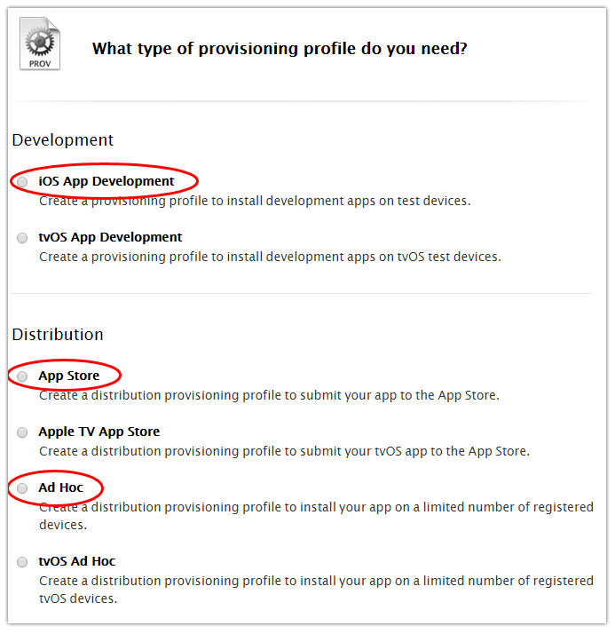
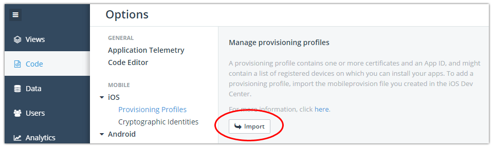
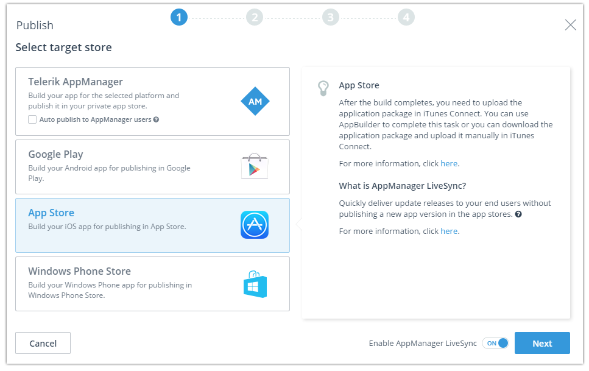

## iOS App Distribution for Dummies

Distributing an app is arguably the Achilles's heel of the iOS app development process - and Apple makes us feel like dummies at times. Provisioning profiles, certificates, device registrations, app ids, oh my! Apple enforces certain requirements to make sure they know who created which apps and control which devices they run on (the app store is a significant chunk of revenue to protect!).

What follows is a cheat sheet to use when trying to figure out how to easily get your iOS app to your users (whether they be testers or end users).

### Step 1: Choose Your Apple Developer Program

For all intents and purposes, you need to have a valid Apple Developer account to distribute an iOS app - regardless of whether you are deploying an app to a few testers or the entire world via the app store. You have two options here:

- [Apple Developer Program](https://developer.apple.com/programs/) - $99/year (what most people choose)
- [Apple Developer Enterprise Program](https://developer.apple.com/programs/enterprise/) - $299/year

The main difference is that the Apple Developer Program limits the number devices you may register per year (more on this later). On the other hand, the Enterprise Program allows for unlimited distribution within your organization. Don't think that you can use an Enterprise account to circumvent the public app stores, it's not a risk that you want to take!

### Step 2: Choose a Type of Certificate

Every iOS app you create has to be signed with a certificate (regardless of your Apple Developer Program membership). Luckily there are only two types of certificates you probably need to worry about (which you access in the [Apple Developer Member Center](https://developer.apple.com/membercenter/)):

- **iOS App Development** (used when developing/debugging your app)
- **App Store and Ad Hoc** (used when distributing your app to the app stores or even to a small group of testers)

> If you are setting up push notifications, you'll have to setup an APN (Apple Push Notification) cert as well. That is best explained [in this tutorial](http://docs.telerik.com/platform/backend-services/javascript/push-notifications/push-getting-started).

### Step 3: Create an App ID

An "app id" is a unique identifier for your app. You'll be prompted to enter a description (can be anything you want) and then enter either an **explicit** or a **wildcard** app id. Let's quickly go over these options:

- **Explicit App Ids** are used when you want to integrate other services with your app, such as push notifications or Game Center. Most people choose this option, whether or not they are using supporting services.
- **Wildcard App Ids** are used when you want to use one app id for multiple apps. This is useful during the development phase, if you want to create one app id that multiple apps can use.

**Regardless of which type of app id you create, your Bundle ID field MUST match the bundle id/application identifier in your project**! If you are using the [Telerik Platform](http://www.telerik.com/platform) for this, we expose it in a property pane:

### Step 4: Register Your Devices (Possibly Optional)

*If you are deploying your app to the public app store or to a private, in-house, app store, you can safely skip this step. Everyone else who is using this for development/testing, read on:*

Since development and ad hoc provisioning profiles (see next step) are limited to 100 device deployments per year per device type, you have to actually register those devices in the Apple Developer Member Center. And yes, I said "per device type", so you can actually register 500 devices per year, if you had 100 each of the following:

- Apple TV
- Apple Watch
- iPad
- iPhone
- iPod Touch

Each device you register gets a name (whatever you want) and a UDID. What's a UDID you ask? It's a unique id for every Apple device out there. The easiest way to get someone's UDID is to have them go to [whatsmyudid.com](http://whatsmyudid.com/). You can thank me later.

### Step 5: Choose a Type of Provisioning Profile

Ok, this is where it gets slightly more tricky, so pay close attention:

I know I just said that every iOS app is signed with a certificate. The reality is that they are signed with a combination of a certificate and a provisioning profile. A provisioning profile effectively creates an association between a set of devices and your app. You are offered four different provisioning profiles to choose from (and yes, you will end up creating more than one profile for each app, depending on the life stage of the app):

- **iOS App Development** (for development/debugging on your own devices - valid for up to 100 devices)
- **Ad Hoc** (for distributing an app internally for testing - valid for up to 100 devices)
- **App Store** (for public app store distribution)
- **In House** (for in-house or private app store distribution - requires an Apple Developer Enterprise Program membership)

However, maybe a better way of looking at this choice is to look at your exact use case. *Are you...*

*Trying to debug an app on your own physical device?* Use an **iOS App Development** Provisioning Profile.

*Trying to distribute an app to your co-workers? Or do you want to deploy your app to a group of beta testers?* Use an **Ad Hoc** Provisioning Profile.

*Trying to deploy your app to the public app store?* Use an **App Store** Provisioning Profile.

*Trying to deploy your app to a private app store (i.e. [AirWatch](http://www.air-watch.com/), [MobileIron](https://www.mobileiron.com/en), [Telerik AppManager](http://docs.telerik.com/platform/appmanager/getting-started/introduction)) or other generic in-house deployment?* Use an **In House** Provisioning Profile (again, requires an Apple Developer Enterprise Program membership).

### Step 6: Build Your App

To create a build (IPA) of your app, you'll have to use [Xcode](https://developer.apple.com/xcode/) or - a far better option - is to use the [Telerik Platform](http://www.telerik.com/platform). The Telerik Platform handles all of the iOS (and Android and Windows Phone) SDK management for you, so you simply push your code to the cloud and we create a build for you. To do so, you simply upload the certificate and provisioning profile you just created:

### Step 7: Distribute Your App

[Telerik Platform](http://www.telerik.com/platform) can also handle app store distribution for you by automatically uploading your app to the iOS app store:

If you are looking to distribute your app in-house for beta testing or end user distribution, you can utilize [Telerik AppManager](http://docs.telerik.com/platform/appmanager/getting-started/introduction), which is a key part of the Telerik Platform! In addition, you can [leverage AppManager LiveSync](http://www.telerik.com/blogs/telerik-appbuilder-may-release-update-a-published-app-in-seconds) for a far easier way of updating your app once it is installed on your users' devices.

### Conclusion

Hopefully this short guide has provided a little more clarity for iOS app store distribution. There are some murky waters to wade through, but it's worth it to see your shiny new app running on your device or even deployed to the app store for millions of people to use. Good luck!