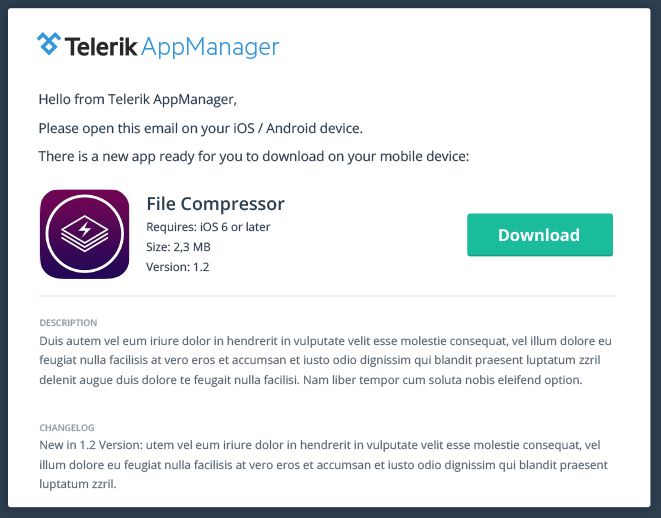
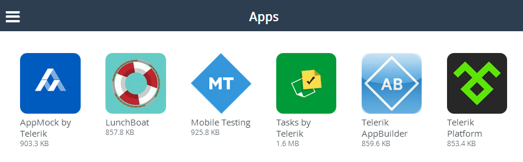

## Telerik AppManager: The Grand Opening of Your Private App Store

This week marks the official public release of [AppManager](http://www.telerik.com/appmanager) - your new mobile app distribution service from Telerik! Whether you are a mobile app developer distributing apps to your testers or an IT administrator distributing production-ready internal apps to your end users, Telerik AppManager has you covered.

This release of AppManager builds upon the foundation established with our beta releases - we squashed bugs, improved the usability, and of course added some great new features. Let's take a quick look at what you can expect out of this exciting new release (and be sure to check out our [release notes](http://www.telerik.com/support/whats-new/platform/release-history/appmanager-v1.0)):

### App Distribution via Email

Many of us are mobile developers who work as consultants or in small or medium-sized development shops. What we need is a way to quickly and easily deliver individual apps to our users (be they testers or end-users). This is where our new email-based distribution option comes in.

Now, instead of (or along with) distributing apps via the AppManager mobile app, all [Telerik Platform](http://www.telerik.com/platform) subscribers have the ability to push an app release to their users with the speed and convenience of email. And yes, you still add and manage apps, users, and distribution groups the same way - the only thing that changes is the way in which you deliver the apps to your users.

### Mobile Web Catalog

[Telerik Platform Professional](http://www.telerik.com/purchase/platform) level subscribers will also have the ability to take advantage of our new cross-platform mobile web catalog! This web-based system gives you most of the functionality of our existing AppManager mobile app, but in the convenience of a mobile web catalog that doesn't need to be installed on your users' devices.

### The iOS Mobile App

A lot of our AppManager beta users have been asking about the status of our iOS mobile app. Unfortunately, Apple has frowned upon our idea to provide access to AppManager via the iOS app store. However, for our [Telerik Platform Business](http://www.telerik.com/purchase/platform) subscribers, we are happy to provide a customized build of the iOS version of the mobile app!

### Summary of App Distribution Options

It's important for everyone to know that regardless of your [Telerik Platform subscription](http://www.telerik.com/platform), there will be at least one convenient app distribution option available to you:

- **Email-Based Distribution:** Telerik Platform Developer (and higher)
- **Distribution via Mobile Web Catalog:** Telerik Platform Professional (and higher)
- **Distribution via iOS and Android Mobile Apps:** Telerik Platform Business

### What's Next?

As important as it has been to build the foundation of AppManager, what is just as important is what you can expect next. We have some very aggressive releases planned for this Summer, but if you have any feature suggestions or just want to lend your vote to some existing feature ideas, please visit our [feedback portal](http://feedback.telerik.com/Project/129) and sound off.

Until next time, thanks for reading and enjoy using [Telerik AppManager](http://www.telerik.com/appmanager)!