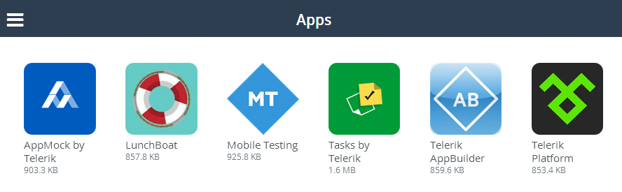
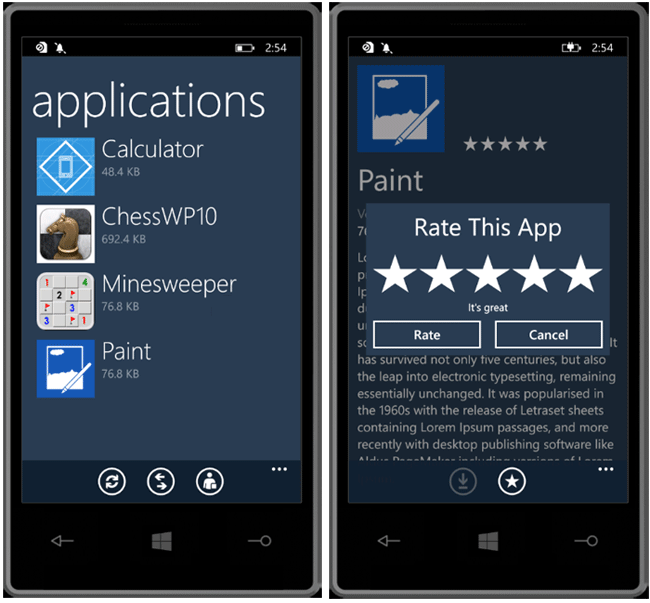
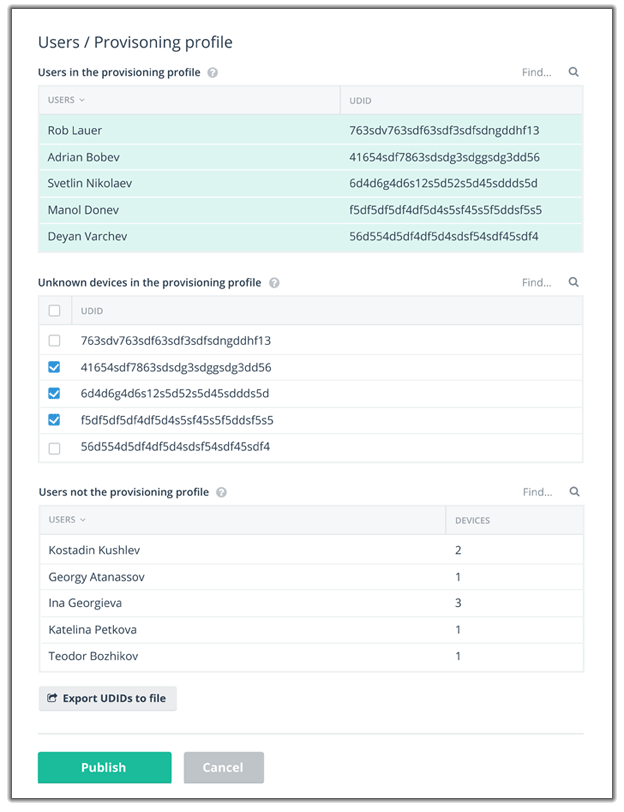

## Telerik AppManager September Release: Windows Phone Support, iOS Provisioning Improvements, and Full Product Access

I'll be honest with you: this is, by far, the biggest [Telerik AppManager](http://www.telerik.com/appmanager) release since our initial launch! I'm excited to announce the latest release of AppManager which includes the ability for every Telerik Platform subscriber to access all of our distribution options, full Windows Phone 8/8.1 support (with a gorgeous Windows Phone app), dramatic improvements to handling iOS devices and provisioning profile issues, and more! Read on to discover more about these time-saving enhancements to use when securely deploying apps to your testers and end users.

You can see all of these updates in action today by logging in (or starting a free trial) at [platform.telerik.com](https://platform.telerik.com/).

**Let's jump into the details!**

### Full Access to All App Distribution Modes

Previously, access to the various app distribution options (email, mobile web catalog, and AppManager for iOS/Android) was limited based on your Telerik Platform subscription level. **In this release we have dropped these barriers and now every Telerik Platform subscriber has the ability to create and manage their own private app store.** You may now deliver apps in the most convenient way for you, including:

- Distributing apps directly via email
- Using a platform-agnostic mobile web catalog
- Delivering apps via the AppManager mobile apps for [iOS, Android, and Windows Phone 8](http://docs.telerik.com/platform/appmanager/getting-started/getting-appmanager-mobile-app)

### Windows Phone 8/8.1 Support

And yes, this release of AppManager brings with it **full support for Windows Phone 8 and 8.1**. Our WP8 support mirrors everything we offer you today with iOS and Android - and you can distribute these apps to your WP8 users using ANY of our existing distribution options (publishing support for WP8 from AppBuilder to AppManager coming soon!).

We even have a brand new native mobile app - **AppManager for Windows Phone**. This feature-rich app is customized with a gorgeous metro UI that will surely delight your users.

### iOS Provisioning Profile Management

Easily the top concern of our existing AppManager users is how we can improve the handling of [iOS provisioning profiles](http://blogs.telerik.com/appbuilder/posts/13-10-28/how-to-create-and-import-an-ios-provisioning-profile-using-the-icenium-extension-for-visual-studio) and device registrations. In this version of AppManager we provide you with clear guidance when you are publishing apps to determine:

- **Are you about to publish an app to AppManager users who aren't in your provisioning profile?** If so, we will let you know who the users are and provide you with an avenue to provision those devices.
- **Are there devices in your provisioning profile who aren't already AppManager users?** If so, we'll give you a list of the device ids to help you track down who is missing and allow you to cross-reference those with devices already logged in the Apple developer web site.

By identifying these two key sets of data, AppManager will help you avoid the dreaded `Unable to Download Application` error that plagues so many of us iOS developers when we deploy our apps. Yet another way AppManager saves you time!

### What's Next?

We have a lot more in store for AppManager in the coming months. Stay tuned to the [Telerik blogs](http://blogs.telerik.com/) to get the latest product updates for AppManager and other Telerik Platform services. If there are any features you think that we are missing, sound off on our [feedback portal](http://feedback.telerik.com/Project/129)!