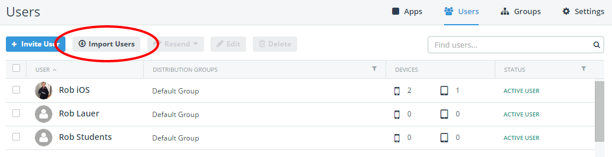
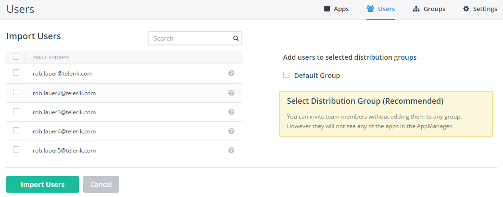
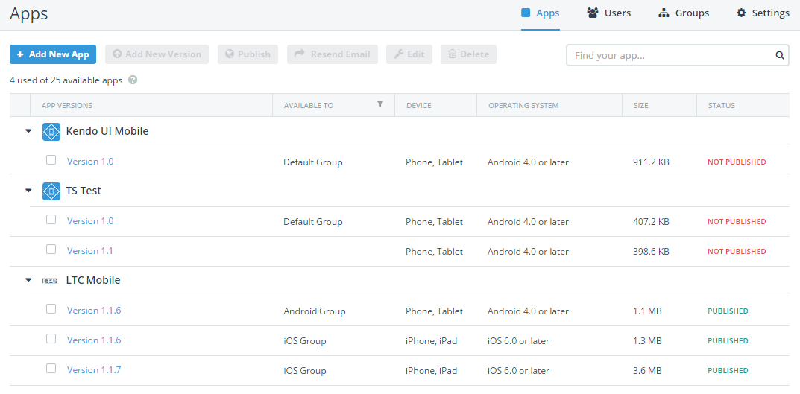

## Telerik AppManager February Release: Import Users, Cleaner Views, and Performance Boosts

Yes, it has been a while since we've been able to talk about [Telerik AppManager](http://www.telerik.com/appmanager)! This isn't due to idle hands at all - in fact the opposite is true. The AppManager team here at Telerik has been very busy working on some new features, cleaning up existing issues, and performing a HUGE migration of our backend systems to AWS (Amazon Web Services). Read on for all of the details of what this means for our AppManager users.

### Bulk Import of New AppManager Users

Previously it could get a little tedious to add a lot of AppManager users at once. Enter an email address, click save, repeat. With this release of AppManager you may now import a CSV file that contains a list of email addresses, and we will do the heavy lifting for you:

Once you have selected a CSV file for import, you'll be presented with a confirmation screen that allows you to select which users to import - as well as which distribution group(s) you want to put them in (optional, but recommended):

That's it! If you have any questions, be sure to [consult our documentation](http://docs.telerik.com/platform/appmanager/appmanager-portal/managing-users/inviting-users#importing-users-from-a-csv-file-containing-e-mail-addresses) to learn more about this time-saving feature.

### Consolidated App View

Some of our customers who are heavy users of AppManager have long wanted a way to see a consolidated view of apps in the main app view screen. Previously we showed every version of every app in its own row - which clearly can cause problems if you are uploading new nightly builds or even if you have more than a handful of versions per app.

This has all changed, as we now show a "parent child" relationship for apps and consolidate all of your related apps (even across platforms) under one heading. [Log in to AppManager](https://platform.telerik.com/) and see how it works for you.

### Performance Improvements

The entire [Telerik Platform](http://www.telerik.com/platform) team has been busy behind the scenes working on migrating our infrastructure to AWS (Amazon Web Services). We did this primarily to improve the robustness and reliability of our services. However, a wonderful side effect of this migration has been a **noticeable increase in performance**! Even navigating around the Telerik Platform you'll notice faster responses and snappier displays of your data.

### What's Next?

AppManager is only about a year old, so in some ways we have just started! In the coming months we are working on a variety of new features including better opportunities to customize AppManager and email notifications that you send. We are also striving to improve your iOS device deployment issues (tip: go with an [Apple Enterprise profile](https://developer.apple.com/programs/ios/enterprise/) if possible :)) and are always looking at ways to make app deployment as frictionless as possible.

**As always, [sound off on our feedback portal](http://feedback.telerik.com/Project/129) with requests you have for AppManager or any other part of the Telerik Platform.**