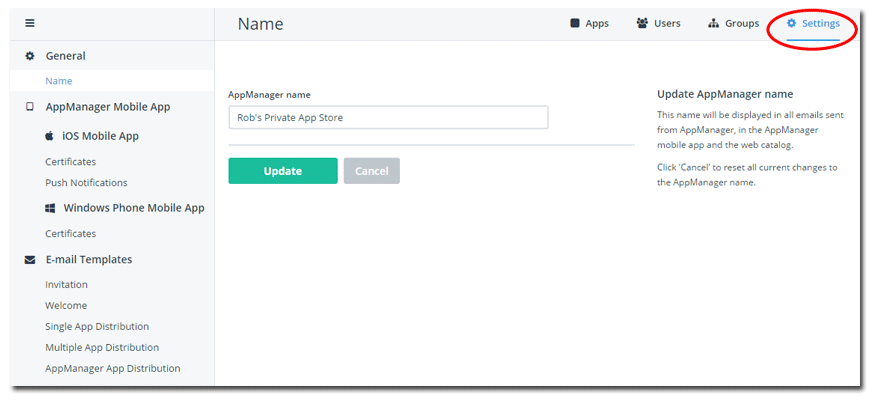
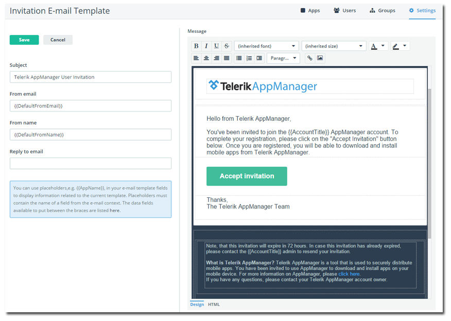

## Telerik AppManager April Release: Customization Options Galore

Today we are pleased to announce a new release of [Telerik AppManager](http://www.telerik.com/appmanager)! Focused on a variety of customization options, now AppManager allows you to make your private app store feel more like YOUR private app store. We also have a nice announcement for Windows Phone developers that should make your app distribution experience even easier.

**Let's get started!**

### App Store Name Customization

By default, the name of your app store is set to be your Telerik Platform account name. Of course, this was inconvenient at best and a little misleading to end users at worst. In this version of Telerik AppManager, we allow you to customize your app store name under the **Settings** menu:

### Email Message Customization

An arguably even more important customization is the ability to manage virtually every aspect of the email messages that are sent from AppManager. There are currently five different messages that could be delivered to your users:

- Invitation
- Welcome
- Single App Distribution
- Multiple App Distribution
- AppManager App Distribution

Up until today, each one of them was heavily branded for the Telerik Platform. But now you have the ability to customize the text, design, and colors of the email messages - AND still leverage a variety of dynamic data elements.

> Tip: [Take a look at our docs](http://docs.telerik.com/platform/appmanager/appmanager-portal/settings/email-templates) for a full list of dynamic data elements you may utilize.

Editing a template is as simple as clicking on the name of the template and using our built-in WYSIWYG editor to customize your template with text, colors, and images. Simply use the double mustache notation (for example `{{AccountTitle}}`) to add dynamic data elements to your template. Again, a complete list of these elements can be found [in our docs](http://docs.telerik.com/platform/appmanager/appmanager-portal/settings/email-templates).

Finally, if you make any mistakes, just hit the `Reset` button to return to a default template.

### Support for Windows Phone .appx Packages

Previously our Windows Phone users had been a bit limited in distributing only .xap packages for Windows Phone 8.1 apps. With this release of AppManager, you no longer have this restriction and can freely distribute .appx packages as well (which appears to be the future of Windows Phone app packaging).

### What's Next?

We have some extremely exciting news coming up in early May at the [TelerikNEXT conference in Boston](http://www.teleriknext.com/). Get your tickets today (tip: use the code **NEXTROB15** to get $50 off your registration!). We have some major advancements in development for AppManager and the rest of the Telerik Platform, so stay tuned. In the meantime, [sound off on the feedback portal](http://feedback.telerik.com/Project/129) if you have any specific requests.