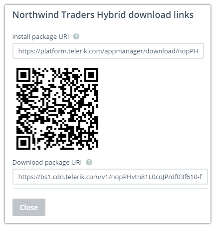
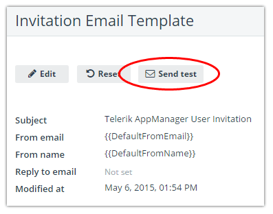
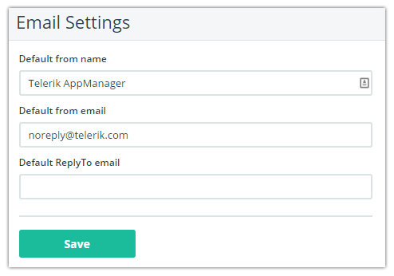

## Frictionless App Distribution with Telerik AppManager

Mobile app distribution is painful. You know it, we know it. Dealing with iOS provisioning profiles is a necessary evil, publishing via the public app stores takes days if not weeks, and setting up your own private app store is more work than it's worth. For the past year now Telerik AppManager has been assisting developers with internal app deployments by taking much of this pain away and providing a friction-free path for apps built with the Telerik Platforms to your users. Today I'm pleased to announce some big updates to AppManager!

> Be sure to consult the [full release notes](http://www.telerik.com/support/whats-new/appmanager/release-history/appmanager-v1.5) for all of the details.

**Let's get started!**

### App Distribution Without User Authentication

When AppManager was first thought up, we wanted to make app distribution 100% secure. And this has been great - every link in the distribution chain is secure and you can rest assured the people you want to install the app are the only ones who are able to install the app.

But what about eliminating this barrier when we don't want it to be there? What if I just want to ship an app from AppManager to my users without requiring them to authenticate themselves? If this sounds familiar, then this feature is for you. Today by clicking a simple toggle you can specify whether or not users must log in before downloading and installing the app:

- **Private = Requires authentication (more secure)**
- **Public = No authentication (less secure, but easier for your users)**

It's that simple! *Just remember that if you choose to remove the authentication requirement, AppManager has no way of tracking which apps are installed on which devices.*

### "Roll Your Own" App Distribution

Another common issue our customers faced was the fact that they were forced to use one of our methods for distributing apps. As a refresher, today you can choose between the following app distribution mechanisms:

- The AppManager mobile apps for iOS, Android, and Windows Phone
- The AppManager mobile web catalog
- Distribution via email

**Today I'm happy to say you can still use any of these methods of distribution - OR - you can just grab a link to your app and send it to your users yourself!**

Simply click the "Get Link" button on your app detail page and you'll be presented with the following dialog containing links to install the app, a QR code for installing the app, and a link to download the app:

Maybe you are posting to an internal company portal, maybe you want to fire off an email to a newsgroup, now it's completely up to you!

### AppManager Email Customization

In the [last release of AppManager](http://www.telerik.com/blogs/telerik-appmanager-april-release-customization-options-galore), we gave you the ability to customize the emails that are sent to your users. We are now working on improving this process by adding a couple additional features:

First, you now have the option to test an email template before using it in production. Simply use the "Send test" button after you customize an email template.

Next, we added a new "Email Settings" section to the AppManager Settings page. Here you may customize the from name, from address, and reply-to address of your email communications. This is all meant to bring AppManager closer to providing a true "private app store" feel for you and your users.

### What's Next?

We have some big plans in store for the second half of 2015! [Sound off on our feedback portal](http://feedback.telerik.com/Project/129) to help us prioritize upcoming features and additions to AppManager and the rest of the Telerik Platform.
