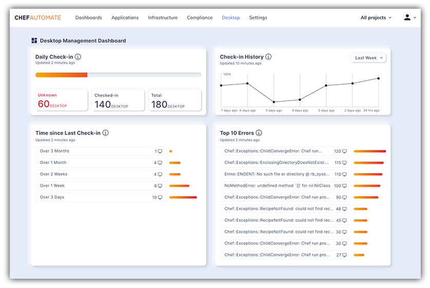

# Learn About Managing IT Resources with Chef Desktop on Learn Chef

Automation has become the modern cornerstone of IT resource management. The days of manually managing hundreds or thousands of desktops and laptops are long gone. *Or are they?* The reality is many organizations are still dealing with a mish-mash of legacy processes for deploying, managing, and securing large fleets of IT resources. Thankfully there is a better way!

> Want to skip the details and get right to the new course? Check out [Chef Desktop: Automated IT Resource Management](https://learn.chef.io/courses/course-v1:chef+Desktop+Perpetual/about) on Learn Chef!

[Chef Desktop](https://www.chef.io/products/chef-desktop) provides IT resource managers the ability to fully automate the deployment and maintenance of laptops and desktops, remotely. It's more than just hardware and software provisioning though, as Chef Desktop also allows for automated compliance scans and issue remediation to help minimize the security risks in an ever-growing remote workforce.

*Quick Video Introducing Chef Desktop:*

<iframe width="560" height="315" src="https://www.youtube.com/embed/fGBMDXj-mpg" frameborder="0" allow="accelerometer; autoplay; clipboard-write; encrypted-media; gyroscope; picture-in-picture" allowfullscreen></iframe>

## What Exactly is Chef Desktop?

Chef Desktop allows you to define (in code) management and configuration of your IT resources. If you're familiar with [Chef Infra](https://www.chef.io/products/chef-infra), then Chef Desktop will feel right at home to you! But if not, don't let the *code* aspect scare you. Chef Desktop includes pre-configured content that enables you to manage your fleet (fully customizable as necessary!). This provides you with immediate value and future flexibility as your fleet evolves.

Just to be clear, Chef Desktop isn't yet another Mobile Device Management (MDM) solution. Aside from standard device management capabilities, it enables continuous compliance against [CIS (Center for Internet Security) benchmarks](https://www.cisecurity.org/cis-benchmarks/) on macOS, Windows, and Linux. In addition, Chef is proud to be the first CIS partner to have our security profiles certified on Amazon Web Services, Microsoft Azure, and Google Cloud Platform!

## Ok, How Can I Learn More?

Glad you asked! We've just released a new course on the ever-popular Learn Chef platform: [Chef Desktop: Automated IT Resource Management](https://learn.chef.io/courses/course-v1:chef+Desktop+Perpetual/about).

In this course, we take a modern look at IT resource management, some of the challenges that are faced today, and delve into how Chef Desktop can alleviate these pains.

*Here are some of the benefits of Chef Desktop that we cover:*

- **Automation:** Automate IT resource configuration and desired state management through code.
- **Visibility:** Maintain continuous visibility and insight into the state of the IT resource fleet.
- **Ease:** Easily manage the configuration of the IT resource fleet through Chef-curated content.
- **Auditability:** Audit IT resource fleet for continuous compliance through CIS benchmarks.
- **Detection and Correction:** Detect IT resource configuration changes against desired state and correct any identified configuration drifts.
- **Flexibility:** Maximize flexibility via customized configuration profiles or third-party integrations. 

**What are you waiting for!?!** Take a look at [Chef Desktop: Automated IT Resource Management](https://learn.chef.io/courses/course-v1:chef+Desktop+Perpetual/about) on Learn Chef today!

You may also be interested in our [blog post on Chef Desktop](https://blog.chef.io/now-available-chef-desktop/) or watching an on-demand webinar, [Introducing Chef Desktop](https://pages.chef.io/202006-Webinar-IntroducingChefDesktop_01Register.html).