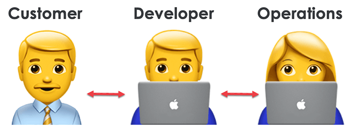
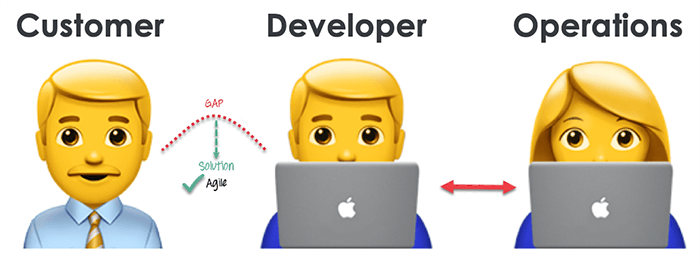
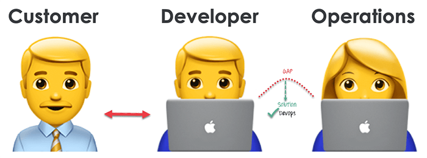
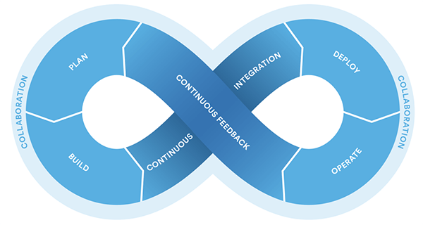
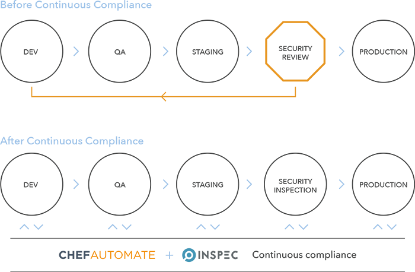
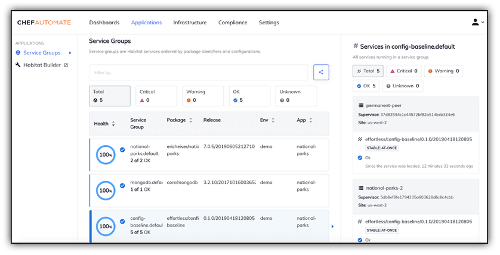

# DevOps, DevSecOps, and the Telerik App Developer

If you've been paying close attention, [Progress](https://www.progress.com/) (the company behind your favorite [Telerik UI](https://www.telerik.com/devcraft) components) recently [completed its acquisition of Chef](https://www.progress.com/blogs/devops-leader-chef-joins-progress).

[Chef](https://www.chef.io/) has been around since 2008 and is a well-established DevOps/DevSecOps company (more on those terms in a bit). Adding Chef to the Progress portfolio helps to round out a comprehensive offering of app development, management, and deployment tools and services.

*So what does this mean for you, an app developer who just wants to write and ship code?*

Traditionally, folks in IT operations weren't the same people who wrote application code. In fact, they (again, traditionally) might not write code at all. This is part of what sets Chef apart: IT infrastructure and application delivery is initiated and managed *as code*. This invites developers to directly collaborate with IT operations and cooperate on infrastructure management and delivery of apps.

Before we continue, let's make sure we are all on the same page regarding these "DevOps" and "DevSecOps" terms.

## So What Exactly is DevOps?

Let me save you a trip to [Wikipedia](https://en.wikipedia.org/wiki/DevOps):

> DevOps is a set of practices that combines software development (*Dev*) and IT operations (*Ops*).

DevOps is a fundamental aspect of collaboration between engineering and IT operations to deploy better code, faster, in an automated manner. DevOps helps to improve an organization's velocity to deliver apps and services. It's all about alignment: alignment of engineering and IT ops via improved collaboration and communication.

*Maybe some examples would be useful?*

In the **old model of infrastructure allocation**, you either allocate existing server space or purchase new servers. The dev team finishes building their app and transitions to testing. Ops works on provisioning servers and the extensive procedures required to deploy this new infrastructure. Under the **DevOps model of infrastructure allocation**, engineering and ops work together to allocate and provision access to cloud, on-premises, or hybrid infrastructures.

Likewise, the **lack of transparency in infrastructure transparency** led to engineering teams experiencing issues with failover, redundancy, unknown data center locations, and opaque storage. This is ironic as they are the ones with deep knowledge of the apps they are deploying! With a **proper DevOps model**, all of these issues can be resolved easily at least partially due to new found collaboration between engineering and ops.

Another example is with load testing. Before going to production, **load testing could crash the app** in a staging environment. Releases would then be delayed, which infuriates stakeholders and requires other groups like marketing and sales to adjust their timelines. With DevOps, well before production load testing is done on pre-provisioned servers, **identifying issues early**. This allows plans to be adjusted earlier and expectations to be better managed.

## DevOps Practices Improve Communication

So a lot of what DevOps delivers is **improved collaboration and improved communication**. You are also likely intimately familiar with continuous integration or continuous delivery (CI/CD). Those concepts dovetail nicely into the DevOps conversation as well. As again, these speak to launching products faster with higher quality into the market.

A typical IT process involves customers/stakeholders, developers, and operations. I think we can all basically agree on that. 👇

Agile is extremely important and addresses gaps in communication between customers and developers. 👇

Whereas DevOps addresses these communication gaps that can exist between developers and IT operations. So DevOps addresses a fundamentally different part of development and deployment communication. 👇

## The DevOps Life Cycle

By now I hope you get my point that DevOps equates to a deep integration between engineering and IT operations. But you can’t truly understand (and appreciate) DevOps without visualizing the software development life cycle:

1. **Development:** Development is now a constant, right? In this phase the entire dev process is separated into small cycles. This enables the DevOps team to speed up both development *and* delivery processes.
2. **Testing:** QA teams use tools like [Selenium](https://www.selenium.dev/) and [Telerik Test Studio](https://www.telerik.com/teststudio) to identify and fix bugs in new code, and to perform regression testing on old code.
3. **Integration:** In the integration stage, new functionality is integrated with legacy code and the aforementioned regression testing can take place. *Continuous development is only possible with continuous integration and continuous testing!*
4. **Deployment:** Deployment also takes place in a continuous manner. Any time the code changes it shouldn’t impact the functioning of a highly used app or website.
5. **Monitoring:** In the monitoring phase, the operations team will take care of any inappropriate system behaviors or bugs which are (inevitably) discovered in production.

## And DevSecOps...?

A relatively new entry in the DevOps space is this concept of DevSecOps. The "Sec" in DevSecOps stands for security. And if you've learned anything so far, you can probably guess that DevSecOps adds security-conciousness to your DevOps methodology.

Again, according to [Wikipedia](https://en.wikipedia.org/wiki/DevOps#DevSecOps,_Shifting_Security_Left):

> DevSecOps is an augmentation of DevOps to allow for security practices to be integrated into the DevOps approach.

I like that description, but an even easier way of understanding this is to think of the purpose of DevSecOps is to **consider security at all stages of the development and delivery process**. It truly builds on this new mindset that everyone at every stage is responsible for app and data integrity and security.

## So Where Does Chef Come into Play?

Much of the Chef portfolio fits well in the *infrastructure-as-code* realm. Need to spin up 200 CentOS VMs running Apache Tomcat? You can easily code that (or even better: leverage a [Chef cookbook](https://supermarket.chef.io/cookbooks/tomcat)!).

What may be more intriguing for app developers is [Chef Habitat](https://www.chef.io/products/chef-habitat/). Why?

Modern app development can be incredibly messy. We start with good intentions and end up with various microservices, a mix of on-prem and cloud environments, maybe Docker or Kubernetes, and a variety of loosely-coupled development tools and frameworks. Habitat allows you to define app packaging (regardless of platform) and app delivery. You specify everything the app needs to run: the code, how to build it, the tests, and so on. Then you can deploy it using Habitat to make sure the deployment is rock solid.

> Be sure to check out all of the free learning resources available on [Learn Chef](https://learn.chef.io/)!

*What else is in the Chef pantry?*

- [Chef Infra](https://www.chef.io/products/chef-infra) automates infrastructure configuration.
- [Chef Desktop](https://www.chef.io/products/chef-desktop/) automates deployment, management, and maintenance of IT resources.
- [Chef InSpec](https://www.chef.io/products/chef-inspec) provides a language for describing security and compliance rules that can be shared.
- [Chef Automate](https://www.chef.io/products/chef-automate) allows for collaboration on delivering application and infrastructure changes.
- [Chef Compliance](https://www.chef.io/products/chef-compliance/) helps enterprises maintain compliance and prevent security incidents.

Notably, when you combine InSpec and Automate, you start to factor in continuous compliance into your CI/CD workflows:

Chef provides a dashboard view to pull together infrastructure configuration information from Chef Infra, compliance status from Chef InSpec, and application delivery data from Chef Habitat, providing a single view into the entire [Enterprise Automation Stack](https://www.chef.io/products/enterprise-automation-stack/):

## The Next Step on Your DevOps Journey

Hopefully you now have a *slightly* better idea of what DevOps is and how DevOps practices can help you and your organization. If you'd like to know more about what's happening at Chef, I welcome you to check out a fantastic (free) resource: [Learn Chef](https://learn.chef.io/).

Learn Chef is a collection of deep-dive courses that tackle all of the important aspects of DevOps and their associated products in the Chef portfolio. For example, if you're interested in improving app delivery, you'll want to look at Chef Habitat and the Learn Chef course, [Deliver Applications with Chef Habitat](https://learn.chef.io/courses/course-v1:chef+Habitat101+Perpetual/about).

Otherwise, hit up the [Chef community on Slack](https://community-slack.chef.io/) and take advantage of the numerous other [community resources](https://community.chef.io/). Happy DevOpsing! 🏗️