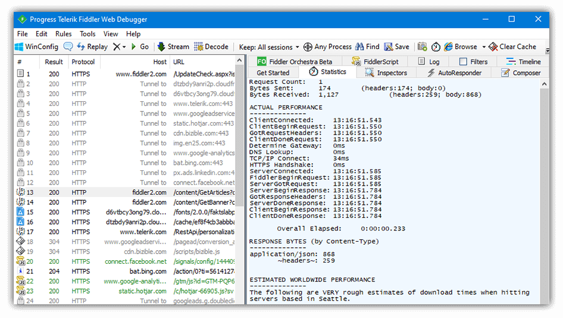
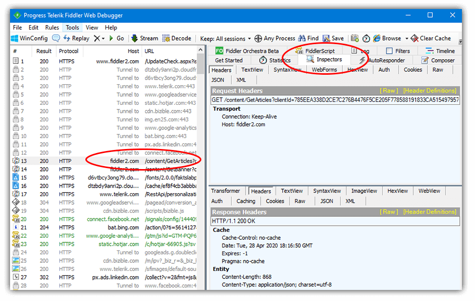
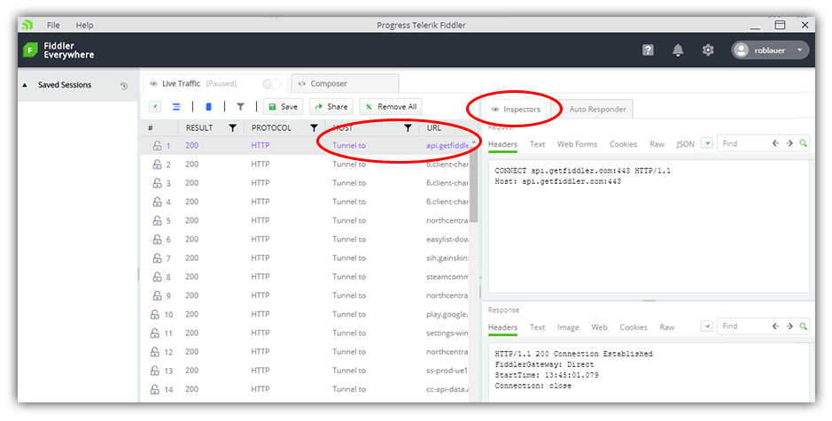
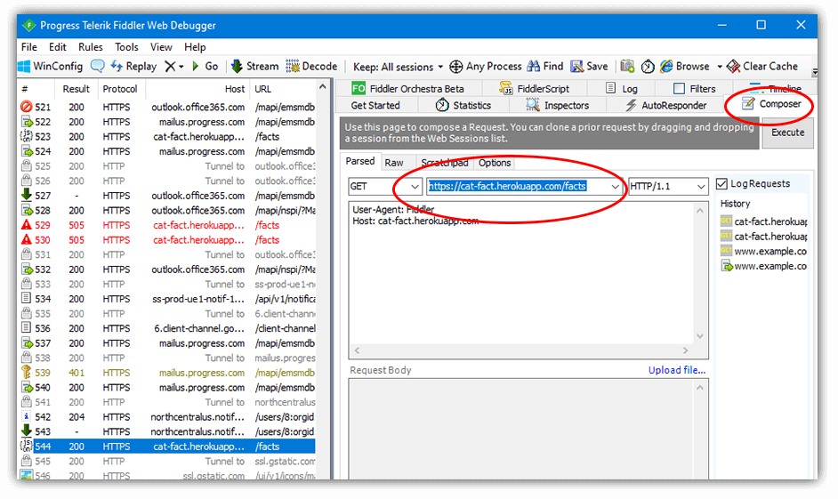
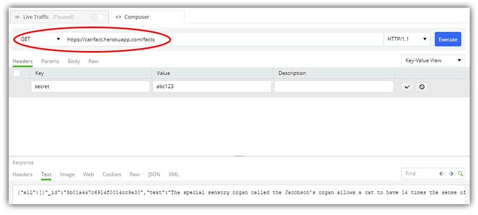
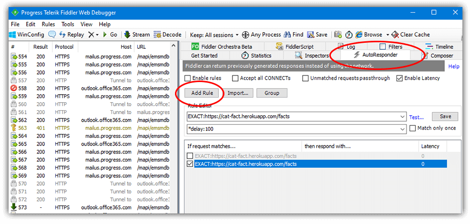
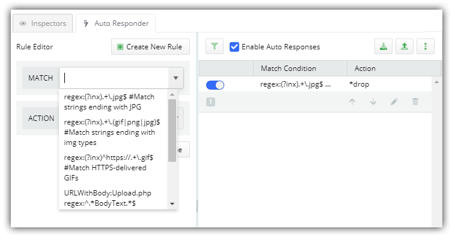
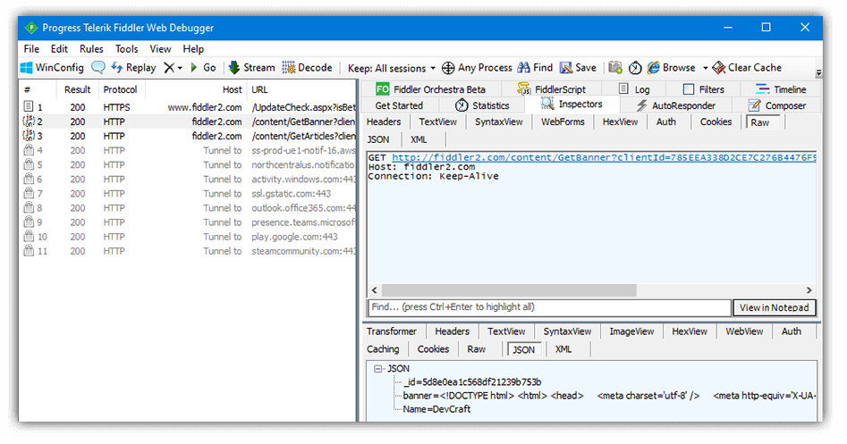

# From Fiddler Classic to Fiddler Everywhere

In the more than 15 years of Fiddler's history, it's become one of the most popular Telerik products. Fiddler has also become a victim of its own success, as it has A LOT of distinct features for A LOT of different types of users!

Long-time users of Fiddler are ok with this, should we say, "cluttered" UI. They know where their features are and how to use them. And you know what, Fiddler is popular because *what it does, it does very well*.

There are some things that Fiddler "Classic" (what we term the current Windows-only version of Fiddler) doesn't do well though. It's not especially inviting to new users due to the aforementioned complicated UI. It also isn't easily accessible to the growing base of web and desktop developers on macOS and Linux.

## Fiddler Everywhere FTW

It's primarily out of these concerns that [Fiddler Everywhere](https://www.telerik.com/fiddler-everywhere) was born. Fiddler Everywhere is a more focused implementation of Fiddler that provides access to the most-adored features of Fiddler Classic. And it works across all platforms equally well: macOS, Linux, and Windows.

> Suffice it to say, [Fiddler Classic](https://www.telerik.com/fiddler) isn't going anywhere. You know it, you love it, and we will continue to support it.

Those of you who have been using Fiddler for a long time might be curious about exactly which features are migrating to Fiddler Everywhere, where they are, and how you use them.

## Traffic Inspector

One of the primary uses of Fiddler is to inspect HTTP/HTTPS traffic to and from browsers and desktop apps. This is a critically important feature for Fiddler users, so it was a no-brainer feature to add to Fiddler Everywhere.

*Inspector in Fiddler Classic*

Fiddler (both Classic and Everywhere) can log all traffic between your device and any remote endpoint. Any application on your computer that supports a system network proxy (all modern browsers and likely any desktop app you are developing) can have its network traffic monitored and debugged.

Fiddler Classic allows you to dive into the details of any specific network request, including:

- Headers
- TextView
- SyntaxView
- WebForms
- HexView
- Auth
- Cookies
- Raw
- JSON
- XML

*Inspector in Fiddler Everywhere*

Likewise, Fiddler Everywhere provides access to a similar set of details:

- Headers
- Text
- Web Forms
- Cookies
- Raw
- JSON
- XML

## API Composer

Modern apps are oftentimes powered by separate remote APIs. Tools such as Postman are widely used to help test and debug these remote API endpoints.

Fiddler Classic provides an API composer, similar to what can be accomplished with Postman:

*API Composer in Fiddler Classic*

With Fiddler Everywhere, we've seen how critical this piece of functionality is in your debugging workflow. So not only have we included this feature from Fiddler Classic, but we have improved upon it:

*API Composer in Fiddler Everywhere*

With Fiddler Everywhere, you can edit headers and add parameters to your requests. For instance, if you want to hard code in your `authorization` test key, you can now do so!

## Auto Responder

One of the most useful features of Fiddler (in this writer's humble opinion) is the Auto Responder. Using Auto Responder, you can set up rules to alter specific requests and test out a myriad of debugging scenarios. You can use local file assets instead of transmitting requests to the server and answer questions like: 

- What happens if my CDN goes down?
- Does my app break if the remote API returns a 500 error?
- If images aren't served properly from the server, does it completely bonk the layout of my app?
- What about if there is significant latency with my remote APIs?

*Auto Responder in Fiddler Classic*

Auto Responder is back (with a vengeance) in Fiddler Everywhere! Not only can you construct your rules in a more elegant and intuitive manner, but you can also stack and re-order rules to provide a fully customized means of responding to complicated requests.

*Auto Responder in Fiddler Everywhere*

## But [Insert Feature Name] is Missing!?!

Clearly Fiddler Classic is chock-full of features it has accumulated over its 15 year lifespan:

And not all of them are in Fiddler Everywhere, nor will all of them *ever* be in Fiddler Everywhere. Does this mean you should stop using Fiddler Classic? No! In fact, you can use the two tools in parallel if you need to, especially as Fiddler Everywhere features ramp-up.

## Try Fiddler Everywhere Today

There is quite literally no reason to wait! Especially if you are already on macOS or Linux, [download Fiddler Everywhere](https://www.telerik.com/fiddler-everywhere) today and take a spin through the features available. Over the forthcoming weeks and months you will start to seeing more significant improvements in the usability and feature set of Fiddler Everywhere.

Happy debugging! 🐛