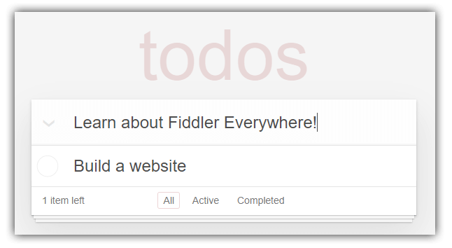
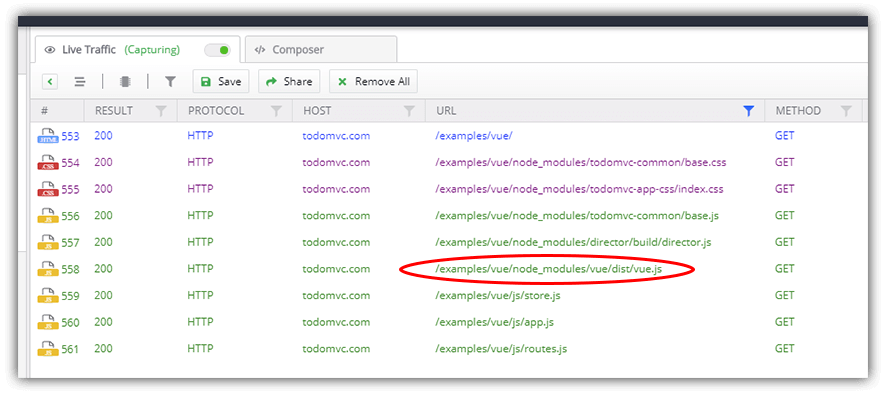
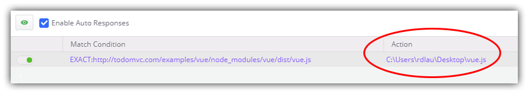
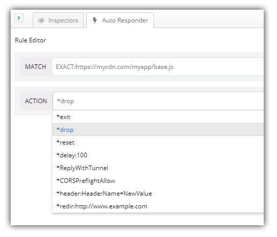
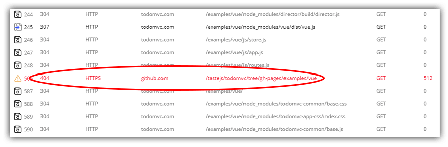

# Test in Production with Fiddler

The anti-pattern of anti-patterns. The king and queen of worst practices. Testing your changes in production. *Obscene!*

In reality, we've all done it...and we still do it today. "This change is so minor no one will even know...I'll just publish it on Friday afternoon and go grab some beers at the pub."

Cheers! 🍻

While we are collectively becoming more responsible with our testing and QA practices, believe it or not, there *are* scenarios where testing a change in production is not only possible, but also safe and effective!

Today we will take a quick look at how to tackle a few different high level "testing-in-production" scenarios with [Fiddler Everywhere](https://www.telerik.com/fiddler-everywhere).

> If you're not yet familiar with Fiddler Everywhere, it's a new version of Fiddler for macOS, Linux, and Windows.

## Our Scenarios

Remember [TodoMVC](http://todomvc.com/)? Well, let's pretend we've commercialized the Vue.js version of it...because why not?!?

And unfortunately a customer of ours is encountering some errors in production!

We have a few suspects: our frontend framework is a few versions old, our CDN might be causing some troubles, and there are some seemingly random issues that we just can't seem to replicate locally.

Let's look at these scenarios and see how each one can be effectively diagnosed with Fiddler Everywhere:

## Updating a Library Version...in Production

As developers, nothing makes our lives easier than when an issue is magically resolved by updating to the latest version of a given framework or library. Luckily with Fiddler Everywhere, this task is incredibly easy to perform and test, even when you want to do so in production.

We can check if an updated version of Vue.js magically fixes the problem and see how our production app *reacts*. Pun intended? 🤔

> While *of course* we would normally take the time to integrate and test the latest version of said library/framework, the ability to *quickly* test our a specific scenario in production is nice to have!

Since the issue we are experiencing cannot be replicated in any environment other than production (yikes!), let's spin up our [TodoMVC Vue.js app](http://todomvc.com/examples/vue/), open up Fiddler Everywhere, and filter our URLs by `/vue` to make sure we only see relevant requests:

Fiddler Everywhere provides the ability to both *inspect traffic* and create *auto responder rules* that are triggered based on defined scenarios. In our case, we want to inspect where and how our Vue.js file is loaded (see above), and redirect the request to another location (either remotely or locally) to load a different version.

By right-clicking on the referenced line you'll want to click on **Add New Rule**. Next you can:

1. Navigate to the **Auto Responder** tab.
2. Edit the pre-filled responder action.
3. In the **Action** field just paste in the filesystem location of the new library (e.g. `C:\Users\myuser\Desktop\vue.js` as I'm on Windows).
4. Finally, check to **Enable Auto Responses**.

> Note the other options you have in the dropdown of **Actions** as well!

With this in place, we can reload our page and Fiddler Everywhere will intercept the request for `vue.js` and use the file we have referenced.

Hopefully that solved the problem, but if not, let's see how else we might diagnose it.

## Maybe It's the CDN?

Since the issue only appears in production for the customer, I'd like to see if it's related to something in my build process from dev to production. 🏗️

One significant difference in production is serving resources from our CDN. Maybe our customer can't access the CDN due to some erroneous firewall rules on their side?

Once again, let's inspect our traffic, right-click on the appropriate request that loads our resource remotely, click on **Add New Rule**, and:

1. Navigate to the **Auto Responder** tab.
2. Edit the pre-filled responder action.
3. Use the dropdown provided to see all of the canned responses, this time choosing ***drop**.
4. Again make sure **Enable Auto Responses** is enabled.

By reloading our website now we can see if the issue they are reporting really did have something to do with the CDN not being accessible.

## Inspect All Incoming/Outgoing Traffic

Some of the issues are intermittent. How fun! In this case, I'd like to see *all* network traffic (especially 404/500 issues) as I run through some customer workflows. 🚦

Next up is a bit of a "Hail Mary" attempt at finding an issue, but can actually be useful in certain scenarios. The customer provided us a step-by-step walkthrough to help us replicate the issue. But when we follow the steps locally, we can't replicate the problem. It's a classic "works on my machine" situation.

> **NOTE:** In this case, the usage of a tool like [FiddlerCap](https://www.telerik.com/fiddler/fiddlercap) can be useful as it's a lightweight version of Fiddler used for quickly recording remote sessions.

What we want to do is work our way through a variety of customer-driven scenarios with our app. We can look for any `404` or `500` errors in Fiddler Everywhere that may have been otherwise missed.

By navigating through your website as a user might do, we can simultaneously track the logging in Fiddler Everywhere to spot any server-side errors or missing files that may not normally interrupt our workflow.

In this case we can see that sure enough, a `404` error was thrown on a missing asset. Maybe this is our culprit!?

## Summary

In these examples, while maybe a little contrived 😎, you can see how Fiddler Everywhere can be your network debugging co-pilot for diagnosing (and solving!) a variety of mysterious issues.

Start your journey on macOS, Linux, or Windows by [downloading Fiddler Everywhere today](https://www.telerik.com/download/fiddler-everywhere).