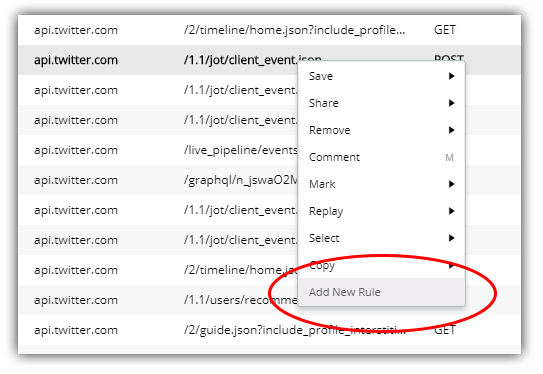
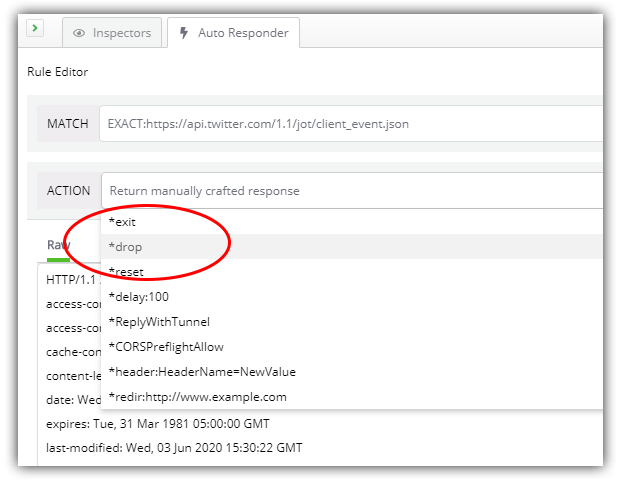

# Debugging with Fiddler Everywhere: Mocking Remote Issues

Many of us have been using [Fiddler](https://www.telerik.com/fiddler) for years to inspect and debug HTTP/S traffic between our computer and the rest of the world. It trivializes the overly complex problems we experience when inspecting network activity both to *and* from both web *and* desktop apps. Oh, and we can also set up "auto-responding" rules and *fiddle* with the request and response. See what I did there? 🧐

[Fiddler Everywhere](https://www.telerik.com/fiddler-everywhere) is the next generation of Fiddler tooling. Fiddler Everywhere brings forward most of what you love about Fiddler to a new cross-platform tool with a revamped UX that performs identically across macOS, Linux, and Windows.

> **NOTE:** Fiddler Classic (the original Fiddler) isn't going anywhere! You can still [download Fiddler](https://www.telerik.com/download/fiddler) and use it like you always have on your Windows PC.

We are kicking-off a blog series in which we'll take a quick look at scenarios most of us have encountered. From remote APIs failing, to diagnosing errors in production, to finding a pesky 404 - Fiddler Everywhere is our trusted co-pilot when debugging these (and plenty of other) issues:

- Mocking Remote Issues (hey, that's today!)
- Scanning for 404 and 500 Status Codes (coming soon)
- Collaborative Debugging (coming soon)
- Resolving an Error in Production (coming soon)
- Diagnosing a Remote API Failure (coming soon)

Today we're going to examine how we can use Fiddler Everywhere to mock a remote server error. What happens when that third party API goes down or the network connection is dropped entirely? Is your app set up to gracefully recover from these types of errors?

## Our Scenario: Bulletproofing an App by Mocking Issues

As a developer, my web and desktop apps rely heavily on remote backend services. Some of them I manage myself, while others are third party APIs that I have no control over. What happens when any one of them goes down? Is my app set up to resolve these errors and notify the user in a graceful manner?

Or will I end up taking crazy pills when an API fails on me?

## Fiddler Everywhere's Solution

Fiddler Everywhere includes a feature called *Auto Responder*.

Auto Responder can be used in virtually any situation where you want to redirect a request, alter a status code, delay a response, and so on.

*For example, you may want to:*

- Replace a remotely-loaded library/image/file with a local version;
- Redirect a request from one URL to a completely different one;
- (In our case) see what happens when a remote connection is dropped!

Let's try out this scenario:

**1)** Open Fiddler Everywhere and toggle the **Live Traffic** option to **Capturing**:

**2)** Open the web app (or desktop app) and navigate to whatever functionality or feature will call the remote service for which you'd like to create a mock response.

**3)** Back in Fiddler Everywhere, toggle the **Live Traffic** option to **Paused** so as to limit new sessions coming into our UI.

**4)** Look for the specific request you want to mock. Note that you can use the filtering options to quickly discover matching sessions. For instance, you can filter by hostname, URL, status code, and so on.

**5)** When you've found the appropriate session, right-click it and choose **Add New Rule**. This will populate the **Auto Responder** tab with a new rule.

**6)** Navigate to the **Auto Responder** tab and edit the newly-created rule. In the **Action** dropdown list, choose `*drop`, as this will mock what happens when a request to this URL is dropped.

> **NOTE:** There are numerous other pre-defined actions you can utilize like `*reset` and `*delay:100`. Take a look at some explanations for these actions in the [Fiddler docs](https://docs.telerik.com/fiddler/knowledgebase/autoresponder#actions).

**7)** With your rule activated (make sure the **Enable Auto Responses** box is checked!), reload your app. Fingers-crossed 🤞 now, hopefully your app handles this connection drop issue just fine. If not? This is an opportunity to alter your app and re-run these tests until your app performs as expected.

## Summary

In this post we took a quick look at how Fiddler Everywhere's Auto Responder feature can allow you to quickly mock up a remote API failure, allowing you to adjust and improve your app *before* a problem occurs in production.

Start your journey with Fiddler Everywhere by [downloading it today](https://www.telerik.com/download/fiddler-everywhere) on macOS, Linux, or Windows.