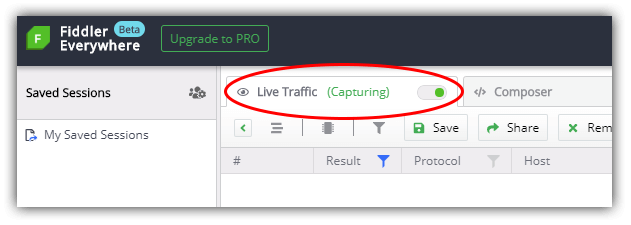
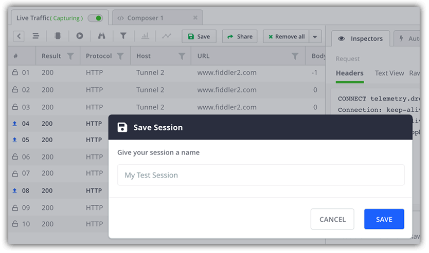
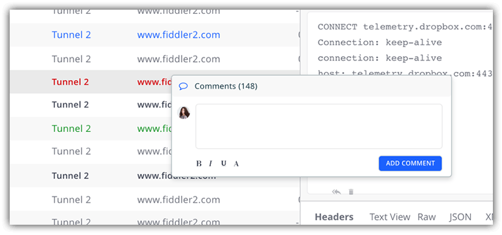
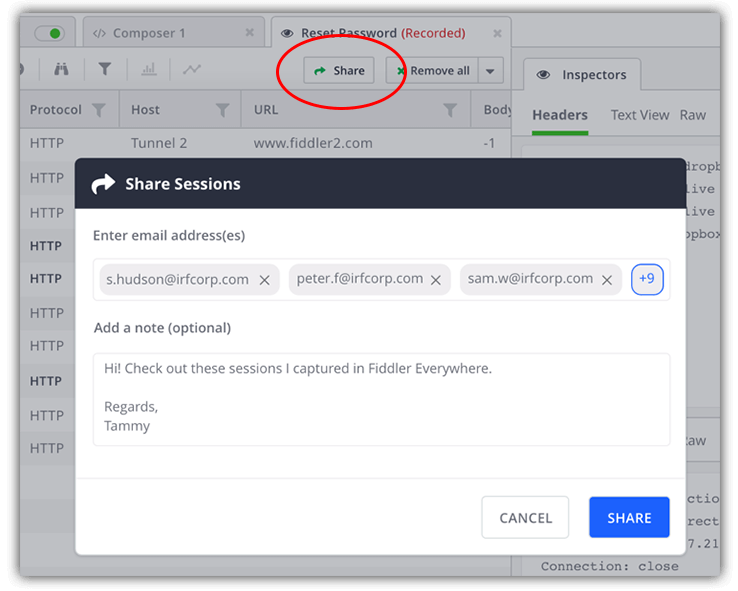
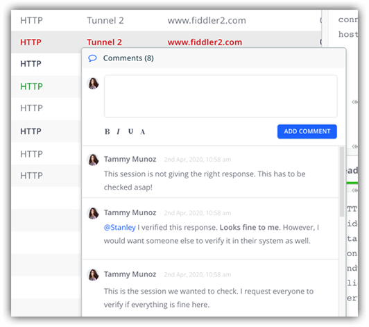

# Debugging with Fiddler Everywhere: Collaborative Debugging

[Fiddler](https://www.telerik.com/fiddler) has been used for years (with lots of ❤️) as the go-to tool for diagnosing and debugging network issues for both web and desktop apps. [Fiddler Everywhere](https://www.telerik.com/fiddler-everywhere) is the *vNext* of Fiddler - a brand new cross-platform version that shares the same core engine, but with a modern interface and vastly improved user experience.

> While on the subject of new Fiddler tooling - take a look at [Fiddler Jam](https://www.telerik.com/fiddler-jam) if you're interested in inspecting remote customer issues!

In this blog series, we are looking into a variety of real world network debugging scenarios that can be effectively addressed with Fiddler Everywhere. Today we are going to look at something *slightly* different - how we might use some of the approaches we've already discussed, but in a team environment where **collaborating with fellow team members is critical**.

*So what are those other topics?*

- [Mocking Remote Issues](https://www.telerik.com/blogs/debugging-with-fiddler-everywhere-mocking-remote-issues)
- [Scanning for 404 and 500 Status Codes](https://www.telerik.com/blogs/debugging-with-fiddler-everywhere-scanning-404-500-status-codes)
- Collaborative Debugging (today!)
- Resolving an Error in Production (coming soon)
- Diagnosing a Remote API Failure (coming soon)

> **NOTE:** Fiddler Classic (the original Fiddler) isn't going anywhere! You can still [download Fiddler](https://www.telerik.com/download/fiddler) and use it like you always have on your Windows PC.

## Our Scenario: Collaborating on Network Debugging

As a developer, lets say I work within a distributed engineering team. I also work alongside a support team and a QA team - and we all collaborate on resolving customer-reported issues.

Individually we each use Fiddler Everywhere to inspect network traffic to help resolve bug reports, but there are times when we want to share recorded sessions with each other. Maybe our testing team records network logs that expose details of the bug, then they want to add context to these saved sessions, and finally send them to us for resolution.

Let's see how Fiddler Everywhere can handle this!

## Fiddler Everywhere's Solution

Previously with Fiddler Classic we were able to "share" sessions via a tedious *inspect -> save -> share -> load -> re-run* workflow across multiple desktop installations. The problem is this process is riddled with issues:

- Saved `.saz` archives have to be manually shared (e.g. via email)
- You can't necessarily control who has access
- You are potentially sharing private/sensitive data
- You lose the context or narrative of the shared session

Not fun at all! 😭

By using Fiddler Everywhere, however, we can utilize all the same request/response inspection features we've been using for years with the added bonus of securely sharing these sessions with select teammates.

*How is this accomplished within the Fiddler Everywhere UI?*

**1)** Open Fiddler Everywhere and toggle the **Live Traffic** option to **Capturing**:

**2)** Open the web or desktop app you are working with and follow whatever in-app workflow is needed to replicate the reported issue.

**3)** Back in Fiddler Everywhere, toggle the **Live Traffic** option to **Paused** so as to limit new sessions coming into our view.

**4)** Look for the specific sessions you want to share (you may want to use the column filters provided). Right-click on them and choose **Save --> Selected Sessions**.

**5)** At this point, you may optionally start adding your own comments to the selected sessions by right-clicking on the appropriate sessions and choosing **Comment**:

**6)** Next, using the **Share** button, you can quickly and securely share the saved session with your teammates:

**7)** Finally, your teammates will receive an email alerting them to the shared session and prompting them to open it up within their own copy of Fiddler Everywhere. They can now inspect, replay, and rework the session...even comment on it so you can collaborate on the issue!

> **NOTE:** The team collaboration features are part of an extended "pro" feature set within Fiddler Everywhere. You can view [full pricing details](https://www.telerik.com/purchase/fiddler) on our website.

## Summary

Today we saw how Fiddler Everywhere can be used to quickly share recorded sessions with teammates. By leveraging this feature of Fiddler Everywhere, you enable your team to more easily collaborate on network debugging sessions - often saving numerous cycles for both your developers and support team!

But wait...something is missing from this equation...🤔

**The customer!** The scenario presented today, while very common, kind of leaves out the customer and requires us to manually replicate reported issues. This is where [Fiddler Jam](https://www.telerik.com/fiddler-jam) comes in - allowing you to **remotely** capture, share, and report on customer issues far easier than ever before. Take a look at Fiddler Jam and [join the pilot program](https://www.telerik.com/fiddler-jam#register) to learn more!

Otherwise, start your journey with Fiddler Everywhere by [downloading it today](https://www.telerik.com/download/fiddler-everywhere) on macOS, Linux, or Windows.