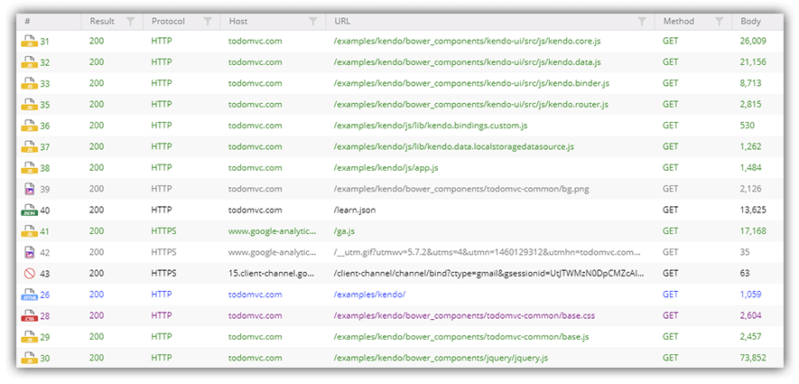
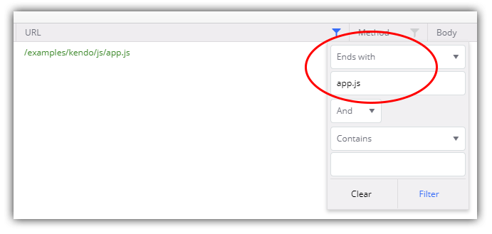
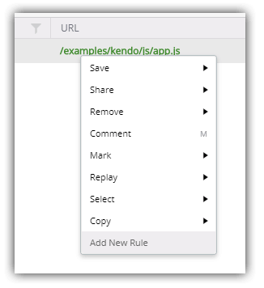
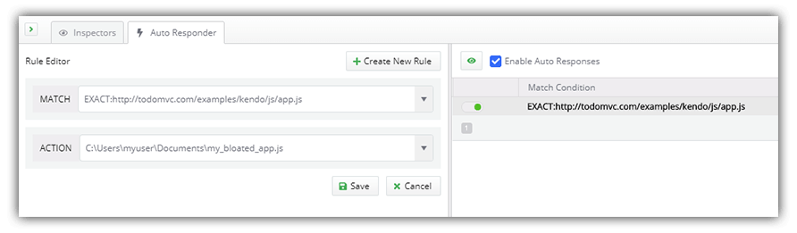
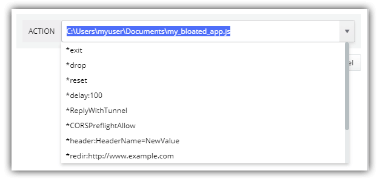

# Debugging with Fiddler Everywhere: Resolving an Error...in Production

If you've been following along with us in this blog series, you'll know I'm a pretty big fan of [Fiddler](https://www.telerik.com/fiddler). The ability to inspect and debug HTTP/S requests and responses from apps of all types (desktop, web, and mobile) can be a critical part of our development and debugging experience.

Fiddler Everywhere is a brand new version of Fiddler. Most of what you love (and none of what you hate) about the original Fiddler is in Fiddler Everywhere. It's a cross-platform tool that includes a revamped experience that performs identically across macOS, Linux, and Windows.

> **NOTE:** Fiddler Classic (the original Fiddler) isn't going anywhere! You can still [download Fiddler](https://www.telerik.com/download/fiddler) and use it like you always have on Windows.

Today brings us to part four of common debugging scenarios many of us have encountered. We experience failures from remote APIs, we look for 404 and 500 errors, and, like today, are trying to replicate and resolve customer-reported issues while an app is already in production. Yikes! 😨

*If you're just tuning in, be sure to check out some other posts from this series:*

- [Mocking Remote Issues](https://www.telerik.com/blogs/debugging-with-fiddler-everywhere-mocking-remote-issues)
- [Scanning for 404 and 500 Status Codes](https://www.telerik.com/blogs/debugging-with-fiddler-everywhere-scanning-404-500-status-codes)
- [Collaborative Debugging](https://www.telerik.com/blogs/debugging-with-fiddler-everywhere-collaborative-debugging)
- Resolving an Error in Production (that's today!)
- Diagnosing a Remote API Failure (coming soon)

> While on the subject of new Fiddler tooling - take a look at [Fiddler Jam](https://www.telerik.com/fiddler-jam) if you're interested in inspecting remote customer issues!

On to the dreaded issue of not being able to replicate a production error locally. We've all been there. When we can't effectively diagnose a production-level error, it's obviously difficult to then debug, test, and ultimately resolve, a change.

## Our Scenario: Resolving a Production Error...While in Production

As a web developer, I've seen some issues pop up from customers that show an error in the production environment for my app. Unfortunately, with the information I have, it's virtually impossible for me to replicate the issue locally due to one of the following factors.

*The error only seems to happen...*

- after scripts are minimized during the build process;
- when files are served from a CDN;
- because my app is part of a massive monolithic solution that cannot be run locally.

## Fiddler Everywhere's Solution

Using Fiddler Everywhere, we are going to fake out our application and make it think that it is running in production. But instead of loading key assets from our production environment, we are going to tell our production app to load them from a different source (in this case our local desktop).

This way we can run most of the app "in production", while loading individual scripts/files/whatever we suspect as being the culprits, from our local development machine. To do this we can take advantage of Fiddler Everywhere's [Auto Responder](https://docs.telerik.com/fiddler-everywhere/get-started/mock-server-response) feature.

Let's see how this works in practice:

**1)** Open Fiddler Everywhere and toggle the **Live Traffic** option to **Capturing**:

**2)** In your favorite browser, open the website in question and make sure all of the suspected problem assets are loaded by navigating to whichever page(s) are throwing errors. Remember, this could be JavaScript bundles, resources served by a CDN, images, or any other components of your application.

**3)** Back in Fiddler Everywhere, toggle the **Live Traffic** option to **Paused** so as to limit new requests coming into our session pane.

*I mean, the app is using Bower as its package manager! Maybe the error we are looking for is the least of its concerns...* ☺️

**4)** Find the specific session(s) you are interested in. In my case, I'm going to filter by **URL** to only show me the `app.js` bundle, which is a minified JavaScript file with my core app logic (a key suspect in the case): 

**5)** Next I want to build an **Auto Responder** rule that will capture a request and do something, anything, with it. Right-click the session identified and choose **Add New Rule**.

**6)** Now, navigate to the **Auto Responder** tab where you'll see the session URL pre-loaded for you. Edit the rule and in the **Action** field, paste the location of the file you want to serve from your local file system. For instance:

- Windows: `C:\Users\myuser\Documents\app_unminified.js`
- macOS: `/User/myuser/Documents/apps/app_unminified.js`

**7)** Save the rule, make sure **Enable Auto Responses** is checked, head back to your website, and reload! Fiddler Everywhere will **intercept the request** and **replace the remotely-served file** with the specified one from your own file system.

In theory, this allows you to quickly and easily substitute *any resource* with any other resource like images, videos, libraries, text, etc.

Auto Responder can do more than just swap out files. Take a look at [additional Auto Responder actions](https://docs.telerik.com/fiddler-everywhere/user-guide/live-traffic/autoresponder#action-strings) that you can experiment with today:

## Summary

We took a quick look at how Fiddler Everywhere can be used to diagnose possible issues in production, without negatively impacting existing users or the production system itself.

**Want some next steps?**

1. Start your journey with Fiddler Everywhere by [downloading it today](https://www.telerik.com/download/fiddler-everywhere) for either macOS, Linux, or Windows.
2. Read up on an exciting new product in the Fiddler family: [Fiddler Jam](https://www.telerik.com/fiddler-jam).
3. Enjoy the rest of your summer (or winter for you folks in the southern hemisphere!) and stay safe out there. 😷

