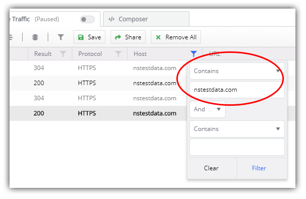
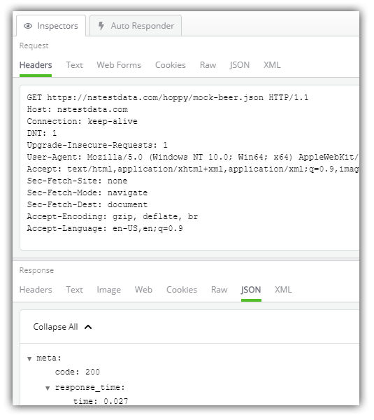
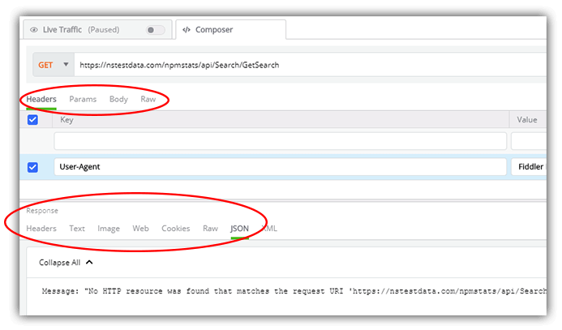

# Debugging with Fiddler Everywhere: Diagnosing a Remote API Failure

For years Fiddler has been the gold-standard tool 🥇 for inspecting and debugging network issues for web, desktop, and mobile applications. Are you a React, Angular, Vue.js, UWP, Electron, NativeScript, React Native, Ionic, WinForms, ASP.NET, Ruby, (you get the picture) developer? Fiddler don't care! Fiddler is completely tech-agnostic.

[Fiddler Everywhere](https://www.telerik.com/fiddler) represents the *next* generation of Fiddler tooling: a similar set of core features to Fiddler Classic wrapped up in a more engaging, cross-platform interface.

In this series, we are looking at a set of specific scenarios many of us regularly encounter during app development. Today we are going to look at that dreaded issue of remote APIs failing on us. These are remote resources that are completely out of our control, thus far more difficult to debug.

*This is the final article in the series, so be sure to check out other articles:*

- [Mocking Remote Issues](https://www.telerik.com/blogs/debugging-with-fiddler-everywhere-mocking-remote-issues)
- [Scanning for 404 and 500 Status Codes](https://www.telerik.com/blogs/debugging-with-fiddler-everywhere-scanning-404-500-status-codes)
- [Collaborative Debugging](https://www.telerik.com/blogs/debugging-with-fiddler-everywhere-collaborative-debugging)
- [Resolving an Error in Production](https://www.telerik.com/blogs/debugging-with-fiddler-everywhere-resolving-an-error-in-production)
- Diagnosing a Remote API Failure (that's today!)

> **NOTE:** Have no fear! Fiddler Classic (the original Fiddler) isn't going anywhere! You can still [download Fiddler Classic](https://www.telerik.com/download/fiddler) and use it like you always have on Windows.

So let's get started!

## Our Scenario: Diagnosing a Failing Remote API

As a developer, I'm utilizing a remote third-party API for my app. While it had been working just fine for days, now every time I generate a request, it fails without any error context! I would just copy and paste the endpoint URL into my browser or another tool, but there are authentication tokens and parameters added to the request that make it a difficult request to generate manually.

Frankly I just need to quickly re-create the full request and inspect/debug the failed response, **based on real world usage** within my app.

## Fiddler Everywhere's Solution

Using Fiddler Everywhere, we can easily view, record, play back, and inspect individual network requests made by any desktop apps running locally (including any modern web browser).

To diagnose and debug this particular issue we can:

**1)** Open up Fiddler Everywhere and toggle the **Live Traffic** option to **Capturing**:

**2)** Open the app/website you are developing (be it a desktop or a web app). Navigate to where the failed request occurs and use whatever functionality necessary in the app to fire the remote request you are trying to debug.

**3)** Back in Fiddler Everywhere, toggle the **Live Traffic** option to **Paused** so as to limit the flood of information coming in.

**4)** Find the specific session you are interested in. In my case, I'll use the **Host filter** to only show traffic from a specific remote host, making it far easier to identify and work with the issue at hand:

**5)** Look for the failed request out of all your captured sessions. (Hint: It'll likely be red if it's throwing an error.) When you find it, inspect the request - look for any improper parameters in the header or body of the request. You may also want to look for a malformed response.

**6)** Next, load the session in Fiddler Everywhere's **API Composer**. Do this by right-clicking on the specific request and choose **Edit in Composer**.

> **NOTE:** This is far and away my favorite step. Why? Instead of just loading the URI into to the API Composer, Fiddler Everywhere *also* transposes any header values or other parameters to duplicate the request!

**7)** In the **API Composer**, alter whatever possible header key/value pairs, parameters, or other mistakes you think you've found. Re-issue the request in the API Composer without going to a third party tool as many times as you'd like.

**8)** Assuming you've effectively re-created the issue, now is your opportunity to either fix the problem (if it exists in your app) or communicate the issue with the API owner. Maybe an opportunity for the [collaboration features](https://www.telerik.com/fiddler/usecases/team-collaboration) of Fiddler Everywhere? 😍

## Summary

Today we took a quick look at how Fiddler Everywhere can be used to quickly diagnose and fix issues found when remote APIs fail.

**What's next on your Fiddler journey?**

Start your using Fiddler Everywhere by [downloading it today](https://www.telerik.com/download/fiddler-everywhere) for either macOS, Linux, or Windows. After that, read about an exciting new product in the Fiddler family: [Fiddler Jam](https://www.telerik.com/fiddler-jam).

Happy Fiddling! 🎸