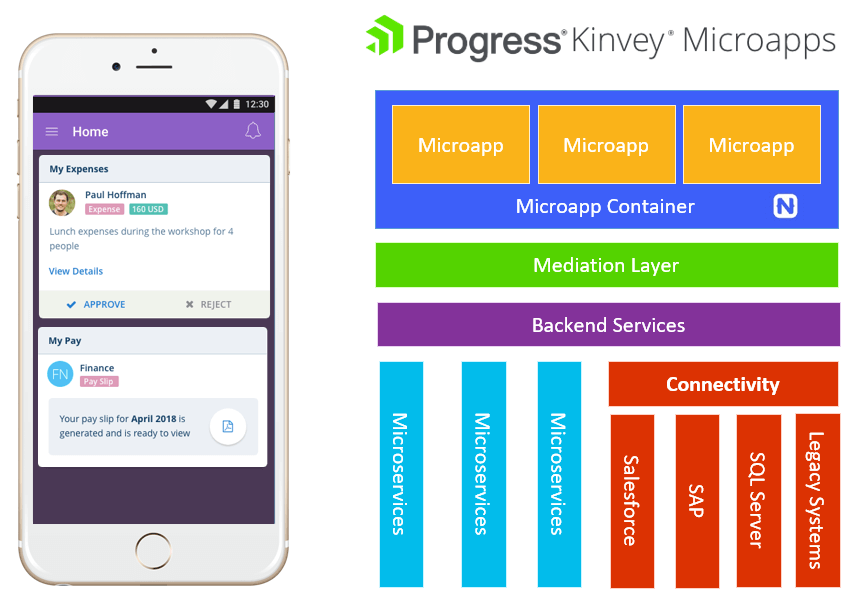

# Using a Microservices Architecture to Develop Microapps

*Microapps and microservices are two distinct concepts. In this article we focus on microapps and how you can utilize a microservices architecture with a microapps platform.*

Microapps is an extremely hot topic right now. But frankly many of us don't really know what a "microapp" is, nor do we understand the benefits. Is this another tech fad? Is it really something new or is it an evolution of an existing construct? Do I really *need* microapps to be successful?

The concept of a "microservices architecture" commonly gets confused with microapps. Microservices are small, maintainable, and easily testable backend services. They are organized around specific business capabilities as well which, as we will see today, makes them a perfect candidate to work with microapps.

Let's take a closer look at microapps and answer some questions such as:

- What *exactly* is a microapp?
- What is the business case for a microapp?
- How can my team start creating microapps with a platform that utilizes a microservices architecture?

## So What *is* a Microapp?

Let’s start by answering that very first, and very key question, **what is a microapp?**

A microapp is just like any other app on your mobile device, except it’s far more focused on performing one task, and performing it very efficiently. In software terms, we often think of the [single responsibility principle](https://en.wikipedia.org/wiki/Single_responsibility_principle), which basically boils down to doing one thing, only one thing, and doing it well. Microapps takes this principle and applies it more broadly to the creation of mobile experiences.

> For more background on what a microapp really is, [consult this blog post](https://www.progress.com/blogs/what-is-a-microapp).

But let’s be clear: **microapps are not really a new thing**. You’ve likely been using microapps yourself, maybe without even realizing it. Google is famous for including microapps in their search results.

Say you want to look up the standings of your favorite sports team. This experience occurs via tiny, focused microapps. You get all of the information you need without having to wade through a larger resource.

The value for the consumer is evident. We can be hyper-focused on providing exactly what the consumer needs, without the unnecessary overhead.

You can also think of all this in terms of a **web portal**. Back in the day we had this concept of [portlets](https://en.wikipedia.org/wiki/Java_Portlet_Specification) that encapsulate a specific set of functionality and were provisioned to users via a web portal. So you can *also* think of microapps as an evolution of this model for the mobile world.

> tl;dr; A microapp is an app that is highly focused on performing just one task.

## What is the Business Value of Microapps?

Let's look at microapps in terms of mobility. Because today we have a problem. Modern enterprises often have 20 or more web and mobile apps that you, as an employee, have to use just to get your job done. *And how much functionality do you really use within these apps?* It can be hard to find what we want, when we want. We are also suffering from app fatigue, both as app consumers in our personal lives and in our work lives as we deal with tens to hundreds of apps on our devices.

### The Developer's Perspective

As app developers we are also suffering, because these 20+ apps have to be maintained. We are also fielding requests for more and more apps, just adding to the maintenance pile. And **each one of these new apps** comes with some baseline work for us to get it up and running:

- Authentication	
- Notifications	
- Offline Access	
- Metadata Management	
- Device Logging	 
- Crash Analytics	
- App Submission/Approval	
- App Updates
- App Distribution
- Branding and Theming
- Authorization/Provisioning
- Performance/Health Monitoring
- Creating User Interface
- Backend Business Logic

However, with a proper microapps platform, instead of marching through these steps for each new mobile experience we create, **microapps allow us to do the hard and boring stuff once, and focus on the practical features and engaging experiences that we ultimately want to deliver**!

So with a microapps platform, you can *eliminate* every task you see above, save for the following:

- Creating User Interface
- Backend Business Logic

### The App Consumer's Perspective

And **consumers** of these apps, even internal enterprise apps, are getting more picky and require:

- **Out of the Box Cross-Platform** (in the BYOD world we are regularly using both iOS and Android devices)
- **60fps Native UI Performance** (apps have to respond to our needs quickly and reliably)
- **Access to Any Device API** (there should be nothing preventing me from using my device to its fullest capabilities)
- **Engaging Experiences like Augmented Reality** (providing immersive experiences can make for a more engaged consumer)
- **New Means of Interfacing with Chatbots** (gone are the days of tap-and-type user input, now we can use chatbots)

So with microapps, as app consumers we are provided with **one app** that provides the focused functionality that we need, with modern and engaging features that we want.

> Microapps dramatically improve the mobility experience for both app consumers and app developers.

## Introducing Kinvey Microapps

We’ve identified some problems and how microapps in general help solve these problems. Let’s now look at how Progress is solving this problem. This is where [Kinvey Microapps](https://www.progress.com/kinvey/micro-apps) comes into play. Kinvey Microapps is part of the established [Progress Kinvey](https://www.progress.com/kinvey/) offering, which is a high productivity app development platform.

From a technical perspective, Kinvey Microapps enables you, as an app developer, to be **dramatically more productive delivering mobile experiences** to your users.

To deliver a microapps experience, you build a **single container app**. This container app is cross-platform, providing a native experience for both iOS and Android users that is branded for your company.

Your container app then contains any number of microapps. Each microapp can be created:

1. From existing microapp templates with built-in data integrations (50+ are on the way!).
1. From scratch as a NativeScript app (learn about the advantages of NativeScript at [nativescript.org](https://www.nativescript.org/)).
1. From an existing web app (yes, legacy web apps can be microapps!).

Next, created for you is also a mediation layer, allowing you to create and host **microservices** to connect to remote APIs and manage data coming from those APIs. Building on top of Progress Kinvey allows you to **connect to other backend systems** with your microapps like SAP, Salesforce, Oracle, SQL Server, and so on. You can also tie into integrations with existing **enterprise authentication providers** like Active Directory, LDAP, SAML, oAuth2, you name it.

*The above can be distilled into the following diagram:*

Finally, microapps created by the Kinvey Microapps platform are **business-agnostic**. It doesn’t matter if you are a massive corporation, a city or county providing public resources, or a smaller organization trying to make your employees as efficient as possible. Every part of your company can benefit from microapps, whether it’s field service, sales, product development, or human resources.

## Summary

Hopefully this has helped to gel what the concept of microapps is and how they can benefit you, your business, and your app users. It all boils down to:

- **App creation** (mobile projects are simpler, easier to initiate, cost less/take less time, and result in fewer bugs)
- **Speed up delivery** (with role-based provisioning, the right people get the right apps at the right time, it’s also far easier to update microapps!)
- **Connecting to disparate (and legacy) data sources** is a *core feature of Progress Kinvey* and Kinvey Microapps
- **Building on NativeScript** providing native performant UI, cross-platform, and access to modern features like Augmented Reality and Chatbots

You can learn more about [Kinvey Microapps here](https://www.progress.com/kinvey/micro-apps) or even [schedule a meeting with a microapps expert](https://www.progress.com/kinvey/contact).
