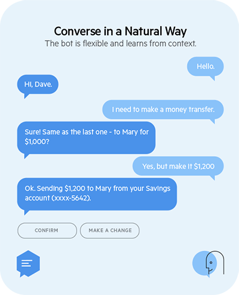
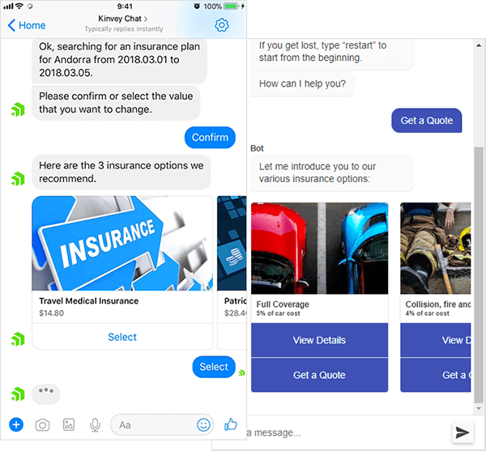
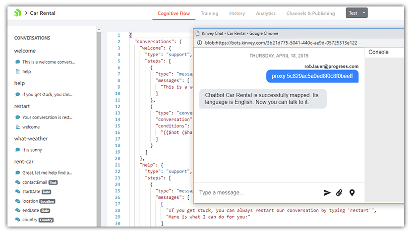
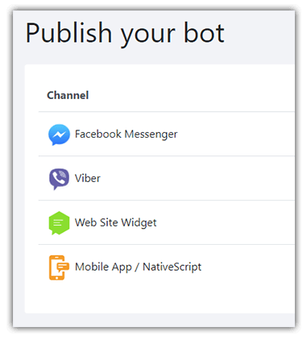
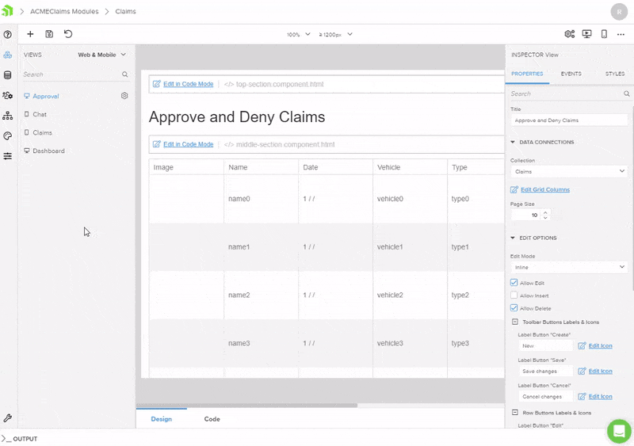
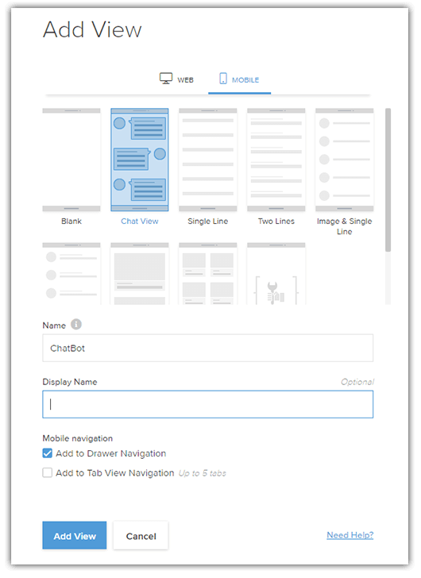
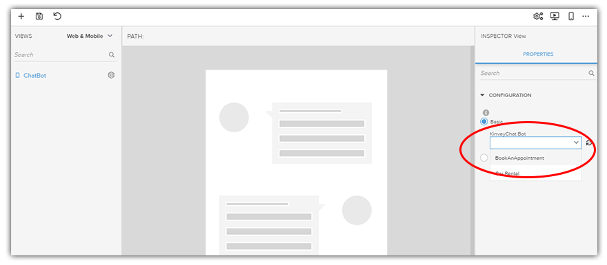
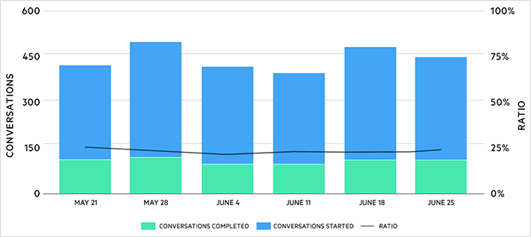

# Easily Add a Self-Service Chatbot to Your Mobile App with Kinvey

Mobile phones are dead. Well, ok, they aren't *dead*, but the traditional way we look at the mobile app *user experience* is changing rapidly.

While the days of master/detail listviews to display parent/child relationships of data are far from over, customers are demanding more engaging (and more efficient) experiences from your apps. This is especially true when it comes to the tedium of data entry and handling repetitive customer service questions.

[Chatbots](https://www.progress.com/blogs/what-is-a-chatbot) are widely considered one of the next great paradigms of user interaction.

Chatbots provide value on every side of the equation:

- App **consumers** love chatbots for their ease of use (and not having to wait to speak to a human 🗣️).
- App **developers** love chatbots for their ease of development and deployment (saving ⏲️).
- App **executives** love chatbots for the time and money saved by not staffing a full suite of customer service agents.

Let's take a look at how the [Progress Kinvey](https://www.progress.com/kinvey/) platform can enable your developers to quickly and easily add a chatbot to your iOS and Android mobile app.

## Introducing Kinvey Chat

[Kinvey Chat](https://www.progress.com/kinvey/chat) (formerly known as "NativeChat") is a key component of Progress Kinvey. Kinvey Chat relies on artificial intelligence (AI) to power purpose-built chatbots for transactional use cases.

In a nutshell, this means you can construct scenarios with Kinvey Chat to address virtually any type of "self-service" use case you desire. For instance:

- Do you want to train a chatbot to respond to customer service inquires? ✔️
- How about guiding your app users to make a purchase from a catalog, rent a car, or sign up for insurance? ✔️
- Ever want to triage requests **before** they get to a real person and optimize their workflow? ✔️

All of this, and more, can be accomplished with Kinvey Chat.

An added bonus is the Kinvey Chat *developer* UI, which is entirely web-based, providing a robust editing environment along with useful code completion of chat configuration options. There is also a fully-featured chatbot testing console:

> Interested in creating your own chatbot with Kinvey Chat? Try our [comprehensive getting started tutorial](https://www.progress.com/kinvey/chat/chatbot-tutorial)!

Kinvey Chat enables multiple deployment options as well:

- Do you want a chatbot deployed to your **website**? 
- How about deployed to **Facebook Messenger**?
- Maybe **Viber**? 
- How about an iOS and/or Android **mobile app**?

No worries - Kinvey Chat handles all of these!

Now let's see how we can easily handle this last scenario - deploying our chatbot to a native iOS and Android mobile app.

## Introducing Kinvey Studio

With a chatbot configured and tested with Kinvey Chat, the next obvious question is *how* we get this chatbot deployed to the appropriate channel. This is where the power of [Kinvey Studio](https://www.progress.com/kinvey/studio) comes into play.

Kinvey Studio (another component of the Progress Kinvey platform) is a desktop application for macOS and Windows that works *with* your developer's current workflow to enable highly productive creation of both web *and* native mobile apps from a **single shared JavaScript codebase**.

[Kinvey Studio provides a visual development UI](https://www.progress.com/blogs/visually-drag-and-drop-your-way-to-a-native-mobile-app) - combining the best of **pre-configured page templates** with a **fully customizable drag-and-drop UI builder**.

Normally when you say those phrases out loud, developers cringe. Why? Because smart developers are afraid of code that is generated for them! Kinvey Studio was built with this in mind though. Code generated by Kinvey Studio is not only clean and easy to read, but also fully customizable and **editable outside of the tool**:

	//-------------------------------------------------------------------------
	// Write your custom logic for ListViewViewComponent here.
	// Changes to this file are preserved when the app regenerates.
	// Find more information on https://devcenter.kinvey.com/guides/studio-extension-points.
	//-------------------------------------------------------------------------
	import { Inject, Injector } from '@angular/core';
	import { ListViewViewBaseComponent } from '@src/app/modules/chat/list-view/list-view.base.component';
	
	export class ListViewViewComponent extends ListViewViewBaseComponent {
	    constructor(@Inject(Injector) injector: Injector) {
	        super(injector);
	    }
	}

> This means Kinvey Studio hits that developer-approved sweet spot between productivity and developer acceptance.

## Adding a Chatbot with Kinvey Studio

Adding a chatbot to your mobile app with Kinvey Studio couldn't be easier. Since mobile apps created with Kinvey Studio are built on the [popular open source NativeScript framework](https://www.nativescript.org/), Kinvey Chat chatbots can be **easily integrated on both iOS and Android simultaneously**.

To start this process in Kinvey Studio, your developers will simply choose to create a new view (or page) of the mobile app based on a Kinvey Chat template:

Next, in the UI provided, they will simply select the Kinvey Chat chatbot they want to include on that view:

From here, the app can be built and deployed to any mobile device (iOS or Android, it doesn't matter with Kinvey Studio!).

**Let's be clear though:** You don't have to use Kinvey Studio to add a chatbot to your web or mobile app, we just make it easier!

> If you're interested in reading more about other chatbot deployment options, check out the [Kinvey Chat docs](https://docs.nativechat.com/).

## Proof of Success

Chatbots are only worthwhile if you can prove their success with reliable metrics. This was a key consideration we confronted head-on when designing Kinvey Chat. This is why comprehensive analytics are included by default with every chatbot you create.

With these built-in analytics you can easily track user engagement, retention, and conversation accuracy to ensure your chatbot is performing as you need, solving the problems you set out to solve.

## Summary

[Kinvey Chat](https://www.progress.com/kinvey/chat) is an easy way for businesses of all sizes to quickly modernize and add immediate efficiency to slow, "human-bottlenecked", processes. By adding in the value of [Kinvey Studio](https://www.progress.com/kinvey/studio), app developers can take advantage of high productivity capabilities and go to market faster, with fewer bugs, and unmatched developer experiences.

**Ready to see what Kinvey Chat can do for you and your business?** Try our [getting started tutorial](https://www.progress.com/kinvey/chat/chatbot-tutorial) or reach out to one of our experts for a [comprehensive demo](https://www.progress.com/kinvey/chat/contact).

