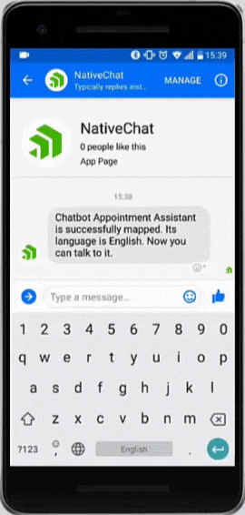
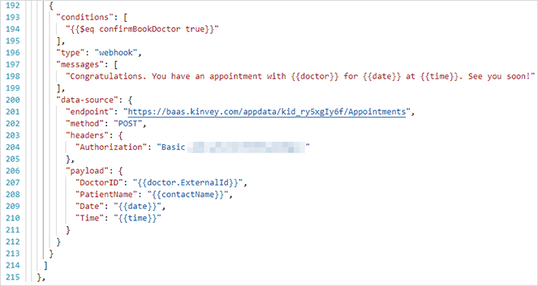
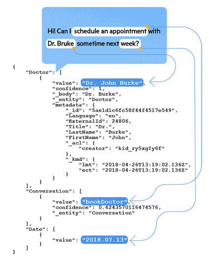

# Replace Complex Mobile Workflows with Chatbots

Creating forms for users to input data on a mobile device is easy for developers, but the end user experience can be incredibly tedious. With our fat fingers and tiny screens, it's easy to see how our users can get thrown off by having to wade through countless fields and never-ending pages.

What if we could simplify this? What if we could easily build a conversational UI that only asks the person what the app needs, when it needs it? And how about instead of entering text over and over, you could provide intelligent shortcuts, date/time pickers, image selections, and default replies?

**Interested?** Welcome to Progress Kinvey and [Kinvey Chat](https://www.progress.com/kinvey/chat)!

**Kinvey Chat works with NativeScript** to provide an innovative artificial intelligence-driven channel powered by the Kinvey Platform for rapidly creating and deploying purpose-built chatbots for transactional use cases.

> Attend our webinar on "The Future of Mobile User Experience" coming up on May 21st! [Register here for free.](https://www.progress.com/campaigns/kinvey/Chatbots-The-Future-Webinar?utm_medium=internal-banner&utm_source=nativescript-blog)

*Let's see one in action:*

While chatbots have certainly been around for a while, Kinvey Chat breaks down some of the barriers presented by other chatbot providers.

*For example:*

## Challenge: "A chatbot with text-only inputs defeats the purpose..."

*"Delivering a superior conversational experience with text-only messages or the simple UI offered by channel vendors is a daunting task."*

**Solution:** Kinvey Chat provides rich, specially-designed UI components for conversational interaction that makes it easy to select dates, times, or items.

- Quick Replies
- Date Pickers 
- Time Pickers
- Rich Selections
- Login Forms

## Challenge: "Publishing a chatbot is a huge issue for us..."

*"Deploying a chatbot to both web and mobile platforms is a massive struggle for my dev team. Not only that, but we can't rely on the security of social channels such as Facebook, Slack or Viber might fail to comply with existing data regulations."*

**Solution:** Kinvey Chat supports deployment to NativeScript, iOS, Android, web, Viber, and Facebook Messenger. You can also build your own private and secure channels using a set of SDKs and ready-to-use components.

## Challenge: "Chatbots don't feel quite right..."

*"Having a natural-sounding conversation requires the bot to know and remember a lot of data about the users and their conversations."*

**Solution:** Kinvey Chat securely stores each interaction with a user in its short- and long-term memory. That can be used to suggest values in subsequent conversations or even to skip some steps. Developers using Kinvey Chat rely on declarative programming where they describe what data they want to extract from a conversation rather than how. The actual conversation flow is controlled by the cognitive algorithms of Kinvey Chat, which produce natural conversations with users.

## Challenge: "Training a bot is tedious..."

*"Training a bot to converse about existing business entities often requires duplicating data and lengthy training processes."*

**Solution:** Kinvey Chat supports dynamic training on top of existing enterprise data through web services from Salesforce, Workday, Zendesk or any other enterprise product.

- Traits by Wit.ai
- Dynamic Training
- Static Training
- Keywords
- Synonyms
- Regex

## Learn More at Our Webinar

If you're interested in learning more about how you can use NativeScript with Kinvey Chat, attend our free webinar on May 21st. [Just sign up here!](https://www.progress.com/campaigns/kinvey/Chatbots-The-Future-Webinar?utm_medium=internal-banner&utm_source=nativescript-blog)