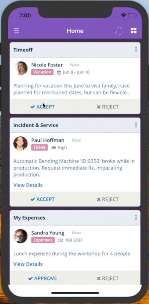
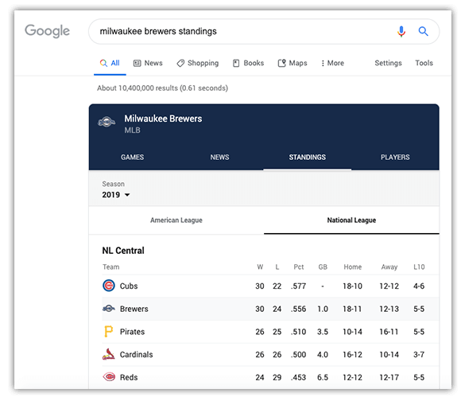

# Creating Microapps with NativeScript

Microapps is an incredibly hot topic right now. But for some of us maybe it's got that feel of a fad that if we just ignore it, maybe it'll pass us by and we'll be better for it in the end.

Now I said that about the first iPhone, and here we are 😅.

The thing is, microapps are not a new concept at all. In fact, the very existence of microapps is derived from core software principles of creating small, testable, reusable components that perform specific tasks as part of a larger workflow.

> Learn all about creating microapps with NativeScript [at our webinar on Tuesday, June 4th](https://www.progress.com/campaigns/kinvey/webinar-post-app-world-microapps?utm_medium=internal-banner&utm_source=nativescript-blog)!

It's probably first best to define just *what* exactly a microapp even is.

## What *is* a Microapp Anyway?

A microapp is just like any other app on your mobile device, except it’s focused on performing one task, and performing it efficiently. Think of having one master (container) app on your device, which is comprised of multiple "microapps" that perform specific functions unique to your users' needs.

*For example, here is a microapp container which allows for multiple, distinct, pieces of key functionality in one user-friendly (and secure) place:*

> Read more in this article on [What is a Microapp?](https://www.progress.com/blogs/what-is-a-microapp)

But again, microapps are not a new thing at all. You've likely used Google's array of microapps when browsing for sports team standings or booking a flight:

Back in the day, we also had web portals with "portlets" that were effectively microapps in and off themselves!

## The Microapps Advantage

But even knowing (roughly) what a microapp is doesn't necessarily mean we instantly see the advantages:

### Advantages for the Business

From the business perspective, there are immense efficiencies to be realized when you minimize your app footprint. Take for instance a company that has 10-20 mobile apps for its employees to use. Maybe they include Workday or Service Now or Zendesk or Salesforce or Box and every custom-built app imaginable for unique business needs. That's a lot of apps to maintain and/or provision to employees.

Next consider the functionality that the average employee is using in each app. They use, what, 5-10% of the features provided due to varying roles and responsibilities?

What if you could distill unique pieces of functionality from each app, creating smaller, more maintainable apps, and then easily provision access to those microapps based an individual's role? The advantages quickly add up:

- A more secure environment for apps, and much easier to provision/de-provision;
- Less employee time spent finding functionality they need and managing apps in BYOD situations;
- Far less time spent creating and managing net new mobile apps, which brings us to the advantages for the developers: 

### Advantages for the Developer

As mobile app developers, we are used to a certain amount of ceremony for each mobile app we create. This boilerplate generally involves, in no particular order:

* Configuring authentication
* Managing online/offline data sync
* Setting up push notifications
* Metadata management
* Configuring app monitoring and device logging
* Setting up crash analytics
* Provisioning the app to end users
* Generating the app UI
* Branding and theming the app
* Building the app's business logic
* Submitting the app for approval
* Updating the app with point releases

😭

However, with a microapps platform like [Kinvey Microapps](https://www.progress.com/kinvey/micro-apps), we can **dramatically simplify this**. Instead of performing the above tasks for *every* app we create, these become one-time tasks which then involves the following for each additional microapp we add to the master/container app:

* Generating the app UI
* Building the app's business logic

😄

This means **developers get to focus on the fun part**, not the tedious ceremony and configuration of developing full-blown mobile apps time and time again! Not to mention, you can also leverage existing legacy web apps in a microapps environment.

*Curious to learn more...?*

## Join the Webinar

Learn all about developing and provisioning microapps (with a variety of pre-built templates and/or with NativeScript) at our [free online webinar coming up on Tuesday, June 4th](https://www.progress.com/campaigns/kinvey/webinar-post-app-world-microapps?utm_medium=internal-banner&utm_source=nativescript-blog).

*Specifically we will dive into:*

* What exactly is a microapp?
* What is the business case for microapps?
* A full demonstration of the Kinvey Microapps platform
* How NativeScript fits into the equation

[Register for the Webinar](https://www.progress.com/campaigns/kinvey/webinar-post-app-world-microapps?utm_medium=internal-banner&utm_source=nativescript-blog)