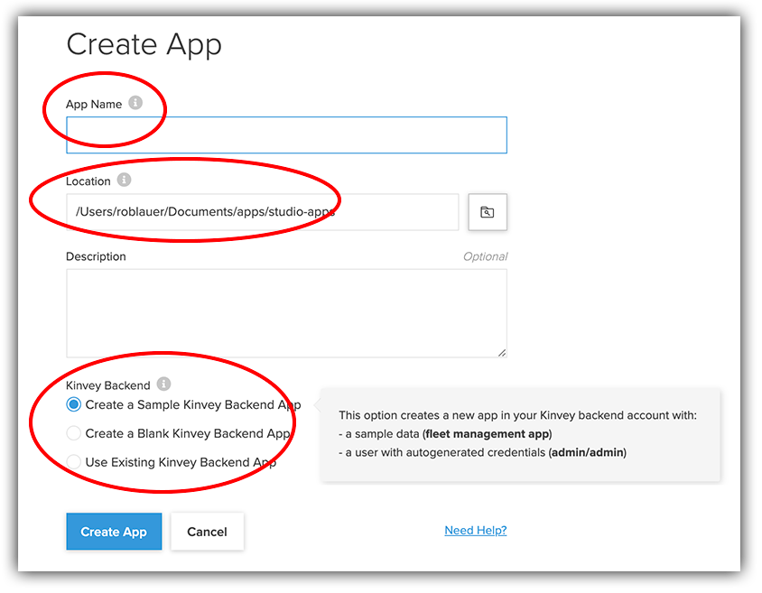

# Step-by-Step Guide to Building a Web, Mobile, and Chat App: Part One

Today's definition of an "app" is vastly different than it was a few years ago. What used to just target desktop web or just phones or tablets has evolved into adapting the *same experiences* across multiple, distinct desktop and mobile devices. Even the term "mobility" has evolved from just native iOS or Android apps to wearables like Apple Watch or WearOS devices. Add in new engaging customer-focused options like chatbots, and creating an "app" can leave us with our heads spinning.

So today we have a very basic set of problems. We are developing more apps than ever before. We are maintaining more legacy apps than ever before. And new apps have multiple potential deployment targets, devices, and screen sizes. How do we get this done, with fewer resources to spend, in the same amount of time?

This exact issue is one that Progress has been laser-focused on for some time now. Let me introduce you to Progress Kinvey - a developer-focused high productivity app development platform built to make your life as a developer easier.

## What is Progress Kinvey?

Marketing blurbs like "low code" and "high productivity" aside, Kinvey's primary aim is to make developers more productive and more successful using the skills (and time!) they have right now. At its core, Kinvey is a Mobile Backend as a Service (commonly referred to as an mBaaS). And Kinvey has been quite successful as an enterprise mBaaS, offering numerous distinguishing features such as:

- Turnkey compliance and security offerings such as HIPAA and SOC2;
- Numerous data connectors for cloud and on-premise databases to allow you to quickly modernize legacy data stores;
- A variety of supporting SDKs, allowing developers to use the languages and frameworks they already know;
- And unique capabilities like Kinvey Studio, Kinvey Chat, and Kinvey Microapps.

In this guide, we will be looking more closely at Kinvey Studio (and Kinvey Chat to an extent) to show us how we can rapidly build powerful web, mobile, and chat apps in a shared project, with shared code, but still using the same languages, frameworks, and tools that are part of our existing development workflow.

## And What is Kinvey Studio...?

Sorry, let's not get too far ahead of ourselves! As mentioned previously, Kinvey Studio is a piece of the Kinvey platform. Kinvey Studio is a desktop application (for both macOS and Windows) that allows you to initialize a web and native mobile app, add a variety of web and mobile views/pages, drag-and-drop individual UI components onto a canvas, tie your UI elements to real data, and preview or even publish to real devices.

Now admittedly that's a lot to unpack!

It's important to note that Kinvey Studio isn't your traditional "low code" offering. Most "low code" or "no code" tools are hamstrung by one or more of these issues:

1. The code they generate is, well, ugly!
2. They force you into a completely new workflow.
3. The vendor locks you into the system.

> Check out this on-demand webinar on real world usage of Kinvey Studio to create a web, mobile, and chat app!

As we will see throughout this guide, Kinvey Studio avoids all of these issues. By generating clean and legible code, allowing you to work in your toolchain of choice, and NOT locking you in, Kinvey Studio sets itself apart from the pack.

## Underlying Technology

As developers, the first thing we want to know about tools like this is: "What are the magical languages and frameworks backing up these apps that I'm creating?". You'll be pleased to know that apps built with Kinvey Studio are based on mature and open source frameworks such as:

- Kendo UI for creating responsive web apps (and PWAs);
- NativeScript for building truly native mobile apps for both iOS and Android;
- Angular for providing the core framework and link between your web and mobile apps.

IMAGE

## Let's Build an App!

Now that you have at least a rough idea of what Kinvey Studio is, and what you can build with it, let's start by creating a new web, mobile, and chat project!

Go ahead and download Kinvey Studio from studio.kinvey.com. You'll note that you have to sign up for a (free) Kinvey account.

IMAGE

> Note that Kinvey offers a completely free ??? offering that you can use for this tutorial.

With Kinvey Studio installed, your environment should be set and ready to start.

### Initialize an App

Your next step is to create a new app. So let's highlight a few areas of interest:

Your app name can be whatever you want of course. Likewise you'll note that all of **your profile files are stored locally**.

> This is a key point: apps created with Kinvey Studio are stored locally, allowing you to use existing collaboration tools like GitHub and existing code editors like Visual Studio Code!

### Your App's Data Source

Apps built with Kinvey Studio are, of course, based on data. And Kinvey Studio allows you to leverage existing data stored in Kinvey (which again, could be a series of Kinvey collections or your own on-premise or cloud-based data).

> What is a Kinvey collection? You can think of it as a database table or view.

Today we are going to start simple by choosing the built-in sample data collection provided.

Here is a view of the data in our Kinvey console:

IMAGE

When you're satisfied, click "ok" and your app will be generated! Note the small progress meter in the bottom-right corner:

IMAGE

This shows you the background tasks involved with a first-time app initalization. It's downloading and installing packages from npm in the background while letting you start to build your app right away.

## The Final Product

What's that? We haven't really even started!

I hear you. Before we go any further it'll be a good idea to get some frame of reference for what we are actually building. Today we are going to build a ???.

IMAGE

The **web app** will act as an internal-facing interface to our data; providing full CRUD capabilities and a dashboard of information.

The **mobile app** will be our public-facing option, allowing end users with a "master detail" interface to browse and view detailed info.

Finally, the mobile app will also include a **chatbot** allowing end users to ask a simple question about one of the cars.

## What's Next?

So far you've successfully initialized a new web, mobile, and chat project. And you should have a decent understanding of the app we are going to build!

In the next part, we will look at fleshing out the complete web app and follow it up with the mobile and chat components.