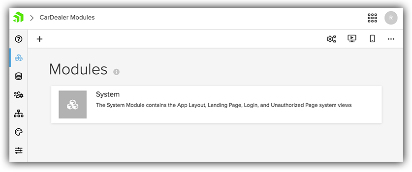
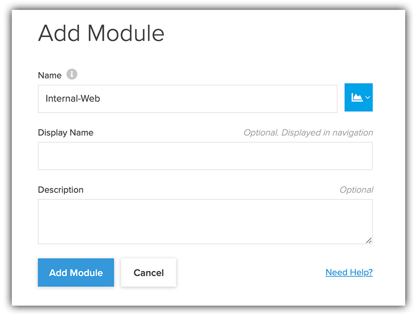
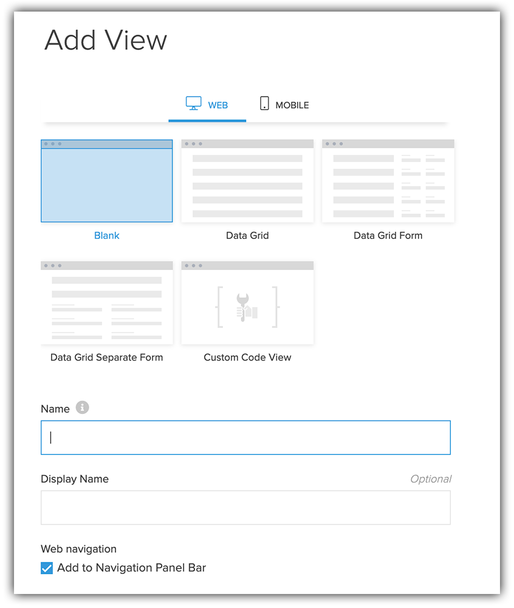
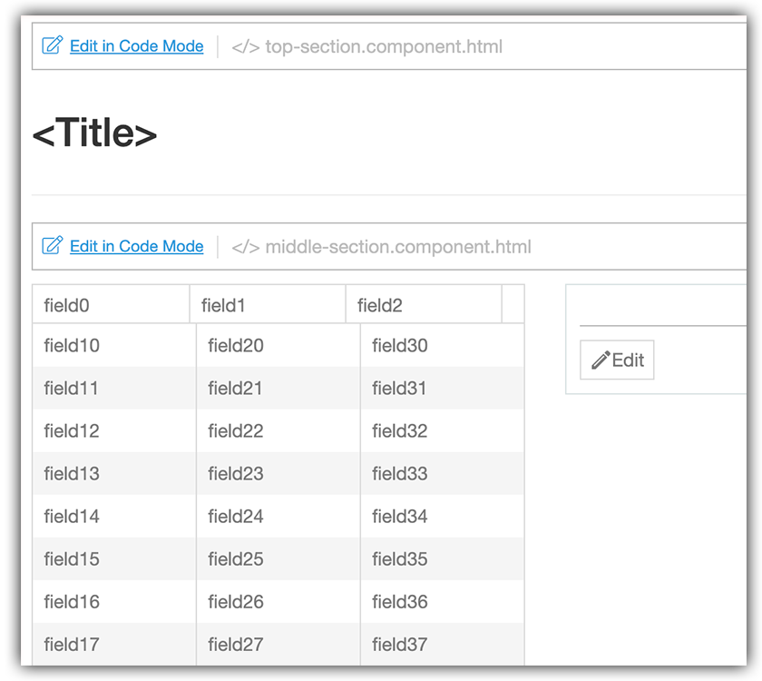
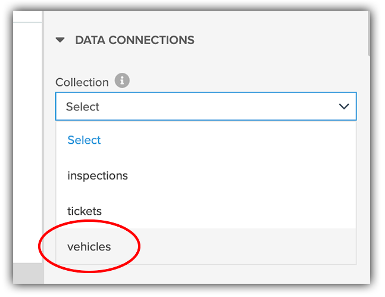
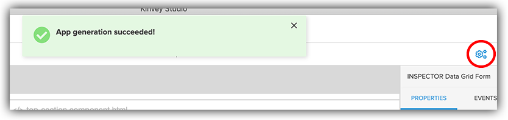
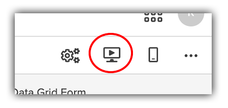

# Step-by-Step Guide to Building a Web, Mobile, and Chat App: Part Two

As we covered in part one of this series, apps today are more than just web or mobile. They are more complicated than ever before, with more capabilities (and opportunities) than we could have envisioned even just a few short years ago.

But Progress Kinvey and Kinvey Studio are here to offer some clarity, and enable web and mobile developers to create those engaging experiences your users have come to expect.

So part two (that's today!) is where we dive into the web side of our car dealer app.

## What's a Web App without a Grid?

With our Kinvey Studio project initialized, it's time to start the real development of our app.

> If you skipped part one, be sure to go back and follow the steps we used to initiate our project in Kinvey Studio!

The first screen we will see in Kinvey Studio talks about "modules". What the heck is a module?

You can think of a module as a high level view of a specific component of your app. It's effectively a folder that is a logical grouping of related pages (or views) of your app.

The default `System` module contains global styling and headers/footers of your app. (We'll come back to look at the `System` module in more detail later.)

For now, let's create a new module called `Internal-Web` (as this will be the internal-facing, web-based component of our app) by clicking on the "+" icon in the upper left corner of Kinvey Studio:

> In a real app, you'll probably get a little more granular with your module names, but this will suit this relatively simple app just fine!

With the module created, we can now start creating some pages/views in our web app.

Click to open the `Internal-Web` module. Then click the little "+" icon to add a new view to your app:

And as the title of this section states, what IS a web app without a grid!? In the "web" tab you can see the variety of web-based views that we can utilize. Let's quickly break down our options:

- Blank: A "blank" view is just that, an empty view that you can customize to your heart's content with any layouts and UI components you need. We will come back to this view shortly.
- Data Grid: The basic "data grid" is a grid-based display of a data collection (using the powerful Kendo UI grid component).
- Data Grid Form: This grid option includes the same Kendo UI grid, but also includes a more fully-featured editing window alongside the grid.
- Data Grid Separate Form: Again, including the same Kendo UI grid, this view instead opens the editing window in a separate view????????
- Custom Code View: ?????

So let's choose the "Data Grid Form" view, name it simply `CarList`, and add it to our app. With the view saved, you'll then get your first glimpse at the visual design canvas provided by Kinvey Studio (with some of the UI components mocked up):

Now this admittedly isn't the prettiest output we could image, but that's mostly because the view has no idea what the underlying data is!

So the next task to do is associate this view with a specific set of data from the data source we chose when we first initiated the app. In our case we are going to use the `vehicles` collection to load up a list of cars from the view's property panel on the right:

You'll notice after the data collection is chosen, the grid in our canvas automatically updated to reflect the data types found in that collection.

At this point why don't we go ahead and fire up this app?

Anytime you make a change in Kinvey Studio, you'll want to use the "generate" button. This will save your changes and *generate* the meta data that powers your app:

With your app saved, you can now deploy it to a local web browser by clicking on the "Start Dev Server" button:

Now you'll have to wait a bit. This one-time step uses the Angular CLI to compile your app and deploy it to your web browser. Luckily, once this is complete, you'll see how we can take advantage of *fast automatic reloads* of the app in the browser whenever we make changes.

With your app deployed to a browser, you'll next have to login. The default credentials for logging in are just `admin/admin`. Very secure right! This is just for ease of initial development of course.

When you deploy this app for real and need added security, you're in luck. Since Kinvey Studio apps are built on top of the mature mBaaS provided by Kinvey, you can also take advantage of Mobile Identity Connect (MIC).

### Sidebar: Mobile Authentication

What is MIC? MIC allows you to leverage your existing enterprise authentication provider in your web and mobile apps. Using Active Directory? By copying-and-pasting some basic configuration options into Kinvey, you can use the same provider without re-writing anything.

MIC allows you to take advantage of:

- Active Directory
- ssomethign else

For a more comprehensive look at MIC, please consult this resource.

### Back to the App!

After logging in with `admin/admin`, your web app should look something like this:

IMAGE

Hmmm...the functionality is there, but it's a bit crowded to say the least!

## Customizing the Grid

Let's now look at how we can customize the display of grid columns, and even alter how the data is displayed in the grid itself without having to touch any code.

Back in Kinvey Studio, click on the ???? link. This will bring up the ??? editor. Go ahead and move all items into the "excluded" columns section, making sure to leave ??? and ??? available. This will hide them from the grid view, providing a much cleaner experience.

IMAGE

Before we continue though, I'd really like to alter the display of the data in the column.

TODO!!!!! maybe also open the app up in VS Code? also sorting/filtering

With those edits in place, let's look at some of the other options provided by Kinvey Studio. In the properties pane, you can scroll through and see all of the one-click options you have to customize the grid. For now, let's focus on the options towards the bottom. We can easily add `sorting` and `filtering` options with just one click, again without touching code:

IMAGE

Now that we have added some Angular templates to our app and customized the grid itself, let's take a look at the display now (remember to click the ??? button to re-generate your app!):

IMAGE

Much better.

As a user of the app, you'll see:

- a cleaner display of the data;
- the ability to sort and filter the data;
- full CRUD capabilities to add, modify, and delete data elements at the click of a button!

## Creating a Dashboard

With our web-based grid complete, let's get a little fancier and add some charts! Here is what we are going to build next, a simple pie chart exposing ???

IMAGE

### Create a New Kinvey Collection

The only trick here is that need to create a new collection in our Kinvey console to display this data.

> NOTE: This is a limitation of Kinvey Studio at the time of this writing! Future iterations will make binding chart elements to data much simpler.

With your Kinvey console open, view all collections, and then click to add a new collection:

IMAGE

You can name this collection "???". To populate the data, I've provided you some sample `json` that you can use (download it here). Go to the "Import" option and simply select the downloaded `json` file. And with that your collection is complete!

IMAGE

Back in Kinvey Studio, you'll need to head to the "Collections" menu option and click to "Sync Collections":

IMAGE

This will make sure those changes we just made in our console are now available to our Kinvey Studio project.

### Create the Chart

Back in the ??? module, go ahead and create a new web view. But this time, choose the "Blank" template option.

IMAGE

This is where the power of Kinvey Studio really shines! With a blank canvas you can drag-and-drop UI components and layouts to fully customize views before you work on the backend "plumbing" of the app. This allows for a true WYSIWYG experience.

IMAGE/GIF

We will keep this simple for now by dragging a `Label` element and a `Pie Chart` element onto our canvas (one after the other). The result should look like this:

IMAGE

Next we need to associate this view with the Kinvey data collection we just created. In the "View's Data Sources" pane, click to add a new data source, choosing the collection we just created:

IMAGE

Next, click the pie chart itself in the canvas, and make sure that "Data Service" is selected:

IMAGE

Finally, click the "Edit Chart Series" link (this will allow us to associate the specific columns of data from our collection appropriately to our app). Click to "Add Item" in this new window, and in the "Item Field" choose `???` and in the "Item Category Field" dropdown choose `???`.

Save your changes, and your pie chart configuration should be complete!

With those steps done, make sure you save your changes with the generate app button, head back to your browser, click on the "Dashboard" link in the navigation menu, and see your glorious chart!

## What's Next?

With our basic web functionality complete, let's shift gears in part three and look at how we create the mobile and chat components of our app.