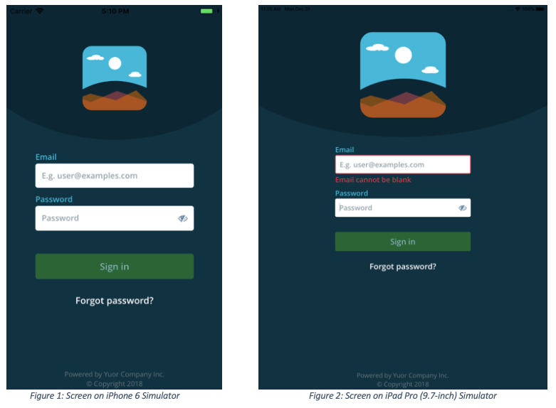
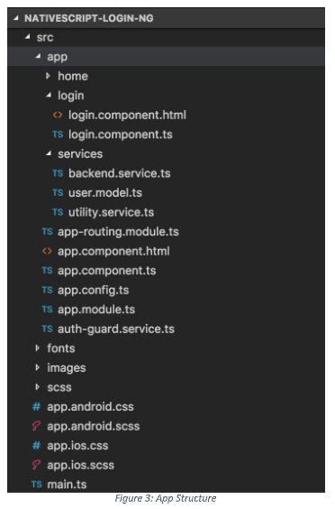

# Building Login Functionality for NativeScript Apps

Forms are an integral part of mobile apps. They provide the basis for user interactions such as sign-in, signup, and search. Therefore, forms can play a key role in enhancing user experience.

In this article, we will develop a login form in [NativeScript](https://nativescript.org/) with the [Angular framework](https://www.nativescript.org/nativescript-is-how-you-build-native-mobile-apps-with-angular), keeping in mind some of the best practices of design. These best practices can be extended to design other sorts of form. We'll later extend login form to add Progress Kinvey as a backend service.

Here is a view of the login screen, which we'll build in this article. Figure 1 shows the login screen on the iPhone 6 emulator; Figure 2 shows the screen on the iPad Pro (9.7-inch) emulator.

## App Structure

Figure 3 shows a part of the app folder structure.

The following code snippet defines the routes for the app. As you can see, the default route, `/home`, is guarded for authentication (AuthGuard). We'll come back to AuthGuard later in this article.

**src/app/auth-guard.service.ts**

	import { NgModule } from "@angular/core";
	import { NativeScriptRouterModule } from "nativescript-angular/router";
	import { Routes } from "@angular/router";
	import { LoginComponent } from "./login/login.component";
	import { HomeComponent } from "./home/home.component";
	import { AuthGuard } from "./auth-guard.service";
	
	const routes: Routes = [
	    { path:"", redirectTo:"/home", pathMatch:"full" },
	    { path:"login", component:LoginComponent },
	    { path:"home", component:HomeComponent, canActivate: [AuthGuard] },
	];
	
	@NgModule({
	    imports: [NativeScriptRouterModule.forRoot(routes)],
	    exports: [NativeScriptRouterModule]
	})
	
	export class AppRoutingModule { }

## Build the User Interface

Here, we'll stay focused on creating the form fields and on implementing validation.

The following is our user model. We'll use the user model to bind the email and password fields of the login form.

**src/app/services/user.model.ts**

	export class User {
	  email: string;
	  password: string;
	  hasEmail() {
	    return this.email != '';
	  }
	}

Our email field comprises a label ("Email"), text field to accept the user email ID, and message in the case of errors. Since we want to collect the user's email ID, we specify the keyboard type as `email`, which is the appropriate input method.

The snippet for adding an email field is as follows:

**src/app/login/login.component.html**

	<GridLayout row="0" rows="auto, auto, auto">
	
	    <Label class="eloha-font-semibold login-field-label m-b-2 font-size-md" row="0" text="Email"></Label>
	    
	    <TextField row="1" class="eloha-font-semibold login-input-field font-size-md" hint="E.g. user@examples.com" keyboardType=" email" [(ngModel)]="user.email" autocorrect="false" autocapitalizationType="none" (focus)="onEmailFocus()" [ngClass]="{'input-field-error': hasEmailErrors()}"></TextField>
	    
	    <Label *ngIf="hasEmailErrors()" class="eloha-font-semibold m-t-2 login-field-label color-danger font-size-md" row="2" [text]="getEmailError()"></Label>
	    
	</GridLayout>

In addition to showing an error message, we would like to highlight the border of the text field, if the user's input is erroneous.

The following subroutine checks if the user input is null/empty or semantically invalid. In either case, the subroutine returns true.

**src/app/login/login.component.ts**

	public hasEmailErrors() {
		const hasErrorMsg = !!this.emailError;
		    
		if (!hasErrorMsg)
		  return false;
		    
		const isValidEmail = this.user.hasEmail() && this.utilityService.isValidEmail(this.user.email);
		
		let hasError = hasErrorMsg || !isValidEmail;
		
		if (isValidEmail) {
		  this.emailError = ""
		  return false;
		}
		
		return hasError;
	}

Here's how we validate the user input (email) — by using an [existing npm module](https://www.npmjs.com/search?q=email%20validator), instead of writing our own validation code.

**src/app/services/utility.service.ts**

	import { Injectable } from "@angular/core";
	
	// From https://stackoverflow.com/questions/201323/how-to-validate-an-email-address-using-a-regular-expression/201378#201378
	
	const regex:any = /(?:[a-z0-9!#$%&'\*+/=?^_`{|}~-]+(?:\.[a-z0-9!#$%&'\*+/=?^_`{|}~-]+)\*|"(?:[\x01-\x08\x0b\x0c\x0e-\x1f\x21\x23-\x5b\x5d-\x7f]|\\[\x01-\x09\x0b\x0c\x0e-\x7f])\*")@(?:(?:[a-z0-9](?:[a-z0-9-]\*[a-z0-9])?\.)+[a-z0-9](?:[a-z0-9-]\*[a-z0-9])?|\[(?:(?:(2(5[0-5]|[0-4][0-9])|1[0-9][0-9]|[1-9]?[0-9]))\.){3}(?:(2(5[0-5]|[0-4][0-9])|1[0-9][0-9]|[1-9]?[0-9])|[a-z0-9-]\*[a-z0-9]:(?:[\x01-\x08\x0b\x0c\x0e-\x1f\x21-\x5a\x53-\x7f]|\\[\x01-\x09\x0b\x0c\x0e-\x7f])+)\])/
	
	@Injectable()
	
	export class UtilityService {
	    public isValidEmail(email: String) {
	        if(!email)
	            return false;
	
	        return regex.test(email);
	    }
	}

Adding the password field is similar to adding the email field, the only difference being the show/hide ([FontAwesome](https://fontawesome.com/v4.7.0/icons/)) icon to enable users to see what they type.

**src/app/login/login.component.html**

	<GridLayoutrow="1"rows="auto, auto, auto"class="m-t-10">
	
	    <Label class="eloha-font-semibold login-field-label m-b-2 font-size-md"row="0" text="Password"></Label>
	
	    <GridLayout row="1" columns="\*, auto" class="login-password-container" [ngClass]="{'input-field-error': hasPasswordErrors()}">
	
	        <TextField #passwordcol="0" class="eloha-font-semibold login-password-field font-size-md" hint="Password" secure="true" [(ngModel)]="user.password" (focus)="onPasswordFocus()"></TextField>
	
	        <Label col="1" [text]="showHideIcon" class="fa show-hide-icon font-size-lg" (tap)="showHidePassword()" verticalAlignment="middle"></Label>
	
	    </GridLayout>
	
	    <Label *ngIf="hasPasswordErrors()" class="eloha-font-semibold m-t-2 login-field-label color-danger font-size-md" row="2" [text]="getPasswordError()"></Label>
	
	</GridLayout>

The below subroutine is called when the user taps the show/hide icon. It toggles the `TextField`'s secure property off or on, and changes the icon accordingly.

**src/app/login/login.component.ts**
	
	showHidePassword() {
		this.showPassword = !this.showPassword;
		this.showHideIcon = this.showPassword ? this.showIcon : this.hideIcon;
		let passField: TextField = this.passwordField.nativeElement;
		passField.secure = !passField.secure;
	}

We have also added focus binding to the password field. When this field is in focus, we can check the input email field for validity and update the errors if any.

**src/app/login/login.component.ts**

	onPasswordFocus() {
		this.passHasFocus = true;
		this.updateErrors(false);
	}
	
	updateErrors(checkPass) {
		if (this.user.hasEmail()) {
			if (this.utilityService.isValidEmail(this.user.email)) {
				this.emailError = "";
			} else {
				this.emailError = "Invalid Email"
			}
		} else {
			this.emailError = "Email cannot be blank"
		}
		
		if (checkPass) {
			let length = this.user.password.length;
			if (length == 0) {
				this.passError = "Password cannot be blank";
			} else {
				this.passError = "";
			}
		}
	}

Next, we'll add the Submit functionality and name it 'Sign in'. Popups can be annoying at times, so we'll display any error messages inline below the Sign in button.

**src/app/login/login.component.html**

	<GridLayout row="2" rows="auto, auto" class="submit-container">
	
	    <Button row="0" [isEnabled]="isSubmitEnabled()" class="eloha-font-semibold login-submit font-size-lg" text="Sign in"(tap)="login()"></Button>
	
	    <Label *ngIf="hasLoginErrors()" class="eloha-font-semibold color-danger font-size-md" row="1" [text]="getLoginError()"textWrap="true"></Label>
	
	</GridLayout>

The **Sign in** button is enabled only when the user enters a valid email ID.

	isSubmitEnabled() {
		return !this.isAuthenticating && this.utilityService.isValidEmail(this.user.email);
	}

## Tablet Support

We have thus far built a login page for a phone app. Now, let's customize it for the tablet. To be precise, we need to:

1. Adjust the width of the UI controls and the font size.
2. Apply these adjustments dynamically.

First, the app needs to identify if it is on a tablet.

**src/app/services/utility.service.ts**

	import { Injectable } from "@angular/core";
	import { DeviceType } from "ui/enums";
	import { device } from "platform";
	
	@Injectable()
	
	export class UtilityService {
	    public isTablet() {
	        return device.deviceType === DeviceType.Tablet;
	    }
	}

**src/app/login/login.component.ts**
	
	isTablet() {
		return this.utilityService.isTablet();
	}

By default, the controls are stretched to fit the parent. You can customize the width individually for each control or for the parent control, depending upon the design of your form. In our sample app, we adjust the width of the parent container, which has these controls.

**src/app/login/login.component.html**

	<GridLayout row="1" rows="*, auto" [ngClass]="{'login-page-tablet': isTablet()}">

We have used the [NGClass](https://angular.io/api/common/NgClass) directive to configure our CSS class `login-page-tablet` in `_app-common.scss` dynamically.

**src/scss/_app-common.scss**

	.login-page-tablet {
		width: 60%;
	}

To manage the font, we have added tablet-specific classes to our CSS classes in `_app-common.scss`. We have chosen to increase each font-size rule by 5 points for tablets.

**src/scss/_app-common.scss**

	.font-size-sm {
		font-size: 12;
	}
	
	.font-size-sm-tablet{
		font-size: 17;
	}
	
	.font-size-md {
		font-size: 14;
	}
	
	.font-size-md-tablet {
		font-size: 19;
	}
	
	.font-size-lg {
		font-size: 16;
	}
	
	.font-size-lg-tablet {
		font-size: 21;
	}

As you can see, the fonts are larger by 5 points for tablets. Next, we have to figure out a way of applying these differences dynamically.

The following snippet uses the font class, `font-size-md`, which defaults to a font-size of 14, for the email label.

**src/app/login/login.component.html**

	<Label class="eloha-font-semibold login-field-label m-b-2 font-size-md" row="0" text="Email"></Label>

We again use the NgClass directive to apply the CSS class based on the device type, as shown here.

**src/app/login/login.component.html**

	<Label class="eloha-font-semibold login-field-label m-b-2" [ngClass]="{'font-size-md': !isTablet(), 'font-size-md-tablet': isTablet()}" row="0" text="Email"></Label>

Similar changes have to be made to other components of the login page. Then, we'll see the page as desired on a tablet.

## Time to Log in

So far, we have implemented form controls, user validation, and device customizations. Now, we'll add the backend logic to execute the login process. This involves the logic to persist a user session until the user logs out.

In this section, we'll add the backend service, which mimics logging into the backend. In the next section, we'll add the functionality for logging into the [Progress Kinvey](https://www.progress.com/kinvey) backend.

The following code shows our login and logout functionality. In login subroutine, we pass 1000ms and then check if the email and password are the same. You can also choose hardcoded values for email and password and then check against the given values. If they are matched, we are storing the details as treating them as session details. The logout also waits for 1000ms before cleaning the session data and returning.

**src/app/services/backend.service.ts**

	import { Injectable } from "@angular/core";
	import { getString, setString } from "application-settings";
	import { User } from "./user.model";
	
	const _CURRENT_USER = "_CURRENT_USER";
	
	@Injectable()
	
	export class BackendService {
	  public isUserLoggedIn(): boolean {
	    let loggedIn = !!this.user;
	    return loggedIn;
	  }
	
	  public login(user: User) {
	    let that = this;
	    return newPromise(function (resolve, reject) {
	
	      setTimeout(() => {
	        if (user.email === user.password) {
	          that.user = JSON.stringify(user)
	          resolve();
	        } else {
	          reject({ message:'Invalid Email/Password, For this example both should be same.' })
	        }
	      }, 1000)
	    });
	  }
	
	  logout() {
	    let that = this;
	    return newPromise(function (resolve, reject) {
	      setTimeout(() => {
	        that.user = "";
	        resolve();
	      }, 1000)
	    });
	  }
	
	  private getuser(): string {
	    return getString(_CURRENT_USER);
	  }
	
	  private setuser(theToken: string) {
	    setString(_CURRENT_USER, theToken);
	  }
	
	}

Next, let's tie this logic to our login, which is invoked when the user taps the **Sign in** button.

The following snippet shows the code for performing login. Upon successful login, the user arrives at the home page/screen `/home`. Note that we are clearing the router navigation history. This is to prevent the user from navigating back to the login screen using the Back button on the device.
	
	login() {
		this.updateErrors(true);
		if (this.isValidForm()) {
		  this.isAuthenticating = true;
		
		  // Use the backend service to login
		  this.backendService.login(this.user)
		    .then(() => {
		      this.isAuthenticating = false;
		      this.routerExtensions.navigate(["/home"], { clearHistory:true });
		    }).catch(error=> {
		      this.isAuthenticating = false;
		      this.loginError = error.message;
		    });
		}
	}

## Auth Guard

Recall that we have guarded the `/home` route, so that the user is taken to the home page only if the login succeeds.

An [Angular route](https://angular.io/api/router/Route) can be configured with the `CanActivate ` property by implementing the [CanActivate](https://angular.io/api/router/CanActivate) interface to decide whether the route can be activated.

The following lines of code show our implementation of auth guard. The implementation depends on the `isUserLoggedIn()` method defined in our backend service.

If the user has logged in, the configured route is activated. Otherwise, the user is redirected to the login screen.

**src/app/auth-guard.service.ts**

	import { Injectable } from "@angular/core";
	import { CanActivate } from "@angular/router";
	import { BackendService } from "./services/backend.service";
	import { RouterExtensions } from "nativescript-angular/router";
	
	@Injectable()
	
	export class AuthGuardimplementsCanActivate {
	    constructor(privatebackendService: BackendService, privaterouterExtensions: RouterExtensions) { }
	
	    canActivate() {
	        if (this.backendService.isUserLoggedIn()) {
	            return true;
	        } else {
	            this.routerExtensions.navigate(["/login"]);
	            return false;
	        }
	    }
	}

So far, we have added a dummy login functionality to our NativeScript app. You can check out the [master](https://github.com/sajjaphani/nativescript-login-ng/tree/master) branch for the source code. In the next section, we will set up Progress Kinvey as the backend.

## Configure Progress Kinvey

[Kinvey](https://www.progress.com/kinvey) is a serverless platform and Backend as a Service (BaaS) provider, which makes it easy for developers to set up and use cloud backend for their mobile apps. In this section, we will configure our app to use Kinvey as a BaaS.

To set up Kinvey as a BaaS, we need to:

1. Create a Kinvey app.
2. Add a user for the Kinvey app.
3. Add the Kinvey NativeScript SDK to the mobile app.
4. Configure the mobile app with details of the newly created Kinvey app details.
5. Modify the backend logic.

### Task 1 — Create a Kinvey app

1. Navigate to the [Kinvey console](http://console.kinvey.com/).
2. If you are a first-time user, sign up with Kinvey to create your user account.
3. Log into the Kinvey console using your user account details.
4. Create the Kinvey app.
5. Navigate to the App dashboard.
6. Right-click your username in the top-left corner on the dashboard.
7. Make a note of the App Key and App Secret. We'll need these details to configure our NativeScript app.

### Task 2 — Add a user for the Kinvey app

In Kinvey, we can manually register a new user for our app by navigating to **Identity -> Users** from the App dashboard.

As we add a new user, we must enter a valid email ID in the username field. This is because our NativeScript app expects an email ID!

### Task 3 — Add the Kinvey NativeScript SDK to the mobile app

We can run either of the following commands to add the Kinvey NativeScript SDK as a plugin to our mobile app:

	npm install --save kinvey-nativescript-sdk

or

	tns plugin add kinvey-nativescript-sdk

### Task 4 — Configure the NativeScript app with details of the Kinvey app

Now, we need to configure the NativeScript app with the **App Key** and the **App Secret**, which we obtained in **Task 1, Step 7**. This involves creating the `app.config.ts` file with the following code:

From the Kinvey app you previously created. Go ahead and create the file `src/app/app.config.ts` as shown in the below code snippet and replace the values for `appKey` and `appSecret` with the values you obtained from your Kinvey app.

**src/app/app.config.ts**

	// Configure Your Kinvey App Here
	
	export const appConfig = {
	    appKey:'your_app_key',
	    appSecret:'your_app_secret'
	}

Add the **App Key** and the **App Secret** as the values of the `appKey` and `appSecret` properties in the code snippet.

Next, we need to initialize the Kinvey SDK with the NativeScript app details. In the following code snippet in the `src/main.ts` file, we initialize the Kinvey SDK by calling `Kinvey.init(appConfig)`, which is how we pass the app configuration.

**src/main.ts**

	import { platformNativeScriptDynamic } from "nativescript-angular/platform";
	import { Kinvey } from'kinvey-nativescript-sdk';
	import { AppModule } from "./app/app.module";
	import { appConfig } from'./app/app.config';
	
	Kinvey.init(appConfig);
	
	platformNativeScriptDynamic().bootstrapModule(AppModule);

As you can see, we initialize the SDK before bootstrapping the app module.

### Task 5 — Modify the backend logic

The final step is to modify our backend logic for logging in and out. We will use the Kinvey SDK to perform the actual login and logout operations with the Kinvey backend, as follows:

**src/app/services/backend.service.ts**

	import { Kinvey } from'kinvey-nativescript-sdk';
		
	public login(user: User): Promise<any> {
		let _user: Kinvey.User = Kinvey.User.getActiveUser();
		if (_user) {
		  return_user.logout()
		    .then(() => this.performLogin(user));
		} else {
		  return this.performLogin(user);
		}
	}
		
	logout() {
		return Kinvey.User.logout().then(() => {
		  this.user = "";
		});
	}
		
	private performLogin(user: User) {
		return Kinvey.User.login(user.email, user.password).then((_user: any) => {
		  this.user = JSON.stringify(_user)
		});
	}

> **Note:** If the app is reinstalled with the user logged in, attempts to log in will encounter the error, 'An active user already exists'. This is just one way to handle an error. You can you're your own error-handling mechanism.

### Forgot Password

If you take a quick look at Figures 3 and 4, you will see the label 'Forgot password?' just below the Sign in button - the purpose of the label is to support password recovery. When the user taps on the label, the user is prompted to enter an email ID. An email containing instructions to reset password is sent the email ID, if it is valid.

Add the below code snippet in `src/app/login/login.component.ts`, which prompts the user to enter an email.

**src/app/login/login.component.ts**

	forgotPassword() {
		prompt({
		  title: "Forgot Password",
		  message: "Enter the email address you used to register to reset your password.",
		  defaultText: "",
		  okButtonText: "Ok",
		  cancelButtonText: "Cancel",
		  inputType:inputType.email
		}).then((data) => {
		  if (data.result) {
		    this.backendService.forgetPassword(data.text.trim())
		      .then(() => {
		        alert("An email has been sent to your email address. Please check your email for instructions on resetting your password.");
		      }, () => {
		        alert("Unfortunately, an error occurred resetting your password.");
		      });
		  }
		});
	}

We can then use the email ID and the Kinvey SDK to reset the password:

**src/app/services/backend.service.ts**
	
	public forgetPassword(email: string) {
		return Kinvey.User.resetPassword(email)
		  .then((data) => {})
		  .catch((error: Kinvey.BaseError) => {});
	}

> **Note:** For password recovery to work in Kinvey, we need to add an email field for Users and an email for each user in the Kinvey Console. Navigate to  Users in Kinvey Console add a new field named 'email' and then update the users by adding corresponding email value for each user.

The full code to use Kinvey as a backend service can found in this  [branch](https://github.com/sajjaphani/nativescript-login-ng/tree/login-kinvey). The sample code for logging into Kinvey backend is available as a [NativeSript Playground sample app](https://play.nativescript.org/?template=play-ng&id=uQ7n0t&v=7).

## Summary

In this article, we saw how to implement a login form in NativeScript and then customize it for the Tablet, and to connect to the Kinvey backend from the NativeScript app, keeping in mind some of the best practices of form design, including, but not limited to, field labelling, password show-hide functionality, providing diagnostic error messages.

We hope you found this article useful. If you have suggestions for improving the article or have questions for us, please leave your comments below.