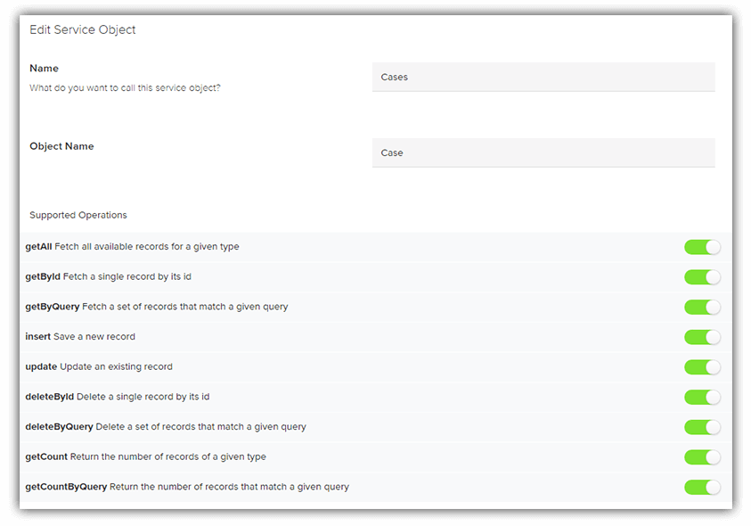

# The Modern Way to Connect to Salesforce for Web, Mobile, and Chat Applications

Clearly positioned as the dominant CRM (Customer Relationship Management) product today, [Salesforce](https://www.salesforce.com/) powers countless businesses and, often times, the apps that power those businesses. But unless you are Certified Salesforce Expert Genius (yes, I just made that title up), figuring out *how* to access data housed in Salesforce (much less managing security considerations, offline data sync, and performance issues) can be a very intimidating prospect.

Thankfully [Progress Kinvey](https://www.progress.com/kinvey) helps to abstract away the technical complexities of Salesforce, while also providing a variety of value-added features on top of what you get out of the box with Salesforce.

## The Kinvey Advantage

If you're new to Kinvey, you should know that at its core, Kinvey simplifies securely accessing data from a variety of cloud and on-premise data providers (even allowing you to *combine data* from disparate sources). But more than that, Kinvey layers on features like cloud caching that dramatically speed up access to data (incredibly important in today's mobile environments).

Let's take a look at how you can easily expose your Salesforce data within Kinvey - but first investigate *why* we might want to use Salesforce with Kinvey.

### Cloud Caching

The speed of data retrieval is without a doubt a critical component of every app. Enter what is arguably my favorite Kinvey feature: [Cloud Caching](https://devcenter.kinvey.com/rest/guides/cloud-caching).

Cloud Caching allows Kinvey to maintain a high speed cached version of your Salesforce data, **allowing your apps to run at the speed of your business**. When dealing with legacy databases, or cloud backend providers with huge data sets like Salesforce, latency is an extremely common problem these days. Cloud Caching solves this, plain and simple, with a simple toggle:

> [Read some success stories](https://www.progress.com/customers?product=kinvey) about how cloud caching (and other Kinvey features) benefit a variety of real world customers.

### Live Service

In today's ultra-connected world, what could be more important than getting a real time view of your data without delay? Kinvey [Live Service](https://devcenter.kinvey.com/guides/live-service) enables an event-driven way to receive data on your device, in real time.

Normally, when an entity is updated in a Kinvey collection, a user would have to perform an operation (reload/refresh) to get any updated data. Using Kinvey Live Service, **updates from the Kinvey backend can be pushed down to the device!**

### Offline Sync

As connected as our apps are today, *losing* connectivity can cause our end users an extreme amount of frustration. Lost data and stuttering app performance are major concerns for developers and stakeholders. This is where Kinvey shines, with [offline data sync options](https://devcenter.kinvey.com/guides/datastore#CachingandOffline). Kinvey gives you the control of *how* your offline data is synced, with full conflict resolution baked in.

> If you're developing a mobile app, take a look at this article on [Going Offline with NativeScript and Kinvey](https://www.nativescript.org/blog/going-offline-with-nativescript-and-kinvey).

### SDKs for Days

Regardless of the type of app you or your developers are building, rest assured Kinvey has a fully-vetted SDK to match their skillsets:

- [iOS](https://devcenter.kinvey.com/ios)
- [Android](https://devcenter.kinvey.com/android)
- [NativeScript](https://devcenter.kinvey.com/nativescript)
- [HTML5](https://devcenter.kinvey.com/html5)
- [AngularJS](https://devcenter.kinvey.com/angular)
- [Angular](https://devcenter.kinvey.com/angular2)
- [PhoneGap/Cordova/Ionic](https://devcenter.kinvey.com/phonegap)
- [Node.js](https://devcenter.kinvey.com/nodejs)
- [Xamarin](https://devcenter.kinvey.com/xamarin)
- [.NET](https://devcenter.kinvey.com/dotnet)
- [REST API](https://devcenter.kinvey.com/rest)

### Security and Compliance

Security and compliance considerations are no joke. That's why Kinvey is an industry leader in terms of data security and integrity. SOC2, HIPAA, GDPR, Sarbanes-Oxley, and other compliance activities are just the start of what Kinvey covers.

Be sure to read more about [how Kinvey keeps enterprises secure](https://www.progress.com/kinvey/enterprise-security) (and compliant), helping build the next great generation of desktop, mobile, and web apps.

## Let's Integrate Salesforce with Kinvey!

Ok, time to put on your technical hat and dive into the *how* part of this tutorial. Let's look at the details of accessing our Salesforce data from Kinvey to take advantage of just some of the features we've already mentioned.

If you don't have a Kinvey account yet, [sign up for your free account](https://www.progress.com/campaigns/kinvey/console-sign-up).

> The "Evaluation Edition" is free forever, but you can check out [Kinvey pricing](https://www.progress.com/kinvey/pricing) to get an idea of the differences between account types.

## Setup Your App and Service

Everything in Kinvey revolves around the concept of an "app". You can roughly correlate an app in Kinvey to the app (web/desktop/mobile) you are creating outside of Kinvey.

Create a new app by clicking the big green **ADD AN APP** button, and enter any name you like:

With your app created, you'll now want to add a *service* to your app. (One *service* can contain multiple *service objects* as we will see in a bit.)

Navigate to your **Service Catalog**:

Click on the big green **ADD A SERVICE** button. From the Service Type dialog, choose **RapidData** (this is what lets us connect to remote data stores - you can also [read more about RapidData here](https://devcenter.kinvey.com/guides/rapid-data)).

Since we are dealing with Salesforce data today, you'll obviously want to choose **Salesforce** on the next screen.

> Here you'll start to get an idea of the types of data sources Kinvey can handle. Sharepoint, Microsoft SQL Server, Oracle, SAP are just a handful of the supported databases. Learn more about the RapidData connectors [in this blog post](https://www.progress.com/blogs/using-kinveys-rapiddata-connectors).

On the following screen, you'll want to **name** your service (whatever you like!), enter an optional **description**, and set the **scope** of the service (usually it's just the "app" scope). If you choose "app", you'll want to select the app you created in the previous step.

## Salesforce Connection Properties

Now the fun starts! With our generic service created, we now need to hook it up to our Salesforce instance via the **Connection Options** pane:

For Salesforce, the **host** is usually `https://login.salesforce.com` for the cloud-hosted version. You can then choose to authenticate via:

- Mobile Identity Connect (MIC) - If you're already using [Mobile Identity Connect](https://devcenter.kinvey.com/guides/mobile-identity-connect), this is your best option.
- Service Account - If you want to utilize a Salesforce service account.
- Service Account - If you want to utilize the Salesforce OAuth authentication flow.

> Note that you may need to reach out to your Salesforce account administrator to help you figure out which option is best here!

## Kinvey Service Objects

Assuming you were able to authenticate properly, your next step will be to start creating *service objects* for each remote Salesforce data object that you want to consume with Kinvey.

> *What is a service object?* A service object is a data object or set of records on a remote system that Kinvey can access!

Click on the big green **ADD A SERVICE OBJECT** button, choose **Discover** to have Kinvey automagically find all the remote data objects you can consume, and choose the data object you'd like from the list provided. Finally, give the service object a **name** (remember this for later).

You'll then want to enable some operations that you'd like to be able to access with this app. For instance, with some data objects you might want to restrict the app to a read-only view of the data.

Finally, you'll need to *map* remote fields, which lets you choose which fields you'd like this service object to expose. You can also (optionally) customize the corresponding field name on the Kinvey side.

## Add a Kinvey Collection

At this point, provided everything went well, you should head back to your *app* and click on the big green **ADD A COLLECTION** button:

> **TIP:** When you add a **name** for your collection, name it the same as your service object. The matched name serves as a mapping between the collection and the service object!

On the following screen, choose **Use a Data Service** from the two options provided, since we are connecting to a *service* created earlier. Choose the service you created, and activate it!

## Test Your Connection

> Still with us? Great! If you run into any troubles you can consult the [RapidData docs](https://devcenter.kinvey.com/guides/rapid-data) and the [Kinvey forums](https://support.kinvey.com/support/home) for help.

Now it's time to test our our Salesforce connection with Kinvey's **API Console**:

In the dropdown provided, choose the service object name you want to test and click **send**.

> Yes, you can also use a tool like [Postman](https://www.getpostman.com/) to test your API calls!

If you don't see any error messages from Salesforce, you should get a nice little json data set, something like this:

	HTTP/1.1 200 OK
	Content-Type: application/json; charset=utf-8
	X-Kinvey-API-Version: 3
	X-Kinvey-Request-Id: bcac700073ac42d385b7436c5e68612e
	X-Powered-By: Express
	
	[
	    {
	        "CaseNumber": "00001002",
	        "Type": "Electrical",
	        "Status": "New",
	        "Reason": "Installation",
	        "Origin": "Web",
	        "Subject": "Seeking guidance on electrical wiring installation for GC5060",
	        "Priority": "Low",
	        "Description": "electrical wiring installation for GC5060 is working oddly",
	        "_id": "50061000000oTqpAAE",
	        "_kmd": {
	            "ect": "2015-08-14T14:37:13.000+0000",
	            "lmt": "2018-12-13T16:19:28.682Z"
	        },
	        "_acl": {}
	    },

Any troubles? Be sure to consult the [RapidData documentation](https://devcenter.kinvey.com/guides/rapid-data) and the [Kinvey forums](https://support.kinvey.com/support/home) for assistance!

## What's Next?

The [Progress Kinvey](https://www.progress.com/kinvey) platform is your first step on the road to building better apps, that run faster, in less time than ever before. This is the root value of the high productivity message we talk so much about and we're delighted to have an opportunity to prove this to you.

If you don't yet have a Kinvey account, you can [sign up here and instantly access your account](https://www.progress.com/campaigns/kinvey/console-sign-up). In addition, be sure to consult the [Kinvey DevCenter](https://devcenter.kinvey.com/) for any and every technical question you may have.

