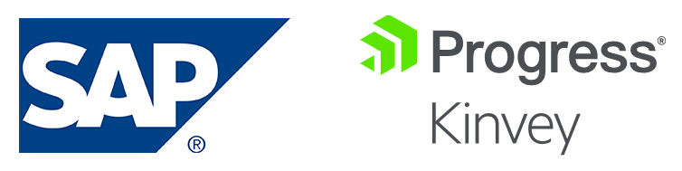
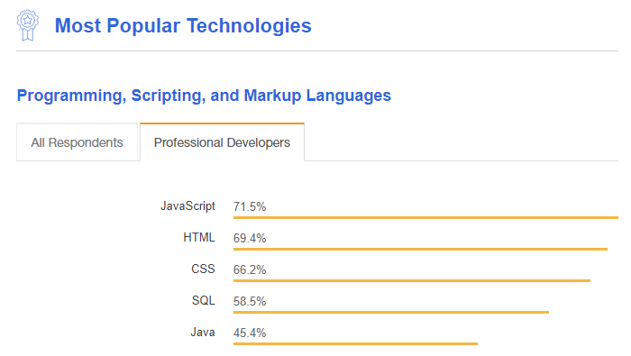

# The Modern Way to Develop Apps on SAP

When it comes to building mobile and web apps on top of [SAP](https://www.sap.com/index.html), what options do you have? How can you *make the most* out of your investment in SAP?

As an organization with a significant stake in the success of your SAP deployment, you're likely looking for ways to squeeze every last penny out of it. This may mean finding a **more performant means** of accessing data stored in SAP, **modernizing mobile apps** that are powered by your SAP ERP modules, or even **improving the security** of *how* end users access your data.

SAP runs at the core of a myriad global organizations, making it a critical business component. However, the problem is on-premise deployments of SAP were not really designed for the "sub-second" data access or horizontal scaling that is considered table stakes for cloud-based infrastructures.

Here on the [Progress Kinvey](https://www.progress.com/kinvey) team, these concerns are expressed to us by SAP developers and stakeholders on a regular basis. And as prospective mobility projects increase, company leaders and enterprise architects are faced with a quandary: *"How can I get the most out of SAP, without altering my investment, while also taking advantage of modern cloud capabilities?"*

In this article we will focus on organizations looking to build mobile apps that leverage SAP as its system of record, and what these organizations can do to **build on top of the robust platform** provided by SAP and Progress Kinvey.

## How Do *You* Build Your Apps?

SAP provides [mobile SDKs](https://developers.sap.com/topics/mobile.html) for developers, making SAP an attractive choice for mobile developer teams. [SAP Fiori for iOS](https://www.sap.com/products/fiori.html) also includes impressive, reusable design components.

The trick for many organizations, is that even with their investment in SAP, they **don't have the in-house expertise** needed to directly support SAP implementations *and* write the apps that consume data housed in SAP modules. Oftentimes we see these organizations hire expensive contractors, yet receive little in return for their investment. Not to mention, **apps are often re-written multiple times**: once for iOS, once for Android, and once for the web. 

**That's three times the cost for one app experience!**

## A Better Way

A viable alternative for these companies is the [Progress Kinvey serverless platform](https://www.progress.com/kinvey). Kinvey provides [SDKs for virtually every mobile development framework](https://devcenter.kinvey.com) to deliver engaging, robust, and performant apps built on top of SAP.

When we talk about the "Kinvey Platform", it's more than just another serverless option. Kinvey includes:

- **Cloud data connectors** for nearly every cloud and on-prem data store (including SAP!)
- Cloud caching to provide you **sub-second response times** for retrieving on-prem data
- **Comprehensive security** and compliance considerations (including SOC2 and HIPAA)
- NativeScript: a free and open source framework for **developing native mobile apps**

> Kinvey offers the security, compliance, and compatibility you need - along with an app dev experience your developers will embrace.

Not to mention, [Progress is a member of SAP PartnerEdge](https://partneredge.sap.com/content/partnerfinder/search.html#/partner/details/0000331968) and a supplier of data access infrastructure for use in SAP business applications.

Laid out simply: **Kinvey adds value to the investment you've already made in SAP.** By delivering on the promise of the cloud, and offering turnkey modernization of data along with cutting-edge mobile and web technologies built on the most popular developer stack in the world: JavaScript.

> [Learn how customers are using Progress Kinvey](https://www.progress.com/customers?product=kinvey) to improve on their existing investment in another cloud provider.

## Build SAP Apps for iOS, Android, and Web

You're investing in developers - external consultants and/or internal staff - and expecting a significant return on these investments. You also can't ever predict the background and knowledge of these developers. So why bet on anything other than the most popular language in the world?

*Image source: [Stack Overflow 2018 survey](https://insights.stackoverflow.com/survey/2018/).*

Likewise, when one development team creates an iOS app and another development team creates an Android app...and yet a **third development team** creates a similar experience on the web, **your costs literally triple**.

This is where [NativeScript](https://www.nativescript.org/) shines. NativeScript is a free and open source framework, built and supported by Progress, and a key component of the Kinvey Platform.

NativeScript enables your developers to:

- Build **truly native app experiences** on iOS, Android, and the Web (from a single codebase)
- Use the web skills they already know, like **JavaScript** and CSS
- Engage with an **open community** of tens-of-thousands of like-minded developers, solving similar problems

Contrast that with alternative methodologies that require repeat investment, with inconsistent results, and, well, there is no comparison.

> [See who else](https://www.nativescript.org/showcases) is building apps with NativeScript!

[SAP trusts NativeScript](https://blogs.sap.com/2017/05/24/sap-enterprise-app-modeler/), and so should you.

## The Kinvey Difference

The [Progress Kinvey serverless platform](https://www.progress.com/kinvey) was built to mobilize and modernize enterprise systems like SAP. Rapid Data connectors for SAP are built-in and enable low code (and no code) data integration and authentication. Integration is provided via SAP RFC (remote function call), SAP Netweaver, or API Management Layers. The backend is fully managed to scale out for large numbers of users through advanced data caching, offline sync, security, compliance and more to provide an SAP data experience without disrupting the back end systems of record.

> Read about the extensive [security and compliance considerations](https://www.progress.com/kinvey/enterprise-security) that are part of the Kinvey platform.

## What About SAP Cloud Platform?

SAP does provide mobile services via the [SAP Cloud Platform](https://cloudplatform.sap.com/index.html) to help mobilize SAP S/4 HANA, SAP, and 3rd party systems. But backend services are limited to a handful of features, and platform services likewise are limited to API and identity management, integration, SAP HANA database, and some security considerations.

The Progress Kinvey alternative is engineered to mobilize enterprise systems from the get-go. Included are pre-built **no code** cloud connectors for SAP that enable data integration and authentication. The backend is fully managed to scale out for large numbers of users through advanced data caching, offline sync, security and compliance to provide a full SAP experience without disrupting your on-premise backend system of record.

*What follows is a quick comparison of the SAP Cloud Platform and Progress Kinvey:*

<table>
    <tr>
        <td></td>
        <td valign="top">
<strong>SAP Cloud Platform</strong>
</td>
        <td valign="top">
<strong>Progress Kinvey</strong>
</td>
    </tr>
    <tr>
        <td valign="top">
Developer SDKs
</td>
        <td valign="top">
SAP Mobile Platform SDK

SAP Mobile Platform SDK for iOS
</td>
        <td valign="top">
NativeScript, iOS, Xamarin, .NET, Node.js, HTML5, Angular, AngularJS, PhoneGap/Cordova/Ionic, Android
</td>
    </tr>
    <tr>
        <td valign="top">
SAP Systems
</td>
        <td valign="top">
SAP S/4 HANA, SAP
</td>
        <td valign="top">
SAP RFC, SAP Netweaver, Third Party API Management Layers
</td>
    </tr>
    <tr>
        <td valign="top">
Mobile Services
</td>
        <td valign="top">
Offline, Push, Business Logic, Logging and Trace, Engagement Analytics
</td>
        <td valign="top">
Offline, Push, SMS, email, social integrations, Serverless Functions for Business Logic Operational Intelligence
</td>
    </tr>
    <tr>
        <td valign="top">
Cloud Platform Services
</td>
        <td valign="top">
Identity, Integration, API Management, SAP HANA, Security
</td>
        <td valign="top">
Identity Provider, Mobile Identity Connect, Rapid and Flex integrations, Extensive Security & Compliance
</td>
    </tr>
</table>

## Learn More about Accelerating SAP Development

Nobody wants to over-promise and under-deliver on mobility projects, especially those based on SAP. You're already dedicated to SAP as your system of record, so you need to make the most of this investment by taking advantage of the productivity-enhancing capabilities layered on by Progress Kinvey. Turn to a trusted and open app developer ecosystem with proven experience working with SAP and improving mobile app success metrics.

[Talk to a SAP + Progress Kinvey expert today!](https://www.progress.com/kinvey/contact)

