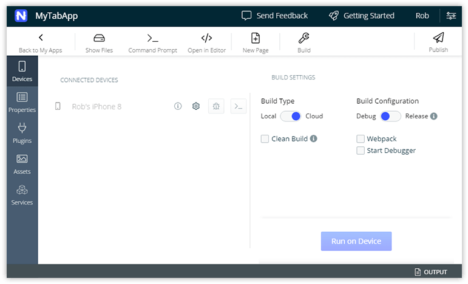
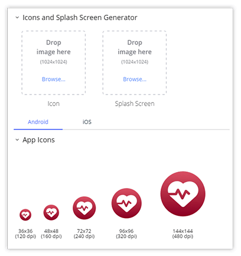
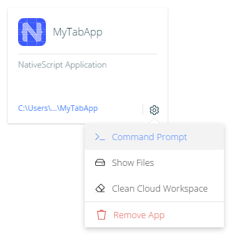
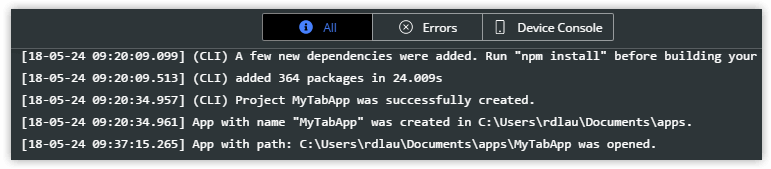
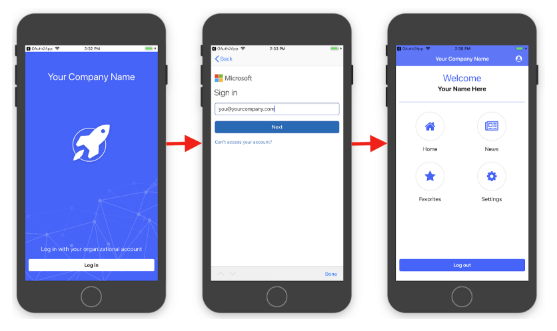

# What's New in NativeScript Sidekick

It's hard to believe, but we are approaching the one year anniversary of the first public release of [NativeScript Sidekick](https://www.nativescript.org/nativescript-sidekick)! Your trusted companion for developing cross-platform apps with NativeScript has matured significantly over the past year (notably with the most recent release).

Let's take a quick look at some of the highlights:

## New Device/Build Screen

One of the most common questions we heard from new Sidekick users was, "what am I supposed to do first!?". This was a common issue when someone *wasn't* using an app template to start a new app. So, we've redesigned the app home screen to focus on what matters to you most:

The goal here is to get an app built and deployed on your device ASAP 🏎️. You may also find it beneficial to follow along with **two new videos** that show off how easy it can be to deploy an iOS app (even while managing those pesky certificates and provisioning profiles!):

*Deploying an iOS App with a <strong>Free</strong> Apple Developer Account:*

iframe width="560" height="315" src="https://www.youtube.com/embed/eLOLiiCSWF8" frameborder="0" allow="autoplay; encrypted-media" allowfullscreen></iframe>

*Deploying an iOS App with a <strong>Paid</strong> Apple Developer Account:*

iframe width="560" height="315" src="https://www.youtube.com/embed/5gKuR2UCOnM" frameborder="0" allow="autoplay; encrypted-media" allowfullscreen></iframe>

> **NOTE:** We've also squashed A LOT of bugs 🐛 recently. [Follow the closed issues on GitHub](https://github.com/NativeScript/sidekick-feedback/issues?q=is%3Aissue+is%3Aclosed) to see what's been fixed.

## Icon and Splashscreen Generation

The bane of any app developer's existence, generating app icons and splash screens is a monumentally tedious chore. At last count, iOS alone asks for 18 icons and 24 splash screens!

Sidekick's mission is to make life easier for you. So to help you out, Sidekick now provides the ability to **automatically generate** all of your image assets for you, from one master source.

## New App Cards

A subtle change for this release is a new app card UI:

You now have easier access to some important tasks:

- Opening the app in your command prompt/terminal;
- Showing the files on your local machine;
- Cleaning your cloud workspace (which deletes any cached files saved after cloud builds).

## Redesigned Logging Pane

If you're a debug-by-console kind of person like me, you'll appreciate the redesigned logging UI:

Instead of just showing **All** logged statements or only **Errors**, you can now filter by what shows up on the **Device Console** as well, making debugging considerably easier.

## New App Templates

Everybody loves templates! We have a brand new template called "Enterprise Auth". You can use this template to get a head start on integration with an enterprise single sign-on provider. What has historically been an arduous task has now been made significantly easier.

Previously this template was only for Angular, but now it is available in TypeScript and vanilla JavaScript flavors as well 🍦

With **support for SAML, OAuth 2, and Open ID Connect**, the Enterprise Auth template in Sidekick guides you through the process of connecting to your provider and makes it easy to customize the look and feel of your login screen.

> **TIP:** [Watch a free online course](https://courses.nativescripting.com/p/nativescript-enterprise-auth/?product_id=308158&coupon_code=AUTH101) on securing your enterprise apps.

## What's on the Sidekick Roadmap?

With the foundation laid, it's time to look to the not-so-distant future for what's next:

- Release of the first public beta of our **Sidekick extension for Visual Studio**;
- **Launch native simulators/emulators** directly from Sidekick;
- Automatic NativeScript **dependency installation** (no more nagging messages about upgrading your CLI!);
- **Performance improvements** for app creation and cloud builds;
- Brand new app templates for [**Vue.js**](https://nativescript-vue.org/).

[Download NativeScript Sidekick](https://www.nativescript.org/nativescript-sidekick) <-- BUTTON