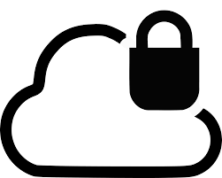

# NativeScript Sidekick Enterprise Cloud

## NativeScript Sidekick Cloud Infrastructure

The leading goals for our NativeScript cloud infrastructure are flexibility, scalability, performance, and security. 

Often these are conflicting goals - our team needs inexpensive infrastructure to handle the volume of the [free NativeScript Sidekick cloud builds](https://www.nativescript.org/nativescript-sidekick), yet make those builds highly secure. We know that no one would trust a cloud service with their code unless they were 100% sure that only they can access the code and the highly sensitive publishing certificates.

That’s why from the start we built a **sophisticated infrastructure with numerous safeguards** to make sure each build is fully isolated from the rest of the world. We use every trick and security feature of the underlying OSes to make sure that your code and assets are fully separated from the rest of the system during the build.  

As an example of our security infrastructure, we are using containers and OS-level sandboxing as the first line of isolation.

## NativeScript Sidekick Enterprise Cloud

However, we know there are customers with *even stricter requirements* for the cloud infrastructure. If you are looking to meet the standards of compliance frameworks like [HIPAA](https://searchhealthit.techtarget.com/definition/HIPAA) or [SOC2](https://www.incapsula.com/web-application-security/soc-2-compliance.html), there haven't been ready-to-use choices available to you...until today!

I am happy to announce that we are ready with our solution for this challenge: the "NativeScript Enterprise Cloud" (a component of our [NativeScript Sidekick Enterprise](https://www.nativescript.org/nativescript-sidekick/purchase) offering). We built an entirely separate infrastructure with the driving goal of utmost confidentiality. With it we used a different security model and use virtual machines to contain the builds.  

But we did not stop just with a new isolation infrastructure. We also introduced other features, desired by our enterprise customers. In this release, our team delivers:

* Full isolation at VM level (as discussed above) 
* Encrypted source code at rest – the source code of your projects is encrypted when you are not actively building 
* Vulnerability management using both team process and automated tools 
* 24/7 infrastructure maintenance to keep the SLA we guarantee 

This allows our enterprise customers to consider our infrastructure even when they need to satisfy very strict security or legal requirements.

## What’s Next

We are not done yet! Currently our entire organization is undergoing SOC2 and HIPAA certification. This will enable us to continue being one of the most trustworthy partners in the market of mobility development tools.