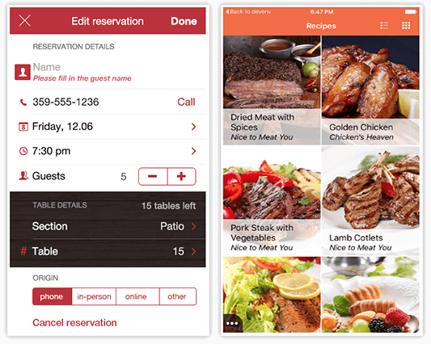

# Professional Components from NativeScript UI - The Big Breakup

A few months ago, we [announced our plans](https://www.nativescript.org/blog/nativescript-ui-whats-next) to divide the professional components in [NativeScript UI](https://www.nativescript.org/ui-for-nativescript) into their own packages. The individual packages are now available for free download from npmjs with the following package names:

- AutoComplete: [nativescript-ui-autocomplete](https://www.npmjs.com/package/nativescript-ui-autocomplete)
- Calendar: [nativescript-ui-calendar](https://www.npmjs.com/package/nativescript-ui-calendar)
- Chart: [nativescript-ui-chart](https://www.npmjs.com/package/nativescript-ui-chart)
- DataForm: [nativescript-ui-dataform](https://www.npmjs.com/package/nativescript-ui-dataform)
- Gauge: [nativescript-ui-gauge](https://www.npmjs.com/package/nativescript-ui-gauge)
- ListView: [nativescript-ui-listview](https://www.npmjs.com/package/nativescript-ui-listview)
- SideDrawer: [nativescript-ui-sidedrawer](https://www.npmjs.com/package/nativescript-ui-sidedrawer)

As promised, the steps to migrate from the old plugin - nativescript-pro-ui - to one of the new (**in this example the Chart**) are simple as 1-2-3:

1) Remove the old plugin:

	tns plugin remove nativescript-pro-ui

2) Add the new plugin:

	tns plugin add nativescript-ui-chart

3) Replace every occurrence of `nativescript-pro-ui/chart` with `nativescript-ui-chart` in your TypeScript/JavaScript/XML imports.

If you are using more than one of the components, you will need to repeat steps 2 and 3 for each of them.

> A more detailed explanation is available in this [migration article](http://docs.telerik.com/devtools/nativescript-ui/migration) from the documentation.

Thank you for your patience while reporting issues through the [feedback portal](https://github.com/telerik/nativescript-ui-feedback/issues), as some fixes were delayed due to the packaging reorganization. Our next target is to stabilize the component quality by fixing the issues with the highest priority, so make sure you give your thumbs up and comments in issues that you would like to get fixed faster!