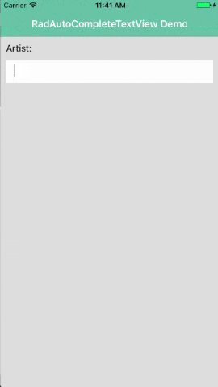
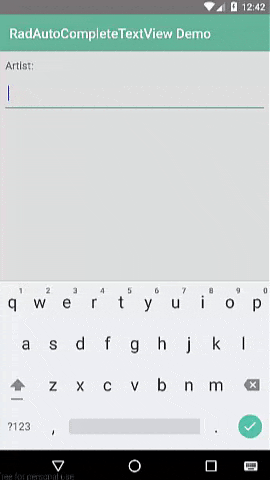
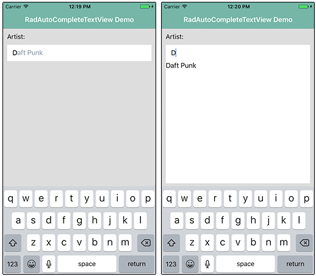
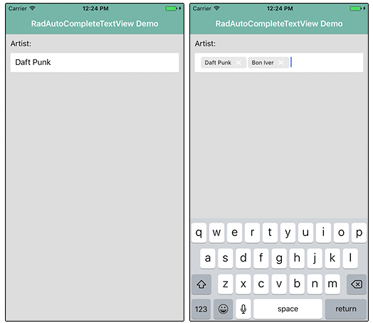
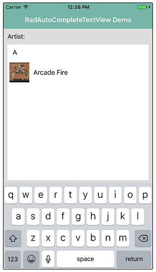

# A Deep Dive into Telerik UI for NativeScript's AutoCompleteTextView

As mobile developers, our job is to delight users with easy to use and engaging mobile experiences - creating apps that require a minimal amount of user input to produce a maximum amount of enjoyment. Part of that means less typing, fewer taps, and a quicker way to completing a task.

Hopefully you've been following along all week as we've been diving deep into the nuts and bolts of [Telerik UI for NativeScript](http://www.telerik.com/nativescript-ui). With UI for NativeScript, we are doing our best to help you create these engaging experiences and create apps that your users **actually want to use**.

This article is part of our "week of UI for NativeScript" that covers the how-to of each UI for NativeScript component. Today is all about the [AutoCompleteTextView](http://docs.telerik.com/devtools/nativescript-ui/Controls/NativeScript/AutoCompleteTextView(Beta)/overview), and we will have an in-depth article for each component in our offering:

- ListView
- Chart
- SideDrawer
- DataForm
- AutoCompleteTextView
- Calendar

## What is UI for NativeScript?

UI for NativeScript is a set of premium UI components for native cross-platform mobile apps written with the [NativeScript](https://www.nativescript.org/) framework. Our goal is to simplify NativeScript app development by providing pre-built, ready-to-use, components that are easy to implement in your app (and equally as easy to style to match your app's look and feel).

Let's get started with learning all about the AutoCompleteTextView component.

## AutoCompleteTextView (a.k.a. RadAutoCompleteTextView)

The AutoCompleteTextView component (known in code as RadAutoCompleteTextView), allows you to provide users with auto-completion for text entries - maybe you are filtering a list or providing an alternative to a multi-select input.

With RadAutoCompleteTextView and a splash of CSS, input scenarios like this on iOS and Android are made easier:

> RadAutoCompleteTextView is part of UI for NativeScript Pro. If you are interested in a free trial [check it out here](http://www.telerik.com/download-trial-file/v2/nativescript-ui).

With RadAutoCompleteTextView you put your users in control by reducing data entry requirements. You can specify different text-suggestion modes as well as define how those suggestions are displayed.

## Installing UI for NativeScript

There are a couple of different ways to get started, depending on your environment and preferences.

**Using UI for NativeScript Pro?**

Download the UI for NativeScript `.tgz` file from [your Telerik account](https://www.telerik.com/account) or grab a [free trial](http://www.telerik.com/download-trial-file/v2/nativescript-ui). Navigate to your project directory and install UI for NativeScript with the following command:

	tns plugin add <path-to-tgz>

**Using Telerik AppBuilder?**

If you are using [Telerik AppBuilder](http://www.telerik.com/platform/appbuilder) (part of [Telerik Platform](http://www.telerik.com/platform)), you may [follow these instructions](http://docs.telerik.com/devtools/nativescript-ui/appbuilder).

## Getting Started with RadAutoCompleteTextView

> Note that all of the code demonstrated here is available [in this GitHub repo](https://github.com/rdlauer/ui-for-nativescript-autocompletetextview). For more code samples, check out the official [UI for NativeScript sample repo](https://github.com/telerik/nativescript-ui-samples).

Plugin installed? Great! Now we'll need to add an XML namespace to the root of the page where we want to use RadAutoCompleteTextView. If "XML namespace" scares you, have no fear. You just need to add a property to your root `<Page>` element, like this:

	<Page xmlns:au="nativescript-telerik-ui-pro/autocomplete">

Finally, we need to add a RadAutoCompleteTextView component to our XML markup, as in:

	<Page xmlns:au="nativescript-telerik-ui-pro/autocomplete">
		<au:RadAutoCompleteTextView id="myAutoComplete" />
	</Page>

It doesn't stop there! Let's wire up some data and see what RadAutoCompleteTextView can do.

## AutoComplete Example

Let's get a RadAutoCompleteTextView component running with a minimal amount of code. Starting with our XML markup:

	<Page xmlns:au="nativescript-telerik-ui-pro/autocomplete" xmlns="http://schemas.nativescript.org/tns.xsd" loaded="pageLoaded">
	
		<ActionBar title="RadAutoCompleteTextView Demo" class="action-bar" />
	
	    <StackLayout class="stack-layout">
			<Label text="Artist:" class="label" />
			<au:RadAutoCompleteTextView items="{{ items }}" suggestMode="Append" displayMode="Token">
				<au:RadAutoCompleteTextView.suggestionView>
					<au:SuggestionView suggestionViewHeight="300">
						<au:SuggestionView.suggestionItemTemplate>
							<StackLayout>
								<Label text="{{ text }}" />
							</StackLayout>
						</au:SuggestionView.suggestionItemTemplate>
					</au:SuggestionView>
				</au:RadAutoCompleteTextView.suggestionView>
			</au:RadAutoCompleteTextView>
		</StackLayout>
	
	</Page>
	
I realize we are going 0-60 in about 3 seconds so bear with me as I walk through this markup:

- We added a `pageLoaded` function to the `loaded` event (see below).
- We inserted an `ActionBar` to show a title in our view.
- We added both `suggestMode` and `displayMode` properties, which we will discuss later on.
- We added an `<au:RadAutoCompleteTextView.suggestionView>` element which is a fancy name for what is effectively a placeholder for our autocomplete suggestions.

Next, we need some JavaScript to make it all work:

	var Observable = require("data/observable").Observable;
	var ObservableArray = require("data/observable-array").ObservableArray;
	var autocompleteModule = require("nativescript-telerik-ui-pro/autocomplete");
	
	var page;
	var pageData = new Observable();
	var items = new ObservableArray([]);
	
	exports.pageLoaded = function(args) {
		page = args.object;
		page.bindingContext = pageData;
	
		var artists = ["Arcade Fire", "Bon Iver", "Daft Punk", "Elbow"];
	
		for (var i = 0; i < artists.length; i++) {
			items.push(new autocompleteModule.TokenModel(artists[i]));
		};
	
		pageData.set("items", items);
	};
	
In this code block we have our `pageLoaded` function, which is executed when our main view/page loads. Within this function, we are looping through the `artists` array and adding items to our `items` observable array (which is what we use as our data source for autocompletion).

> Looking for Angular 2 code samples? Check out our [complete docs for Angular 2](http://docs.telerik.com/devtools/nativescript-ui/Controls/Angular/overview) as well!

This all results in the following:

 

> Note that the styles you see come from the [core light theme](https://docs.nativescript.org/ui/theme) that is part of NativeScript, plus some customizations made with the [NativeScript Theme Builder](http://www.nativescriptthemebuilder.com/).

## AutoComplete Suggestion Modes

In the example above, you probably noticed the `suggestMode` property, which has the following options:

- Suggest
- Append
- SuggestAppend

**Suggest** (the default option) provides a drop-down list of options for you to pick from. **Append** (as we used above) provides an inline display of the first suggestion. And as you probably guessed, **SuggestAppend** combines the functionality of the two.

## Different Display Options

As with using radio buttons vs checkboxes on the web, RadAutoCompleteTextView lets you choose between a single option or a multiple choice option. This is accomplished using the `displayMode` property, which as two options:

- Plain
- Tokens

**Plain** (the default display option) simply allows for one selection per RadAutoCompleteTextView control. **Tokens** on the other hand (which we used above) allows for multiple selections and the ability to delete previously selected items.

## Customizing Suggestion Item Template

Displaying autocompletion options as text is very useful, but what if we want to spice things up a bit and include, for instance, images? That's the point of the item template found in the `<au:RadAutoCompleteTextView.suggestionView>` element.

Let's first change our `suggestMode` to be `suggestMode="Suggest"` so we get the full drop-down experience to see our images.

Next, let's make a change to our markup and swap out our existing `StackLayout` element with this:
	
	<StackLayout orientation="horizontal" margin="5">
	    <Image src="{{ image }}" width="50"/>
	    <Label text="{{ text }}" marginLeft="10" />
	</StackLayout>
	
Finally, we need to alter our array and our for loop in the code-behind JavaScript to pass in an image along with the text:

	var artists = [
		{
			text: "Arcade Fire",
			image: "~/images/arcade-fire.png"
		},
		{
			text: "Bon Iver",
			image: "~/images/bon-iver.png"
		},
		{
			text: "Daft Punk",
			image: "~/images/daft-punk.png"
		},
		{
			text: "Elbow",
			image: "~/images/elbow.png"
		}
	];

	for (var i = 0; i < artists.length; i++) {
		items.push(new autocompleteModule.TokenModel(artists[i].text, artists[i].image));
	};
	
Which all results in a little more pleasing UI:

## Anything Else?

You've seen just a taste of how RadAutoCompleteTextView can add needed functionality to your native mobile app. Be sure to [peruse our documentation](http://docs.telerik.com/devtools/nativescript-ui/Controls/NativeScript/AutoCompleteTextView(Beta)/overview) and set yourself up with a [free trial copy](http://www.telerik.com/download-trial-file/v2/nativescript-ui) of UI for NativeScript Pro!

