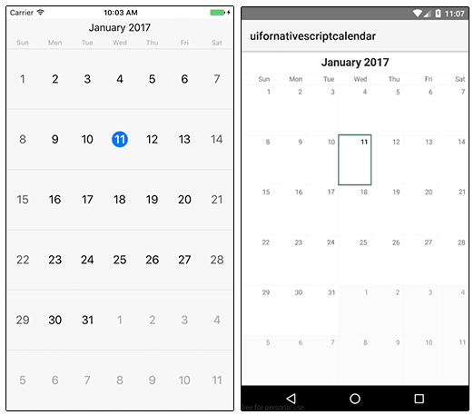
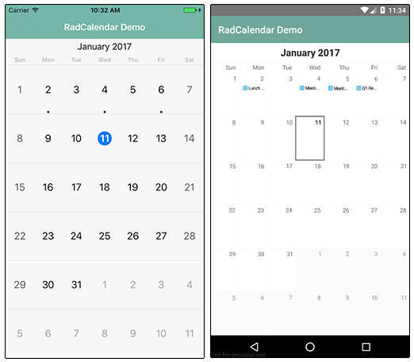
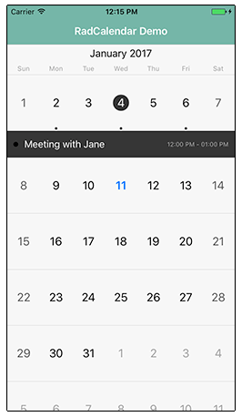
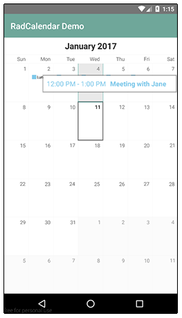
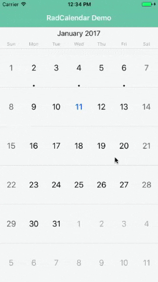
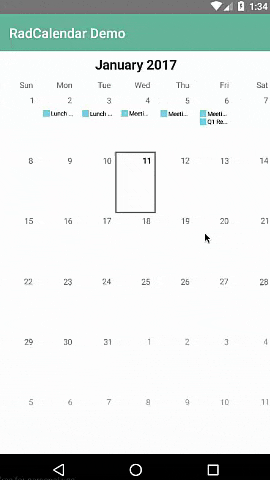

# A Deep Dive into Telerik UI for NativeScript's Calendar

If you asked a group of developers, "What is the most difficult UI to implement?", I would guess a majority would have something to say about dates, calendars, and scheduling. Calendars are hard. Leap years, holidays, weekends - it's too much for someone to have to manage. You shouldn't have to remember "30 days has September..." in lieu of writing code.

When you throw "mobile" into the mix, it gets all that much more complicated. How do you create an effective UI that balances a small canvas with a month's or even a year's worth of event data?

[Telerik UI for NativeScript](http://www.telerik.com/nativescript-ui) to the rescue! UI for NativeScript is a clean abstraction on top of native calendar UIs provided by iOS and Android. With UI for NativeScript we are building on the Telerik tradition of providing easy to use components that delight developers with their ease of use - and delight end users with their engaging features.

This post is part of our "week of UI for NativeScript" that goes into the how-to of each UI for NativeScript component. Today is all about the [Calendar](http://docs.telerik.com/devtools/nativescript-ui/Controls/NativeScript/Calendar/overview) and is the final article of our series:

- ListView
- Chart
- SideDrawer
- DataForm
- AutoCompleteTextView
- Calendar

## What is UI for NativeScript?

UI for NativeScript is a set of premium UI components for native cross-platform mobile apps written with the [NativeScript](https://www.nativescript.org/) framework. Our goal is to simplify NativeScript app development by providing pre-built, ready-to-use, components that are easy to implement in your app (and equally as easy to style to match your app's look and feel).

Let's get started with learning all about the Calendar component.

## Calendar (a.k.a. RadCalendar)

The Calendar component (known in code as RadCalendar), exposes a unified API on top of the native calendar controls provided by iOS and Android. No more individual, platform-specific implementations of event/scheduling UIs. **With RadCalendar we do the heavy lifting for you and grant you the ability to add complex, mobile-optimized UI widgets to your app with a minimal amount of code.**

 

> RadCalendar is part of UI for NativeScript Pro. If you are interested in a free trial [check it out here](http://www.telerik.com/download-trial-file/v2/nativescript-ui).

RadCalendar allows you to display events inline (as in the above example), customize your week/month/year views, style calendars with CSS, and handle calendar events based on user interactions.

## Installing UI for NativeScript

There are a couple of different ways to get started, depending on your environment and preferences.

**Using UI for NativeScript Pro?**

Download the UI for NativeScript `.tgz` file from [your Telerik account](https://www.telerik.com/account) or grab a [free trial](http://www.telerik.com/download-trial-file/v2/nativescript-ui). Navigate to your project directory and install UI for NativeScript with the following command:

	tns plugin add <path-to-tgz>

**Using Telerik AppBuilder?**

If you are using [Telerik AppBuilder](http://www.telerik.com/platform/appbuilder) (part of [Telerik Platform](http://www.telerik.com/platform)), you may [follow these instructions](http://docs.telerik.com/devtools/nativescript-ui/appbuilder).

## Getting Started with RadCalendar

> Note that all of the code demonstrated here is available [in this GitHub repo](https://github.com/rdlauer/ui-for-nativescript-calendar). For more code samples, check out the official [UI for NativeScript sample repo](https://github.com/telerik/nativescript-ui-samples).

Plugin installed? Great! Now we'll need to add an XML namespace to the root of the page where we want to use RadCalendar. If "XML namespace" scares you, have no fear. You just need to add a property to your root `<Page>` element, like this:

	<Page xmlns:calendar="nativescript-telerik-ui-pro/calendar">

Next, we need to add a RadCalendar component to our XML markup, as in:

	<Page xmlns:calendar="nativescript-telerik-ui-pro/calendar">
		<calendar:RadCalendar id="myCalendar" />
	</Page>

Believe it or not, a code sample this simple resolves into a nice looking calendar:

But let's add some events and see what else RadCalendar can do for us!

## Adding Event Data

RadCalendar allows us to easily add event data via the `CalendarEvent` class, which describes a single event and exposes a variety of properties.

Let's start by making some minor changes to our XML markup:

	<Page xmlns="http://schemas.nativescript.org/tns.xsd" xmlns:calendar="nativescript-telerik-ui-pro/calendar" loaded="pageLoaded">
		<ActionBar title="RadCalendar Demo" class="action-bar" />
		<calendar:RadCalendar id="myCalendar" eventSource="{{ events }}" />
	</Page>

What changed?

- We added a `pageLoaded` function to the `loaded` event (see below).
- We inserted an `ActionBar` to show a title in our view.
- We added `eventSource="{{ events }}"` to associate the data source with our calendar.

Next, let's add some code to our JavaScript code-behind file:

	var Observable = require("data/observable").Observable;
	var calendarModule = require("nativescript-telerik-ui-pro/calendar");

	var page;
	var pageData = new Observable();
	
	exports.pageLoaded = function(args) {
		page = args.object;
		page.bindingContext = pageData;
	
		var eventTitles = ["Lunch with Steve", "Meeting with Jane", "Q1 Recap Meeting"];
		var events = [];
	
		var j = 1;
		for (var i = 0; i < eventTitles.length; i++) {
			var now = new Date();
			var startDate = new Date(now.getFullYear(), now.getMonth(), j * 2, 12);
			var endDate = new Date(now.getFullYear(), now.getMonth(), (j * 2) + (j % 3), 13);
			var event = new calendarModule.CalendarEvent(eventTitles[i], startDate, endDate);
			events.push(event);
			j++;
		}
	
		pageData.set("events", events);
	}

In this code sample we are providing some fake event data to our calendar. The key line of code is this:

	var event = new calendarModule.CalendarEvent(eventTitles[i], startDate, endDate);
	
This is where we are creating the individual event with the `CalendarEvent` class. Note that the `startDate` and `endDate` variables are just plain JavaScript date objects!

> Looking for Angular 2 code samples? Check out our [complete docs for Angular 2](http://docs.telerik.com/devtools/nativescript-ui/Controls/Angular/overview) as well!

This results in the following changes to our calendar app:

> Note that the styles you see come from the [core light theme](https://docs.nativescript.org/ui/theme) that is part of NativeScript, plus some customizations made with the [NativeScript Theme Builder](http://www.nativescriptthemebuilder.com/).

## Viewing Event Data

We have data in our calendar (which we can see based on the dot in iOS and the short event preview in Android). However, we'd like to actually **see** the event data somehow!

This is accomplished using the [event view modes](http://docs.telerik.com/devtools/nativescript-ui/Controls/NativeScript/Calendar/populating-with-data#event-view-modes) provided by RadCalendar. By tweaking our markup, we can see our event data either `Inline` or via a `Popover`:

	<calendar:RadCalendar id="myCalendar" eventSource="{{ events }}" eventsViewMode="Inline|Popover" />
	
Inline on iOS:

Popover on Android:

## Changing the Calendar View

Now we don't **always** want to see our calendar in the full month view (which is the default). In scenarios where you want to show a different view of dates, you can use the RadCalendar's `viewMode` property, which supports [the following options](http://docs.telerik.com/devtools/nativescript-ui/Controls/NativeScript/Calendar/view-modes):

- `Week` (displays one week of dates)
- `Month` (displays one month at a time - default)
- `MonthNames` - (shows all month names in a year)
- `Year` - (shows us an entire year of days on one screen - see below)

## Fancy Calendar Transitions

When swiping to move between weeks/months/years, NativeScript will use the host platform's native transitions. With RadCalendar, you can specify different [transition modes](http://docs.telerik.com/devtools/nativescript-ui/Controls/NativeScript/Calendar/transition-modes):

- None
- Slide
- Stack
- Flip (iOS only)
- Fold (iOS only)
- Float (iOS only)
- Rotate (iOS only)
- Plain (Android only)
- Free (Android only)
- Combo (Android only)
- Overlap (Android only)

You can try out these transitions by setting the `transitionMode` property of your RadCalendar. Here is an example of the `Stack` transition on iOS and Android:

 

## Anything Else?

RadCalendar allows you to create customized calendar controls with ease. Imagine adding a [RadDataForm](http://docs.telerik.com/devtools/nativescript-ui/Controls/NativeScript/DataForm/dataform-overview) to the mix to create a fully-capable scheduling system!

Be sure to check out the [RadCalendar docs](http://docs.telerik.com/devtools/nativescript-ui/Controls/NativeScript/Calendar/overview) for anything we missed and grab a [free trial copy](http://www.telerik.com/download-trial-file/v2/nativescript-ui) of UI for NativeScript Pro today!

