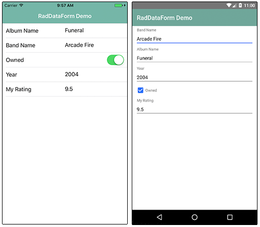
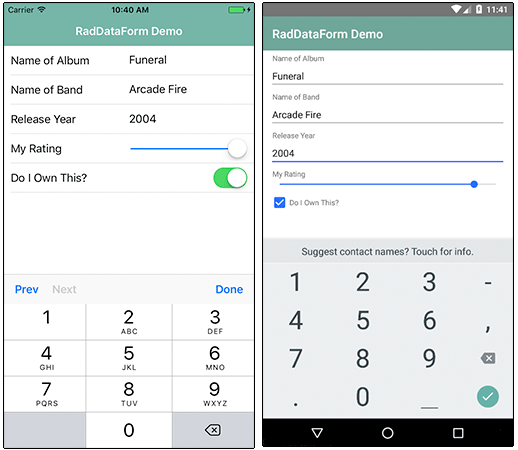
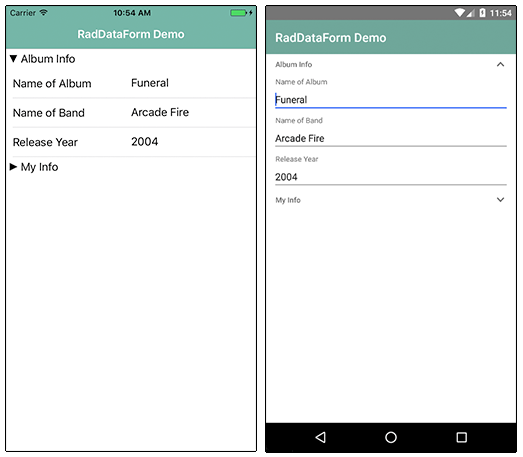
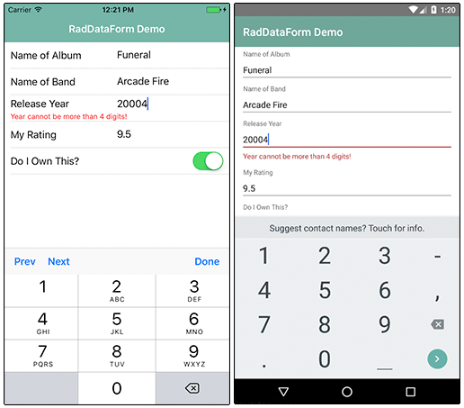

# A Deep Dive into Telerik UI for NativeScript's DataForm

Since the dawn of Visual Basic (ok, even before then), developers have been tasked with creating forms-over-data styles of user interfaces. You have some data in a database and you need to provide an easy for your end users to manage that data. Sound familiar? We've all done it so many times, your stomach probably drops an inch or two when you realize you have to create YET ANOTHER FORM to manage data!

Now add mobility to the equation. Not only are you developing for the web, but you have to consider how your mobile users are going to interact with that same data. Are the text fields too long (or not long enough)? Do the select boxes make sense? Can they properly tap on checkboxes? Ayyyy, count me out.

This is yet another reason why [Telerik UI for NativeScript](http://www.telerik.com/nativescript-ui) is so exciting. With UI for NativeScript we are building on the Telerik tradition of providing easy to use components that delight developers with their ease of use - and delight end users with their engaging features.

This post is part of our "week of UI for NativeScript" where we go over the how-to of each UI for NativeScript component. Today is all about the [DataForm](http://docs.telerik.com/devtools/nativescript-ui/Controls/NativeScript/DataForm/dataform-overview), and soon we will have an in-depth article for each component in our offering:

- ListView
- Chart
- SideDrawer
- DataForm
- AutoCompleteTextView
- Calendar

## What is UI for NativeScript?

UI for NativeScript is a set of premium UI components for native cross-platform mobile apps written with the [NativeScript](https://www.nativescript.org/) framework. Our goal is to simplify NativeScript app development by providing pre-built, ready-to-use, components that are easy to implement in your app (and equally as easy to style to match your app's look and feel).

Let's get started with learning all about the DataForm component.

## DataForm (a.k.a. RadDataForm)

The DataForm component (known in code as RadDataForm), allows you to **automatically create a form based on existing data**. For example, using the RadDataForm and some CSS, you can pretty easily create form-over-data UIs like this:

> RadDataForm is part of UI for NativeScript Pro. If you are interested in a free trial [check it out here](http://www.telerik.com/download-trial-file/v2/nativescript-ui).

With RadDataForm, you can not only have forms created for you automatically, but you can easily customize those forms in your markup or with JavaScript. It's also very easy to add validation to your forms and group UI elements to make large forms more manageable.

## Installing UI for NativeScript

There are a couple of different ways to get started, depending on your environment and preferences.

**Using UI for NativeScript Pro?**

Download the UI for NativeScript `.tgz` file from [your Telerik account](https://www.telerik.com/account) or grab a [free trial](http://www.telerik.com/download-trial-file/v2/nativescript-ui). Navigate to your project directory and install UI for NativeScript with the following command:

	tns plugin add <path-to-tgz>

**Using Telerik AppBuilder?**

If you are using [Telerik AppBuilder](http://www.telerik.com/platform/appbuilder) (part of [Telerik Platform](http://www.telerik.com/platform)), you may [follow these instructions](http://docs.telerik.com/devtools/nativescript-ui/appbuilder).

## Getting Started with RadDataForm

> Note that all of the code demonstrated here is available [in this GitHub repo](https://github.com/rdlauer/ui-for-nativescript-dataform). For more code samples, check out the official [UI for NativeScript sample repo](https://github.com/telerik/nativescript-ui-samples).

Plugin installed? Great! Now we'll need to add an XML namespace to the root of the page where we want to use RadDataForm. If "XML namespace" scares you, have no fear. You just need to add a property to your root `<Page>` element, like this:

	<Page xmlns:df="nativescript-telerik-ui-pro/dataform">

Finally, we need to add a RadDataForm component to our XML markup, as in:

	<Page xmlns:df="nativescript-telerik-ui-pro/dataform">
		<df:RadDataForm id="myDataForm" />
	</Page>

Of course, this markup won't actually render anything useful (yet). Let's add some data and see what magic RadDataForm can provide!

## Automagical Form Creation

The beauty of RadDataForm starts with the ability to **auto-generate UI** on top of an existing data structure. Sound too good to be true? Let's let the code prove our case and start with our UI markup:

	<Page xmlns:df="nativescript-telerik-ui-pro/dataform" xmlns="http://schemas.nativescript.org/tns.xsd" loaded="pageLoaded">
		<ActionBar title="RadDataForm Demo" class="action-bar" />
		<df:RadDataForm id="myDataForm" source="{{ album }}" />
	</Page>
	
Nothing too crazy here:

- We added a `pageLoaded` function to the `loaded` event (see below).
- We inserted an `ActionBar` to show a title in our view.
- We added `source="{{ album }}"` in which `album` is our Observable object (see below).

Next, we need some JavaScript to make it all work:

	var Observable = require("data/observable").Observable;
	
	var page;
	var album = new Observable();
	var pageData = new Observable();
	
	exports.pageLoaded = function(args) {
		page = args.object;
		page.bindingContext = pageData;
	
		album = {
			bandName: "Arcade Fire",
			albumName: "Funeral",
			year: "2004",
			owned: true,
			myRating: "9.5"
		};
	
		pageData.set("album", album);
	};

In this code block we have our `pageLoaded` function, which is executed when our main view/page loads. Within this function, we have an Observable object called `album` that contains data for one music album.

> Looking for Angular 2 code samples? Check out our [complete docs for Angular 2](http://docs.telerik.com/devtools/nativescript-ui/Controls/Angular/overview) as well!

Note that for demo purposes we are hardcoding data in our backend. In reality you would want to access data via your own API. Nic Raboy has some great sample code for this [in this article](https://www.thepolyglotdeveloper.com/2015/11/make-http-requests-in-a-nativescript-mobile-application/).

This all results in the following:

Now remember, this is a fully functional UI on top of our data! We not only had data bound from an existing data source, but even the labels in our UI were translated properly from camel case!

> Note that the styles you see come from the [core light theme](https://docs.nativescript.org/ui/theme) that is part of NativeScript, plus some customizations made with the [NativeScript Theme Builder](http://www.nativescriptthemebuilder.com/).

## Customizing Individual Fields

While the default behavior of RadDataForm gets us a long way in providing a full UI on top of our data, there are usually some tweaks to be made.

Luckily, RadDataForm allows us to customize each individual form field label, the underlying data editor, and the order in which they are displayed. Let's take a look at how that is accomplished with the [EntityProperty](http://docs.telerik.com/devtools/nativescript-ui/Controls/NativeScript/DataForm/dataform-entity-property).

For each data entity, I can specify an `EntityProperty`. And those properties are fairly intuitive:

	<df:RadDataForm id="myDataForm" source="{{ album }}">
		<df:RadDataForm.properties>
			<df:EntityProperty name="albumName" displayName="Name of Album" index="0" />
			<df:EntityProperty name="bandName" displayName="Name of Band" index="1" />
			<df:EntityProperty name="year" displayName="Release Year" index="2" />
			<df:EntityProperty name="myRating" displayName="My Rating" index="3" />
			<df:EntityProperty name="owned" displayName="Do I Own This?" index="4" />
		</df:RadDataForm.properties>
	</df:RadDataForm>
	
In this case I've altered the `displayName` (or label) of these fields. I've also reordered the appearance of the items using the `index` property.

[Check out the docs](http://docs.telerik.com/devtools/nativescript-ui/Controls/NativeScript/DataForm/dataform-entity-property#adjusting-the-editors-with-xml) to see all of the properties you can edit, like `readOnly`, `hintText`, and `required` + `validators` which we will discuss later in this article.

**Before we move on though, we need to customize the editor used for some of the form elements.** Editing strings (like in our case `albumName` and `bandName`) are fine as-is. I'm also happy that the boolean `owned` property is translated into a switch on iOS and a checkbox on Android. But what about numeric values in `year` and `myRating`? Let's fix that:

	<df:EntityProperty name="year" displayName="Release Year" index="2">
		<df:EntityProperty.editor>
			<df:PropertyEditor type="Number" />
		</df:EntityProperty.editor>
	</df:EntityProperty>
	<df:EntityProperty name="myRating" displayName="My Rating" index="3">
		<df:EntityProperty.editor>
			<df:PropertyEditor type="Slider">
				<df:PropertyEditor.params>
					<df:PropertyEditorParams minimum="0" maximum="10" />
				</df:PropertyEditor.params>
			</df:PropertyEditor>
		</df:EntityProperty.editor>
	</df:EntityProperty>
	
For the `year` property, we are swapping in a `Number` [PropertyEditor](http://docs.telerik.com/devtools/nativescript-ui/Controls/NativeScript/DataForm/dataform-editors#editors-list). And for the `myRating` property, we are using a `Slider` (which itself has `minimum` and `maximum` properties you may specify).

## Grouping Form Elements

Sometimes our forms get long. Too long. Especially on mobile this can make for an awkward user experience. RadDataForm allows us to [group form elements](http://docs.telerik.com/devtools/nativescript-ui/Controls/NativeScript/DataForm/dataform-groups) together, to make long forms more manageable:

	<df:RadDataForm id="myDataForm" source="{{ album }}">
		<df:RadDataForm.groups>
			<df:PropertyGroup collapsible="true" name="Album Info">
				<df:PropertyGroup.properties>
					<df:EntityProperty name="albumName" displayName="Name of Album" index="0" />
					<df:EntityProperty name="bandName" displayName="Name of Band" index="1" />
					<df:EntityProperty name="year" displayName="Release Year" index="2" />
				</df:PropertyGroup.properties>
			</df:PropertyGroup>
			<df:PropertyGroup collapsible="true" name="My Info">
				<df:PropertyGroup.properties>
					<df:EntityProperty name="myRating" displayName="My Rating" index="3" />
					<df:EntityProperty name="owned" displayName="Do I Own This?" index="4" />
				</df:PropertyGroup.properties>
			</df:PropertyGroup>
		</df:RadDataForm.groups>
	</df:RadDataForm>
	
In this code, we have replaced the `<df:RadDataForm.properties>` element with the `<df:RadDataForm.groups>` element, allowing us to organize fields in groups. (Note that we've also removed the editor customizations, to make the code more legible here.)

This results in the following, with the second group collapsed:

## Validating Form Entries

The final RadDataForm feature we will look at is the all-important validation of form entries. There are two parts to look at here, whether or not a field is **required** and whether or not you want to **validate** the content of the field.

Let's take a look at how both of these are handled:

To specify that a field should be **required**, you'll simply add `required="true"` to an `EntityProperty`, like so:

	<df:EntityProperty name="albumName" displayName="Name of Album" index="0" required="true" />
	
We can also **validate** a variety of scenarios with the built-in [validators](http://docs.telerik.com/devtools/nativescript-ui/Controls/NativeScript/DataForm/dataform-validation#validators):

	<df:EntityProperty name="year" displayName="Release Year" index="2">
		<df:EntityProperty.validators>
			<df:MinimumLengthValidator 
				errorMessage="Year must be at least 4 digits!" 
				length="4" />
			<df:MaximumLengthValidator 
				errorMessage="Year cannot be more than 4 digits!" 
				length="4" /> 
		</df:EntityProperty.validators>
	</df:EntityProperty>

In this case we are adding a `MinimumLengthValidator` and a `MaximumLengthValidator` to make sure our year is exactly 4 digits. We will have to deal with the fallout from this in the year 9999 :).

## Anything Else?

I hope you've seen how easy it can be to add a pleasing form on top of existing data sources in your NativeScript app. We did not cover a few interesting parts of RadDataForm, like the [commit mode](http://docs.telerik.com/devtools/nativescript-ui/Controls/NativeScript/DataForm/dataform-commit), stack vs grid [form layouts](http://docs.telerik.com/devtools/nativescript-ui/Controls/NativeScript/DataForm/dataform-layouts), how to [style](http://docs.telerik.com/devtools/nativescript-ui/Controls/NativeScript/DataForm/dataform-styling), and the ability to [add images](http://docs.telerik.com/devtools/nativescript-ui/Controls/NativeScript/DataForm/dataform-image-labels) to your form labels.

While you're reading those docs, be sure to grab a [free trial copy](http://www.telerik.com/download-trial-file/v2/nativescript-ui) of UI for NativeScript Pro!