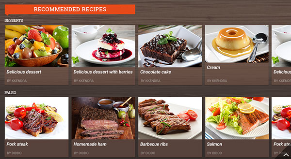
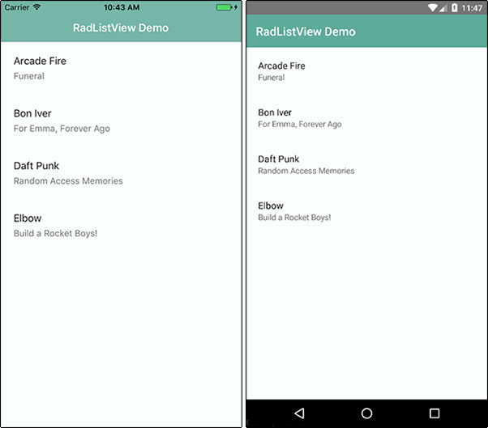
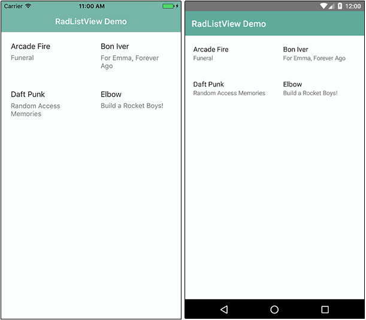
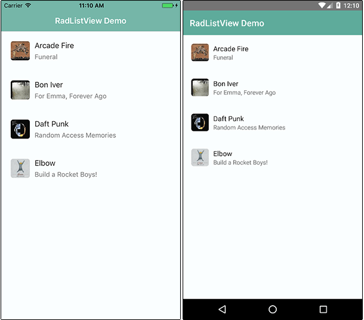
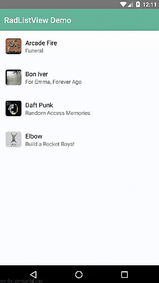
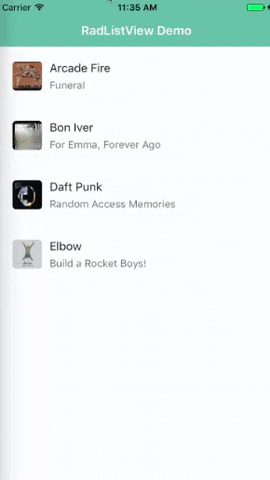
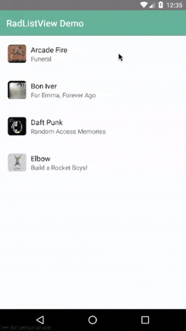
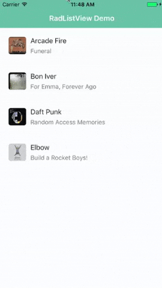
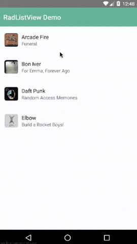

# A Deep Dive into Telerik UI for NativeScript's ListView

Let's face it developers, creating an engaging user experience is hard. When the web was in its infancy we could amaze users with the `<marquee>` tag, but today our customers are more critical and more demanding. They want an app that is not only useful, but immersive and gorgeous.

Whether you are building for web, mobile, or desktop, you know the [Telerik UI tools](http://www.telerik.com/devcraft) have your back. From Kendo UI, to UI for Xamarin, to UI for ASP.NET, to UI for WPF, our tooling can handle virtually any development need.

That's why [Telerik UI for NativeScript](http://www.telerik.com/nativescript-ui) is especially exciting. With UI for NativeScript we are building on the Telerik tradition of providing easy to use components that delight developers with their ease of use - and delight end users with their engaging features.

This is the first post in our "week of UI for NativeScript" series that will dive deep into each component. Today is all about the [ListView](http://docs.telerik.com/devtools/nativescript-ui/Controls/NativeScript/ListView/overview), and soon we will have an in-depth article for each component in our offering:

- ListView
- Chart
- SideDrawer
- DataForm
- AutoCompleteTextView
- Calendar

## What is UI for NativeScript?

UI for NativeScript is a set of premium UI components for native cross-platform mobile apps written with the [NativeScript](https://www.nativescript.org/) framework. Our goal is to simplify NativeScript app development by providing pre-built, ready-to-use, components that are easy to implement in your app (and equally as easy to style to match your app's look and feel).

Let's get started with learning all about the ListView component.

## ListView (a.k.a. RadListView)

The ListView component (known in code as RadListView), allows you to customize lists of data. Sounds basic, but the functions and display options provided are quite diverse. For example, using the RadListView's Grid layout and some CSS styling, you can pretty easily create UIs like this:

> RadListView is part of the *completely free* version of UI for NativeScript. If you are interested in a free trial of UI for NativeScript Pro, which includes additional components, [check it out here](http://www.telerik.com/download-trial-file/v2/nativescript-ui).

With RadListView, you can animate list items, utilize different layouts, and take advantage of numerous gestures like swipe to execute, press/drag to reorder, pull to refresh, and select on press.

## Installing UI for NativeScript

There are a few different ways to get started, depending on your environment and preferences.

**Using the free version of UI for NativeScript?**

Navigate to your NativeScript project directory and install UI for NativeScript with the following command (no manual download required):

	tns plugin add nativescript-telerik-ui

**Using UI for NativeScript Pro?**

Download the UI for NativeScript `.tgz` file from [your Telerik account](https://www.telerik.com/account) or grab a [free trial](http://www.telerik.com/download-trial-file/v2/nativescript-ui). Navigate to your project directory and install UI for NativeScript with the following command:

	tns plugin add <path-to-tgz>

**Using Telerik AppBuilder?**

If you are using [Telerik AppBuilder](http://www.telerik.com/platform/appbuilder) (part of [Telerik Platform](http://www.telerik.com/platform)), you may [follow these instructions](http://docs.telerik.com/devtools/nativescript-ui/appbuilder).

## Getting Started with RadListView

> Note that all of the code demonstrated here is available [in this GitHub repo](https://github.com/rdlauer/ui-for-nativescript-listview). For more code samples, check out the official [UI for NativeScript sample repo](https://github.com/telerik/nativescript-ui-samples).

Plugin installed? Great! Now we'll need to add an XML namespace to the root of the page where we want to use RadListView. If "XML namespace" scares you, have no fear. You just need to add a property to your root `<Page>` element, like one of these:

	<Page xmlns:lv="nativescript-telerik-ui-pro/listview"> // ui for nativescript pro version
	<Page xmlns:lv="nativescript-telerik-ui/listview"> // ui for nativescript free version

Finally, we need to add a RadListView component to our XML markup, as in:

	<Page xmlns:lv="nativescript-telerik-ui-pro/listview">
		<lv:RadListView>
		</lv:RadListView>
	</Page>

And we are done! Well, not quite. This simple example doesn't actually *do* anything yet. Let's get some data in there so we can start playing with the cool stuff!

## Item Templates

ListViews are all about data. The way we format the display of data in a RadListView is with an `ItemTemplate`. Let's add a simple `ItemTemplate` to our existing RadListView:

	<Page xmlns="http://schemas.nativescript.org/tns.xsd" xmlns:lv="nativescript-telerik-ui-pro/listview" loaded="pageLoaded">
		
		<ActionBar title="RadListView Demo" class="action-bar" />
	
		<lv:RadListView id="listview" class="list-group"> 
			<lv:RadListView.listViewLayout>
				<lv:ListViewLinearLayout scrollDirection="Vertical"/>
			</lv:RadListView.listViewLayout>
			<lv:RadListView.itemTemplate>
				<StackLayout class="list-group-item">
					<Label text="{{ itemName }}" class="list-group-item-heading" />
					<Label text="{{ itemDesc }}" textWrap="true" class="list-group-item-text" />
				</StackLayout>
			</lv:RadListView.itemTemplate>
		</lv:RadListView>
	
	</Page>

**Ay dios mio!** I just threw a lot of code at you didn't I? Luckily it's not nearly as complicated as it may first look:

- We associated the `pageLoaded` function with the `loaded` page event (see below).
- We added an `ActionBar` to show a title in our view.
- We added a `listViewLayout` to specify the item layout (see below).
- We added CSS classes for styling.
- We added a `StackLayout` to stack our `Labels` on top of each other.

That's it!

Now for our code-behind JavaScript file, we'll need to populate this view with some data:

	var view = require("ui/core/view");
	
	exports.pageLoaded = function(args) {
		var items = [];
		items.push(
			{
				itemName: "Arcade Fire",
				itemDesc: "Funeral"
			},
			{
				itemName: "Bon Iver",
				itemDesc: "For Emma, Forever Ago"
			},
			{
				itemName: "Daft Punk",
				itemDesc: "Random Access Memories"
			},
			{
				itemName: "Elbow",
				itemDesc: "Build a Rocket Boys!"
			}
		)
		var page = args.object;
		var listview = view.getViewById(page, "listview");
		listview.items = items;
	}

> Looking for Angular 2 code samples? Check out our [complete docs for Angular 2](http://docs.telerik.com/devtools/nativescript-ui/Controls/Angular/overview) as well!

Our `pageLoaded` function simply takes an array of items and associates that array with our RadListView. The results of which are:

> Note that the styles you see come from the [core light theme](https://docs.nativescript.org/ui/theme) that is part of NativeScript, plus some customizations made with the [NativeScript Theme Builder](http://www.nativescriptthemebuilder.com/).

But this is literally just the start. Let's look at how we can extend RadListView.

## Item Layouts

Usually when we think about a ListView, we think of a simple vertical list of items. But what about when we want to utilize a different, even non-linear, type of layout? RadListView provides a few different item layout options (all fully native and optimized for cross-platform use).

- Linear (`ListViewLinearLayout`) - a traditional list with a vertical or horizontal orientation.
- Grid (`ListViewGridLayout`) - use this to order items in columns and rows.
- Staggered (`ListViewStaggeredLayout`) - an extension of the Grid: items are positioned according to their size, not in an even grid-like table.

The linear layout (`ListViewLinearLayout`) is quite easy to implement (this is the layout we used above): 

	<lv:RadListView.listViewLayout>
	    <lv:ListViewLinearLayout scrollDirection="Vertical" />
	</lv:RadListView.listViewLayout>

Likewise, to implement Grid or Staggered layouts, just substitute in `ListViewGridLayout` or `ListViewStaggeredLayout` like so:

	<lv:RadListView.ListViewLayout>
	    <lv:ListViewGridLayout scrollDirection="Vertical" itemHeight="100" spanCount="2"/>
	</lv:RadListView.ListViewLayout>
	
...which results in this kind of a display:

Note that the `itemHeight` property is only valid for a Grid layout, as the Staggered layout has dynamic sizes for rows. Also important to note here is the `spanCount` property. This is what determines how many columns are in your Grid or Staggered layout.

## Spicing it Up with ObservableArrays and Images

The next sections get into the heart of RadListView - animations and support for all kinds of gestures. In order to show these off, we'll want to switch over to using [ObservableArrays](https://docs.nativescript.org/cookbook/data/observable-array) instead of the basic array we've used up to this point.

Easy enough.

Out with the old, in with the new - here is our new code-behind JavaScript file with ObservableArrays:

	var Observable = require("data/observable").Observable;
	var ObservableArray = require("data/observable-array").ObservableArray;
	
	var page;
	var items = new ObservableArray([]);
	var pageData = new Observable();
	
	exports.pageLoaded = function(args) {
		page = args.object;
		page.bindingContext = pageData;
	
		items.push(
			{
				itemName: "Arcade Fire",
				itemDesc: "Funeral",
				itemImage: "~/images/arcade-fire.png"
			},
			{
				itemName: "Bon Iver",
				itemDesc: "For Emma, Forever Ago",
				itemImage: "~/images/bon-iver.png"
			},
			{
				itemName: "Daft Punk",
				itemDesc: "Random Access Memories",
				itemImage: "~/images/daft-punk.png"
			},
			{
				itemName: "Elbow",
				itemDesc: "Build a Rocket Boys!",
				itemImage: "~/images/elbow.png"
			}
		)
	
		pageData.set("items", items);
	};
	
What changed? Not a whole lot. Our array is now observable and we've added an `itemImage` property to display a thumbnail image for all of our list items.

To support this thumbnail display, we are going to re-work our XML markup a little as well:

	<lv:RadListView items="{{ items }}" class="list-group"> 
		<lv:RadListView.listViewLayout>
			<lv:ListViewLinearLayout scrollDirection="Vertical"/>
		</lv:RadListView.listViewLayout>
		<lv:RadListView.itemTemplate>
			<GridLayout class="list-group-item" rows="auto" columns="auto, *">
				<Image row="0" col="0" src="{{ itemImage }}" class="thumb img-rounded" />
				<StackLayout row="0" col="1" >
					<Label text="{{ itemName }}" class="list-group-item-heading" />
					<Label text="{{ itemDesc }}" class="list-group-item-text" />
				</StackLayout>
			</GridLayout>
		</lv:RadListView.itemTemplate>
	</lv:RadListView>
	
In this case we have added a `GridLayout` to allow us to align an image next to the labels, like so:

## Animations

When items are added to (or removed from) a list, it's a great idea to perform some kind of animation to give your users a visual cue of the action taking place. With RadListView, you have four different animation options to choose from:

- Default (the platform default animation)
- Fade
- Scale
- Slide

Let's try out some animations with the our RadListView!

First, let's fake out the system by adding this code snippet right **after** `pageData.set("items", items);`:

	setTimeout(function() {
		items.push(
				{
					itemName: "LCD Soundsystem",
					itemDesc: "This is Happening",
					itemImage: "~/images/lcd-soundsystem.png"
				}
		);
	}, 2000);
	
*After two seconds, an additional item will get pushed into our array.*

Next, we are going to set the `itemInsertAnimation` property on our `ListViewLinearLayout`, like so:

	<lv:ListViewLinearLayout scrollDirection="Vertical" itemInsertAnimation="Slide" />
	
The result of which shows our items sliding in automatically (after two seconds). Simply replace "Slide" with one of "Fade", "Scale", or "Default" to see the other animations at work!

As [Burke Holland](https://twitter.com/burkeholland) would say, "*that's purty cool*". But what we really want to see are some full-fledged gestures and actions that we can apply to our app.

## Gesture Actions

Ah gestures! The key to any engaging mobile app is integrating with the native gestures people use.

Let's look at some of the more common gesture actions you'll want to take advantage of:

Who hasn't used **[pull-to-refresh](http://docs.telerik.com/devtools/nativescript-ui/Controls/NativeScript/ListView/pull-to-refresh)** at some point? Nobody, that's who! Implementing pull-to-refresh is easy, you simply add two properties to your markup:

	<lv:RadListView id="listview" items="{{ items }}" class="list-group" pullToRefresh="true" 
	pullToRefreshInitiated="pullToRefreshInitiated">

First, we set `pullToRefresh="true"`, then we add the `pullToRefreshInitiated` function to the `pullToRefreshInitiated` event.

And here is said `pullToRefreshInitiated` function (which you can paste at the end of your code-behind JavaScript file:

	exports.pullToRefreshInitiated = function() {
		setTimeout(function() {
			items.push(
					{
						itemName: "LCD Soundsystem",
						itemDesc: "This is Happening",
						itemImage: "~/images/lcd-soundsystem.png"
					}
			);
			page.getViewById("listview").notifyPullToRefreshFinished();
		}, 2000);
	};
	
Like above, we are faking out the system to add an item to our array after two seconds during a pull-to-refresh. In the real world, this function would call a remote API to pull in additional data.

 

**[Swipe actions](http://docs.telerik.com/devtools/nativescript-ui/Controls/NativeScript/ListView/swipe-actions)** are another great way to add mobile-specific UI to your app. Each item in your list can be swiped to reveal one or more functions.

Let's look at setting up a simple swipe action with our RadListView:

	<lv:RadListView id="listview" items="{{ items }}" class="list-group" swipeActions="true">

We set the `swipeActions` property to true and then add an `itemSwipeTemplate` to our RadListView, which tells the app what new controls you want to see when you swipe a list item to the left or right.

This code can go before the closing `</lv:RadListView>` tag in your XML markup:

	<lv:RadListView.itemSwipeTemplate>
		<GridLayout columns="auto, *, auto">
			<StackLayout col="0" class="save-btn" tap="onLeftSwipe" orientation="horizontal">
				<Label text="Save" verticalAlignment="center" horizontalAlignment="center"/>
			</StackLayout>
			<StackLayout col="2" class="delete-btn" tap="onRightSwipe" orientation="horizontal">
				<Label text="Delete" verticalAlignment="center" horizontalAlignment="center" />
			</StackLayout>
		</GridLayout>
	</lv:RadListView.itemSwipeTemplate>
		
This `itemSwipeTemplate` allows us to specify a view of our list item as it will appear when the swipe action takes place.

 

Now to make these swipe actions truly functional, you'll need to implement a specific swipe action, which you can [follow in our documentation](http://docs.telerik.com/devtools/nativescript-ui/Controls/NativeScript/ListView/swipe-actions#implementing-swipe-actions). Our docs will show you how to execute an action on a full swipe (swipe-to-execute) or to execute an action on a swipe plus a tap (tap-to-execute).

## Anything Else?

**Oy, we've barely scratched the surface!** RadListView is chock full of ways to customize your NativeScript ListViews. Take a while and [peruse the documentation](http://docs.telerik.com/devtools/nativescript-ui/introduction) where you'll find in-depth examples and code snippets of everything we couldn't cover here today.

In the meantime, be sure to grab a [free trial copy](http://www.telerik.com/download-trial-file/v2/nativescript-ui) of UI for NativeScript Pro to use the - AutoCompleteTextView, Calendar, Chart, and DataForm components!
