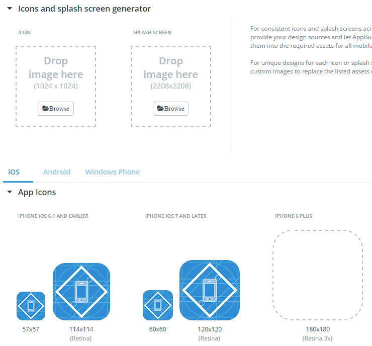
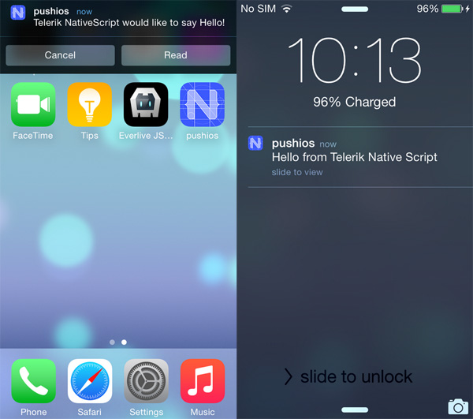
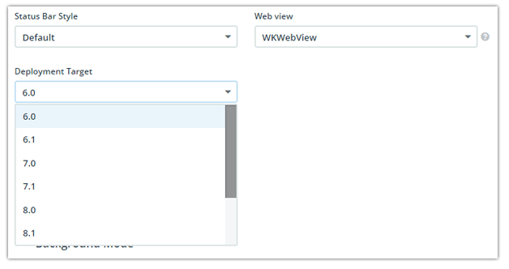
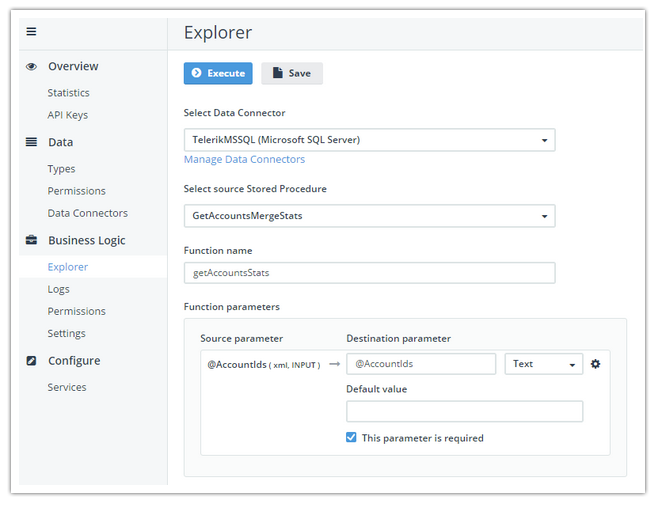
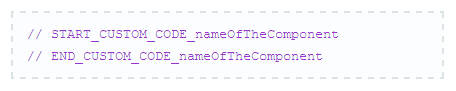
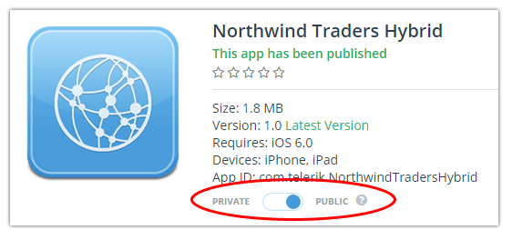

## What's New in the Telerik Platform for August 2015

So many of you have made the [Telerik Platform](http://www.telerik.com/platform) your development platform of choice when it comes to creating hybrid, native, and mobile web apps. Today we are pleased to offer you a look at the latest updates to the entire Telerik Platform. No more searching through individual blog posts to piece together what is new and exciting - here is a high level overview of what is newly available in the fastest growing product in Telerik's history!

**Let's get started!**

- [Automated Creation of Icons and Splashscreens](#icons)
- [NativeScript v1.1.2 Support](#ns)
- [Push Notifications Support for NativeScript](#push)
- [Support for Apple Watch](#watch)
- [Use Cordova Plugins in the AppBuilder Companion Apps](#plugins)
- [Choose iOS Deployment Target](#deployment)
- [Offline Support Now with Offline Files, Caching, and More!](#offline)
- [Support for Stored Procedures in our Data Connectors](#storedprocs)
- [Writing and Retaining Custom Code in Screen Builder](#customcode)
- [New Documentation for Backend Services](#besdocs)
- [Support for Progress Data Services](#progress)
- [App Distribution Without User Authentication](#appmanager)

#### Automated Creation of Icons and Splashscreens

One of the primary pain points you identified when managing your mobile apps is the creation of the ridiculous number of icons and splashscreens for iOS, Android, and Windows Phone **(79 separate images at last count!)**. Today in [AppBuilder](http://www.telerik.com/appbuilder), we handle the creation of all of these image assets for you. All you have to do is provide one high res icon and splashscreen and the AppBuilder clients will generate all of the images!

#### NativeScript v1.1.2 Support

Continuing our tradition of supporting the latest and greatest from our open source [NativeScript](https://www.nativescript.org/) framework, all of the AppBuilder clients now support NativeScript 1.1.2. What's new in this version you ask? Take a look at [this blog post](https://www.nativescript.org/blog/use-native-ios-static-libraries-and-js-modules-from-npm-with-latest-1.1-release).

*Remember that by leveraging NativeScript you can write truly native mobile apps using the JavaScript and CSS skills you know and love.*

#### Push Notifications Support for NativeScript

In March, we announced that the [Telerik Backend Services SDK](http://docs.telerik.com/platform/backend-services/development/javascript-sdk/introduction) would be fully compatible to work in NativeScript applications. Today, we are extending our support to also cover Push Notifications which has been one of the most requested features for customers willing to adopt NativeScript. 

To make it easier for developers to adopt any push notifications provider, we have created a [dedicated push notifications plug-in](https://www.npmjs.com/package/nativescript-push-notifications) that can register your device for push. Further, we have extended the JavaScript SDK of the Backend Services to work directly with the plug-in, so all supported functionality that you have in the SDK for hybrid apps, now works for NativeScript apps as well!

#### Support for Apple Watch

Wearable enthusiasts rejoice! AppBuilder now provides industry-leading support for creating hybrid apps on the [Apple Watch](https://www.apple.com/watch/). Shortly we will release a new Cordova plugin on the [Verified Plugins Marketplace](http://plugins.telerik.com/cordova) that will contain all of the goodies you need. In the meantime, here is a sneak peak:

#### Use Cordova Plugins in the AppBuilder Companion Apps

These days everybody seems to have a "companion app" to use when developing mobile apps. What sets the [AppBuilder Companion Apps](http://www.telerik.com/appbuilder/companion-app) apart (aside from their ease of use and [LiveSync](http://docs.telerik.com/platform/appbuilder/testing-your-app/livesync/using-livesync) support) is that **we now support some of the most used 3rd-party Cordova plugins**!

This makes it even easier for you to fully test your apps in a provision-free deployment.

*Which Cordova plugins you ask?*

- [ActionSheet](http://plugins.telerik.com/cordova/plugin/actionsheet)
- [AdMob](http://plugins.telerik.com/cordova/plugin/admob)
- [BarcodeScanner](http://plugins.telerik.com/cordova/plugin/barcodescanner)
- [Calendar](http://plugins.telerik.com/cordova/plugin/calendar)
- [EmailComposer](http://plugins.telerik.com/cordova/plugin/emailcomposer)
- [Flashlight](http://plugins.telerik.com/cordova/plugin/flashlight)
- [KeyChain](http://plugins.telerik.com/cordova/plugin/keychain)
- [LocalNotification](http://plugins.telerik.com/cordova/plugin/localnotification)
- [Native Page Transitions](http://plugins.telerik.com/cordova/plugin/native-page-transitions)
- [SocialSharing](http://plugins.telerik.com/cordova/plugin/socialsharing)
- [SQLite](http://plugins.telerik.com/cordova/plugin/sqlite)
- [Toast](http://plugins.telerik.com/cordova/plugin/toast)

*Not to mention the existing Telerik plugins that we continue to support in our Companion Apps:*

- [Telerik Analytics](http://plugins.telerik.com/cordova/plugin/telerik-analytics)
- [Telerik AppFeedback](http://plugins.telerik.com/cordova/plugin/telerik-appfeedback)
- [Telerik Push Notifications](http://plugins.telerik.com/cordova/plugin/pushnotification)

#### Choose iOS Deployment Target

A long requested feature, you may now choose a specific iOS deployment target (from iOS versions 6.0 to 8.4). This means that you can now target iOS 7+ devices, which are the only ones that can run apps with code written with [Swift](https://developer.apple.com/swift/) (for example, if you are using a custom Cordova plugin written in Swift).

#### Offline Support Now with Offline Files, Caching, and More!

We are thrilled to see the number of customers creating mobile apps that are offline ready! It’s a must requirement for any serious app, and we are continuing to invest in making it super easy to take your app offline. With this release, we are introducing several important improvements in that regard to our JavaScript SDK for our Telerik Backend Services.

You can now configure the JavaScript SDK to preserve all downloaded files in the storage of the device. It will help you increase the loading time of files that have already been retrieved and load the images much faster. We are also introducing HTML helpers to help you integrate offline files in your existing apps easily. You should simply set the `data-offline` flag in your resource tag, and call the process method of the SDK like this:

    
     
    var el = new Everlive(“api-key”);
    el.helpers.html.processAll();

*Behind the scenes, the SDK will check whether this image is already available in the file system, and load it directly from it, otherwise it will reach out to the server and preserve it for consecutive loads.*

To make things even better, the HTML Helpers are also supporting our responsive images that are dynamically re-sized for you at our servers to fit the screen size, and are served from a Content Delivery Network by simply setting the `data-responsive` tag in your resource like this:

    

With this release you can also configure caching and expiration time for any requests that doesn’t have to be retrieved instantly from the server. You have the choice to set caching and expiration time both on a content type level or on a global level:

	var el = new Everlive({
	    apiKey: 'your-api-key-here',
	    caching: {
	        maxAge: 120, //Global setting for maximum age of cached items in minutes. Default: 60.
	        typeSettings: { //Specify content type-specific settings that override the global settings.
	            "Countries": {
	                maxAge: 43200,
					nabled: true
	            }
	        }
	    }
	});

In a truly Telerik style, all of these improvements are targeted at decreasing the loading time for your users, and decrease the bandwidth footprint of your app and increasing the satisfaction of your users with you app.

#### Support for Stored Procedures in our Data Connectors

The ability to connect directly to your SQL Server and automatically expose the tables and views you want over as web services using our Data Connectors has been gaining traction fast! One of the common requests we have been hearing over and over was the need to support Stored Procedures - where most of the business logic of legacy systems is buried. With this release, you can expose stored procedures directly from your SQL Server to cloud endpoints that can be consumed straight from your mobile app.

The support for stored procedures comes with easy to use interface to map your stored procedures and parameters along with tools that help you execute and test your endpoints before you start integrating them in the device.

#### Writing and Retaining Custom Code in Screen Builder

When you generate an app with Screen Builder, it's common to enhance and modify the generated code in AppBuilder. And, until recently, if you wanted to do that but then wanted to return to Screen Builder to edit the app again (e.g. add a new or edit an existing view) without losing the custom code changes, you were in trouble - you were going to lose these changes after regenerating your app in Screen Builder.

With the latest release we made sure that if you put your custom code changes in a dedicated area outlined by a block comment in the files generated by Screen Builder, **we respect your changes and don't overwrite them!** For more info please check [this help article](http://docs.telerik.com/platform/screenbuilder/troubleshooting/how-to-keep-custom-code-changes).

#### New Documentation for Backend Services

The team has [rearranged the documentation](http://docs.telerik.com/platform/backend-services/what-are-telerik-backend-services) for the Backend Services to help you discover and navigate among the plethora of features that are supported in our products. We hope that you will enjoy it!

#### Support for Progress Data Services

Screen Builder lets you use your own data content by connecting to a data provider. You can connect and use data hosted in our own data provider (Telerik Backend Services) or connect to your own data provider using some of the available data transport protocols like OData and REST (JSON). And with the latest release we added one more option - connect and use data from a Progress Data Service - [OpenEdge](https://www.progress.com/openedge) or [Rollbase](https://www.progress.com/rollbase) (still in the works).

#### App Distribution Without User Authentication

A new time-saving feature for your AppManager end users is the ability for you to turn on and off the requirement they login before downloading your app. So now you can easily deploy an app to your users without forcing them to authenticate themselves. Yes, you should be aware that it's less secure - but in case security isn't as big of an issue, you can use this feature for friction-free app deployment. Read more in the last [AppManager release blog post](http://www.telerik.com/blogs/frictionless-app-distribution-with-telerik-appmanager).

#### Summary

We sincerely hope you enjoy using some of these new features in the creation of your next great mobile app! Going forward, be sure to check out our [feedback portal](http://feedback.telerik.com/Project/129) to help us decide what's next in the Telerik Platform. If you haven't yet, be sure to [sign up for a free trial today](https://platform.telerik.com/#register).