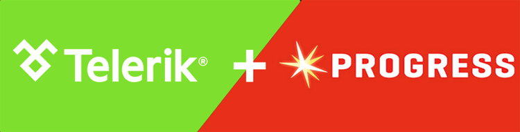
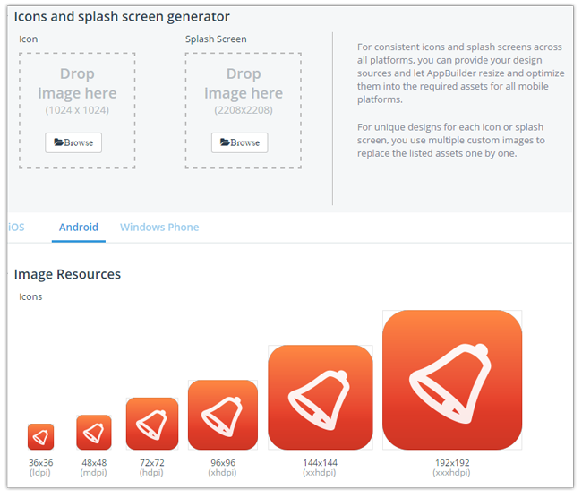
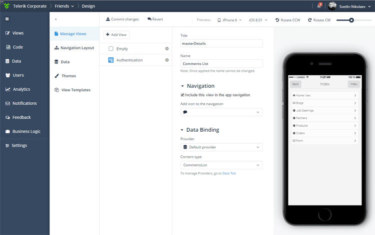
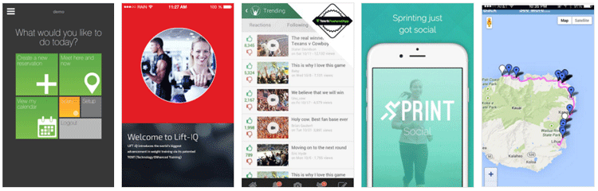

## Telerik Platform 2015 - A Year in Review

As we begin another year here at Telerik, it's a good time for us to sit back, bathe in the afterglow of the holiday season, and reminisce on what 2015 meant for the [Telerik Platform](http://www.telerik.com/platform).

**2015 was a tremendous year across the board here at Telerik.** At the end of 2014 we were acquired by [Progress](https://www.progress.com/), and suffice it to say it has been a fantastic marriage that has allowed us to thrive under the wing of a company that has been successful for 35 years in the industry.

Being part of Progress has, of course, raised our visibility in the enterprise dramatically. [Gartner recognized us as a Challenger](http://www.telerik.com/campaigns/platform/2015-gartner-magic-quadrant-report) in their latest Magic Quadrant for Mobile Application Development Platforms (the second year in a row we have had the honor of being recognized in the MQ).

Enterprises are leveraging the Telerik Platform all over the world, but at the same time we are maintaining a focus on our roots: the web/mobile developers who have been with us on this journey from day one.

### Serving the Developer

This is why, even while our business grows, the tools and services we provide will continue to serve the developer. In 2015 we maintained this focus by providing new and improved features and capabilities across the Telerik Platform lineup including:

The [release of Screen Builder](http://www.telerik.com/blogs/announcing-screen-builder), our visual app scaffolding tool. We followed that up with the ability to [preserve custom code changes](http://docs.telerik.com/platform/screenbuilder/troubleshooting/how-to-keep-custom-code-changes), upgrade older apps to the latest Screen Builder generators, and added support for the Progress Data Source as a data provider. At the same time [we released AppManager LiveSync](http://www.telerik.com/blogs/telerik-appbuilder-may-release-update-a-published-app-in-seconds) which allows you to instantly update an app without going through app store review.

To save you a huge headache you can now [auto-generate your splash screens and icons](http://docs.telerik.com/platform/appbuilder/cordova/configuring-your-app/assets/generate-icons-splashscreens). We added support for [Apple Watch](http://plugins.telerik.com/cordova/plugin/applewatch) and now support alternative webviews such as [WKWebView](http://plugins.telerik.com/cordova/plugin/wkwebview) and [Crosswalk](http://plugins.telerik.com/cordova/plugin/crosswalk). [Jenkins](https://jenkins-ci.org/) users will be happy now that we have embraced the ability to generate CI cloud builds! We also released a public beta for our brand new [cross-platform Desktop Client](https://platform.telerik.com/appbuilder/webclient/#/downloads).

[Telerik Backend Services](http://www.telerik.com/platform/backend-services) released interactive push notifications, full offline support for your data, and a vast array of data connectors. And with [Telerik Analytics](http://www.telerik.com/platform/analytics), we added [user retention cohorts](http://www.telerik.com/blogs/intro-to-user-retention-cohort-reports-in-telerik-analytics) and [new dashboard widgets](http://www.telerik.com/forums/custom-dashboards-product-update).  

**And who could forget NativeScript!?!**

### Native App Development

Historically, when talking about Telerik Platform (or Telerik AppBuilder), we were speaking specifically about hybrid (i.e. Cordova/PhoneGap) development. Nowadays we have to bring native into the conversation with our open source framework, [NativeScript](https://www.nativescript.org/).

NativeScript allows you to create truly native cross-platform apps using the web skills you know and love (JavaScript and CSS) along with an easy to understand XML markup.

**NativeScript grew immensely in 2015, with about 5,500 [GitHub stars](https://github.com/NativeScript/NativeScript) and 1000's of [CLI downloads](https://www.npmjs.com/package/nativescript) every month!**

> Just issue the magic command: npm install -g nativescript

The community around NativeScript is growing dramatically as well. Our friend [Nic Raboy](https://twitter.com/nraboy) created a great [NativeScript training course](https://www.udemy.com/nativescript-101-a-quickstart-to-building-mobile-apps/?couponCode=TELERIK10) that I highly suggest you check out.

Without getting too deeply into our 2016 plans (let's save that for the next blog post :)), I can say that 2016 will merge NativeScript and the Telerik Platform in amazing ways. This next year will bring native development up to par with hybrid and ensure that developing native apps in the Telerik Platform is incredibly empowering in ways that Telerik has traditionally been successful.

### Unification of Tools and Services

If you attended our [December webinar](http://www.telerik.com/webinars/platform/mobile-fast-forward), you learned all about how we have taken our set of mobile app development tools and services and integrated them under one roof. From AppBuilder for coding and building, to Analytics for measuring your app's performance, to Backend Services for data and push notifications, to Screen Builder for visual app scaffolding, to AppManager for distributing your app - the Telerik Platform has embraced all of these services and made it so incredibly simple to use just one, or all of them, depending on your app development needs.

We also spent a lot of time consolidating and improving our docs! If you haven't been there in a while, now is a great time to [check them out](http://docs.telerik.com/platform/) along with our updated [getting started app samples](http://docs.telerik.com/platform/samples/).

If you'd like to learn more about what the new unified Telerik Platform means to you, take a look at [this blog post](http://www.telerik.com/blogs/telerik-platform-2.0-is-coming-in-december-with-big-changes) or [watch a replay](http://www.telerik.com/webinars/platform/mobile-fast-forward) of the webinar.

### Verified Plugins Marketplace

Your source of verified Cordova plugins, the [Verified Plugins Marketplace](http://plugins.telerik.com/) has been a huge success. Traffic to the marketplace is at an all-time high and we now count almost 70 Cordova plugins - and we recently released the [NativeScript plugins marketplace](http://plugins.telerik.com/nativescript)!

We are very proud of what the marketplace has done to enable developers of all types succeed at adding native functionality to their apps with easy to read documentation and code samples.

### Showcase Apps

The [Telerik Platform app showcase](http://www.telerik.com/platform/showcases) has been expanding with more and more great examples of what you can do with our tools and services. If you have an app that you'd like to see in the showcase, be sure to [let us know](http://www.telerik.com/platform/showcases/submit)!

### Excitement Ahead in 2016!

Needless to say, planning for 2016 started a few months ago, and the team is actively at work on the next great set of features for the Telerik Platform. In the next couple of weeks I'll have another blog post for you that outlines more of our plans for this coming year.

I'd like to end with a hearty "THANK YOU!" from everyone here at Telerik. It is **you** who have made the Telerik Platform successful and we aim to keep making mobile app development easier, more engaging, and more fun in 2016.