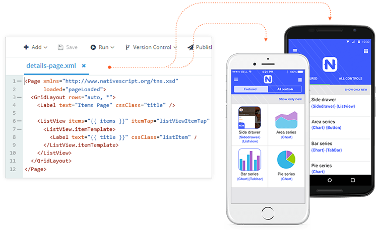
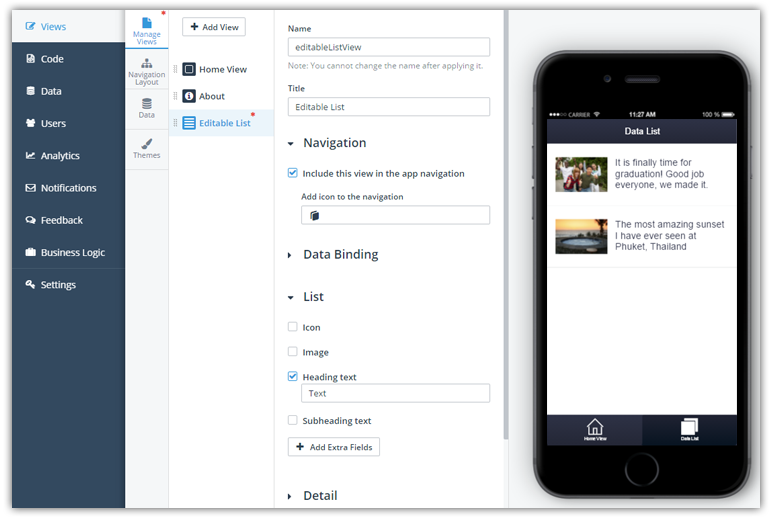
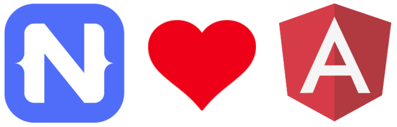
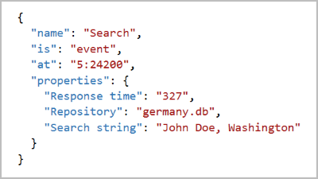
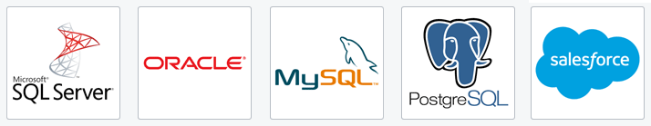

## What to Expect from Telerik Platform in 2016

2015 was a fantastic year for Telerik, especially for our fastest growing product ever, [Telerik Platform](http://www.telerik.com/platform). We have some huge plans for 2016, some of which we will share here and others you'll discover as the year progresses!

### Looking Back

First, we need to acknowledge 2015 as the year the foundation was laid for the Telerik Platform. [Take a look at this blog post](http://www.telerik.com/blogs/the-telerik-platform-year-in-review-for-2015) recapping last year and learn more about everything that we delivered in 2015.

### How We Create a Roadmap

You may be asking, "*How does Telerik create a roadmap?*". It's a great question, as roadmaps for the Telerik Platform are created by our Product Management and Engineering teams working in tandem, along with feedback from our Sales, Marketing, and Developer Relations teams. [Analyst reports](http://www.telerik.com/campaigns/platform/2015-gartner-magic-quadrant-report) certainly come into play as well.

**But the key ingredient is YOU!** By leveraging our [feedback portal](http://feedback.telerik.com/Project/129), [customer forums](http://www.telerik.com/forums/platform), [support tickets](http://www.telerik.com/account/support-tickets/my-support-tickets.aspx), surveys, and one-on-one interviews, you have the opportunity to interface directly with the decision-makers and help guide our roadmap.

Without further ado, let's go through the (public) roadmap for the foreseeable future. And yes, it is the public bits, as we always have something cooking that we can't share quite yet!

### NativeScript

Our open source native app framework called [NativeScript](https://www.nativescript.org/) is a huge part of the "[JavaScript native](http://developer.telerik.com/featured/defining-a-new-breed-of-cross-platform-mobile-apps/)" app development story within the Telerik Platform. While you can certainly develop a NativeScript app today, we are going to make the experience wildly better in the coming weeks, including:

- An expanding NativeScript plugin ecosystem (in [NPM](https://www.npmjs.com/search?q=nativescript) and the [Verified Plugins Marketplace](http://plugins.telerik.com/nativescript))
- Enhanced syntax highlighting and code-completion for NativeScript
- Improved debugging features and [LiveSync](http://docs.telerik.com/platform/appbuilder/cordova/livesync/using-livesync) on device
- Cloud-based emulation options
- A set of dramatically improved [Companion Apps](http://www.telerik.com/platform/appbuilder/companion-app)

### Views

Formerly known as Screen Builder, the Views section allows you to visually scaffold the views (or pages) of your app with a simple point and click interface. This is the starting point for creating an app in the Telerik Platform, so we have a lot of improvements on deck:

- A much **improved data list view** (which you can see today is called "Master Detail"). It comes with full CRUD (Create Read Update Delete) functionality on top of your data.
- Streamline app creation by **extending views to your own templates** and sharing them between your apps.
- **Additional field types** available in the Master Detail and Form views, enabling you to scaffold bigger parts of your apps without writing code.
- Richer capabilities for **navigating between the views**.
- Making it **easier for you to enable Telerik Platform services** (such as Push Notifications and Analytics).

*And of course, the Telerik Platform Views section can generate both hybrid (Cordova) and native (NativeScript) apps!*

### Code

The Code section comprises what you may know to be [Telerik AppBuilder](http://www.telerik.com/platform/appbuilder). This is where you do the bulk of your work (the manual coding) when developing a mobile app. So what's next from AppBuilder?

We are taking our [Visual Studio extension](http://www.telerik.com/platform/appbuilder/visual-studio-extension) to the cloud! You are now able to sync your local Visual Studio projects with the cloud, [switch](http://www.telerik.com/platform/appbuilder/in-browser-client) [between](http://www.telerik.com/platform/appbuilder/windows-client) [AppBuilder](http://www.telerik.com/platform/appbuilder/command-line-interface) [clients](http://www.telerik.com/platform/appbuilder/sublime-text-package) with ease, and leverage new functionality from our [Companion Apps](http://www.telerik.com/platform/appbuilder/companion-app).

We also have plans to offer a way to **generate your app builds locally**, provide **tooling to run unit tests**, and go live with our new **cross-platform Desktop Client** (available as a public beta today for [Mac](https://platform.telerik.com/appbuilder/downloads/proton/osx) and [Windows](https://platform.telerik.com/appbuilder/downloads/proton/win)).

Angular developers have a lot to look forward to this year! Not only will [Angular 2](https://angular.io/) come out of beta, but NativeScript will have full support for Angular 2 - and on top of that - **Telerik Platform will provide tooling and service integrations with Angular 2 for both hybrid and native apps**.

### Analytics

Without [Telerik Analytics](http://www.telerik.com/platform/analytics), you would have no idea how your app is performing, which features are being used, or whether or not your app is churning out errors left and right! One of our biggest priorities is to allow you to quickly and easily enable analytics in both hybrid and NativeScript apps.

In addition, we have a variety of new features in the pipeline:

- **Real-time views** with metrics reflected within seconds of activity.
- Powerful **free-text search** to allow you to instantly search your exceptions with complex queries.
- **Richer monitor data** with the ability to attach properties as key/value pairs to individual measurements, for example:

### Data and More

No mobile app is complete without data, and [Telerik Backend Services](http://www.telerik.com/platform/backend-services) provides you with the means to manage your data and services above and beyond what you may expect. This includes features like [responsive images](http://developer.telerik.com/featured/responsive-images-theres-service/), [cloud code](http://docs.telerik.com/platform/backend-services/javascript/server-side-logic/cloud-code/introduction.html), [push notifications](http://plugins.telerik.com/cordova/plugin/pushnotification), and [user management](http://docs.telerik.com/platform/backend-services/javascript/users/introduction.html) (not to mention storing your files and app data!). Our enterprise customers love the fact that they can connect to their legacy databases using our [Data Connectors](http://docs.telerik.com/platform/backend-services/javascript/data-connectors/introduction.html) as well.

As the year progresses, we will offer **staging and production environments** for all of our runtime services. This means you'll be able to leverage different environments for all of the services just mentioned in various test and release modes. This will make your life much easier when developing against our services.

We are also going to offer an **improved experience for collaborators**. We will have a new "Content Editor" role to allow you to invite new team members who only manage services like Analytics, Backend Services, Push Notifications, and Feedback.

### Thank You!

Thank you again for making the Telerik Platform such a huge success. Feel free to reach out via our [feedback portal](http://feedback.telerik.com/Project/129) and [forums](http://www.telerik.com/forums/platform) to make sure that we continue to evolve to meet your mobile app development needs!

disclaimer: http://www.telerik.com/support/whats-new/analytics/roadmap