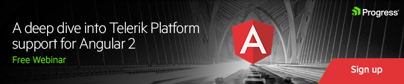

# Deep Dive into Telerik Platform Support for Angular 2

If [Angular 2](https://angular.io/) isn't the hottest ticket in town, I don't know what is. Ok maybe [Hamilton](http://www.hamiltonbroadway.com/). But since Angular 2 went final in September, there has been a skyrocketing interest in what the new version of this wildly popular framework brings to the web and mobile developer communities.

For the past few months, the [Telerik Platform](http://www.telerik.com/platform) team has been hard at work to make Angular 2 a first class citizen among our tools and services. And we are ready to talk about how **you can leverage Angular 2 to build truly native mobile apps with [NativeScript](https://www.nativescript.org/)** in a free online webinar on [Tuesday, November 15 at 11:00 AM ET](http://www.telerik.com/campaigns/platform/angular-2-support-webinar).

> Pro tip: We are also giving away great prizes like an Oculus Rift, Xbox One, and a little something from Nintendo that I think you'll like!

## Why Angular 2?

Why are people flocking to Angular 2? Isn't it just another framework? Not at all! Angular 2 is more of a "platform" than a traditional framework - you can use Angular to create responsive websites, hybrid mobile apps, and native mobile apps with NativeScript. All from one code base!

While we will talk a lot about Angular 2 during the webinar, you may want to [read up on some of the benefits](https://www.nativescript.org/nativescript-is-how-you-build-native-mobile-apps-with-angular) you can take advantage of today. Or even go through an [online tutorial](https://docs.nativescript.org/tutorial/ng-chapter-0)!

## Why Telerik Platform?

For years now Telerik Platform has enabled novice and expert developers to create engaging mobile app experiences. By using the power of [Kendo UI](http://www.telerik.com/kendo-ui) for hybrid mobile apps, and now NativeScript to create truly native apps, Telerik Platform provides an instantly available environment to code, test, publish, and monitor your app.

Can't wait for the webinar? [Start your free 30-day trial](https://platform.telerik.com/#register) of Telerik Platform today.

## Join Us to Learn More

[Join our free online webinar](http://www.telerik.com/campaigns/platform/angular-2-support-webinar) on Tuesday, November 15 at 11:00 AM ET to learn more (and to have a chance to win those sweet prizes!). **Space is limited**, so sign up today!