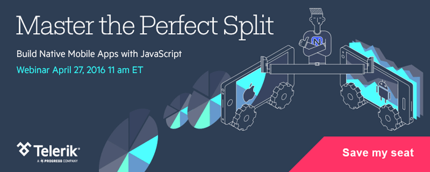
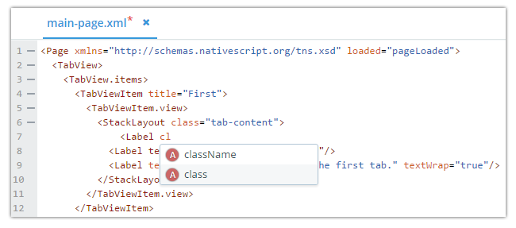
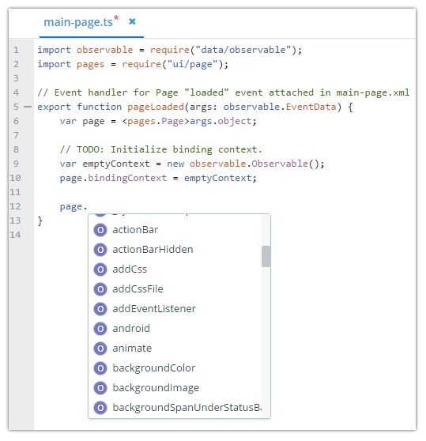
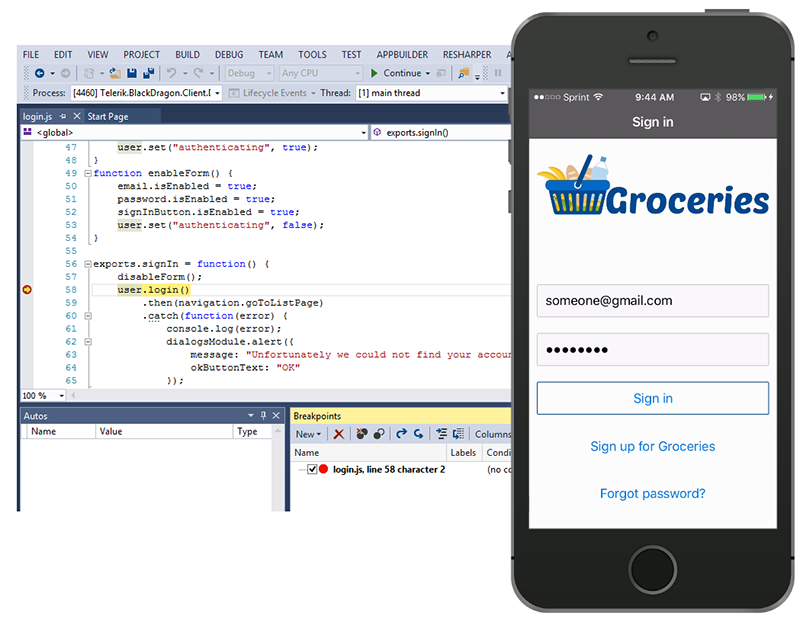
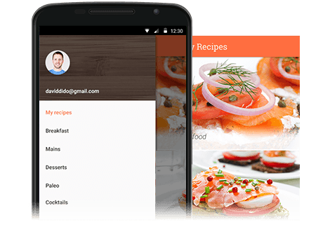
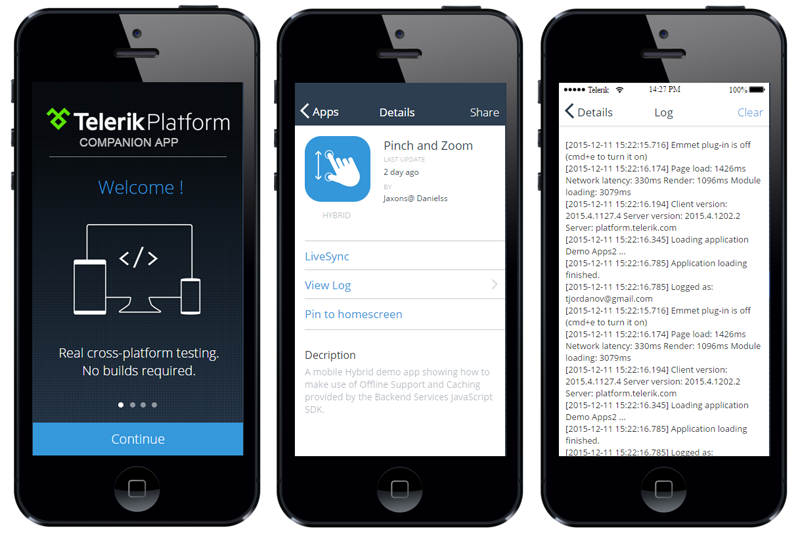
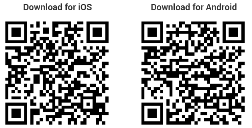
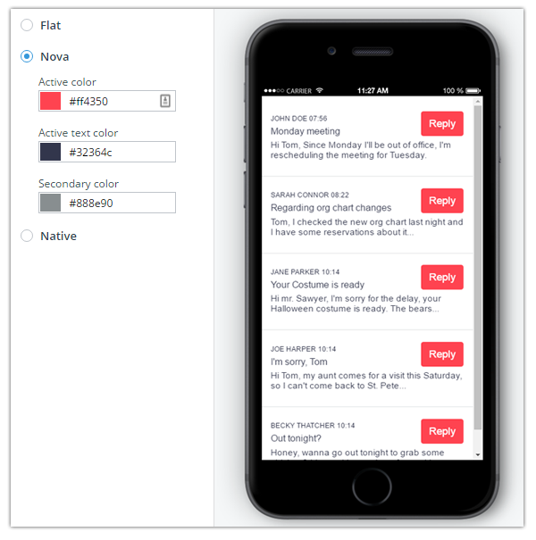

## Bringing True Native App Development to Telerik Platform

As the fastest growing product in Telerik's history, you've come to expect a lot from the [Telerik Platform](http://www.telerik.com/platform). When our journey started a few years ago, we released a cloud-based toolset that focused on the up-and-coming hybrid app development model. Back then our mantra was, "Use your web skills to create hybrid mobile apps". And guess what, that is still our message, because you can now use your web skills to create **native** mobile apps as well!

**Today I'm pleased to announce the latest release from the Telerik Platform.** This major update focuses on the growing need to create engaging mobile experiences by leveraging native device functionality without compromising app performance. Imagine all of the time-saving Telerik Platform tools and services you have been using to create hybrid apps, but now also optimized for native app development.

### Upcoming Webinar

Before we start, you should know that [we have a free webinar](http://www.telerik.com/campaigns/platform/nativeapps) coming up on April 27th! In this presentation we'll be providing a lot more in-depth content about this Telerik Platform release, along with more information about NativeScript (not to mention, some huge raffle prizes for attendees!).

### Telerik Platform and NativeScript

You may already know that Telerik has been developing an open source framework called [NativeScript](https://www.nativescript.org/) which lets you create truly native mobile apps using JavaScript and CSS. While we've had support for NativeScript in the Telerik Platform for some time now, the experience wasn't quite as mature as the hybrid one. And up until now, NativeScript developers were limited to using the NativeScript CLI to build and emulate apps.

This all changes today as we bring NativeScript development up to speed and also introduce numerous code-free tooling and service options to boost your native mobile app development process.

**Enough of the fluff, let's get into the details!**

- [Native App Development Improvements](#native-app-development-improvements)
- [NativeScript UI Controls](#nativescript-ui-controls)
- [Brand New Companion Apps](#brand-new-companion-apps)
- [Universal Desktop Client Steps Forward](#universal-desktop-client)
- [Revamped Views (Screen Builder)](#revamped-views)
- [And No, We Haven't Forgotten About Cordova!](#cordova)

### Native App Development Improvements

Want to impress your co-workers by leveling up on your native app development skills? By using Telerik Platform you'll be doing just that:

**Writing code is where you probably expect to find the most improvements from our tools, and we won't disappoint.** When developing NativeScript apps, you can take advantage of the new auto-completion features in all of our clients:

You can also drop [TypeScript](http://www.typescriptlang.org/) definition files into your project and automagically take advantage of auto-completion for a variety of JavaScript [libraries and frameworks](http://definitelytyped.org/)!

**We are also introducing support for NativeScript 1.7.** You can [read all about the improvements](https://www.nativescript.org/blog/nativescript-1.7-announcement), but suffice it to say there is some pretty amazing stuff there (including a preview of Windows support and an alpha release of the Angular 2 integration!).

**What about debugging?** Native app debugging used to be a bit of an arduous process, but today with NativeScript and the Telerik Platform, you can set breakpoints and debug your apps on any connected iOS or Android device:

### NativeScript UI Controls

Ask any .NET developer out there today and most of them will know Telerik for our wide array of UI controls. That's why we feel strongly that leading with a strong UI offering is critical for the success of NativeScript. We recently released a new product we call [Telerik UI for NativeScript](http://www.telerik.com/nativescript-ui) which contains four time-saving controls (with more on the way):

- [SideDrawer](http://www.telerik.com/nativescript-ui/sidedrawer)
- [ListView](http://www.telerik.com/nativescript-ui/listview)
- [Chart](http://www.telerik.com/nativescript-ui/chart)
- [Calendar](http://www.telerik.com/nativescript-ui/calendar)

And today you can leverage the free version of UI for NativeScript (yes, free!) from with the Telerik Platform via our Package Manager npm integration!

### Brand New Companion Apps

One of our most popular features is the Telerik Platform Companion App. Available for iOS, Android, and Windows Phone, the Companion App lets you test your app on any device without having to deal with the mess of provisioning, certificate management, and app deployment.

When it came to NativeScript development, we used to have a separate NativeScript Companion App. Today we have ONE Telerik Platform Companion App and two separate "player" apps for Cordova and NativeScript apps. We set it up this way to provide the most flexibility and new features to improve your experience, such as the ability to:

- Log in with your Telerik Platform account to access all of your apps (without having to scan QR codes!)
- View the console.log output to assist with debugging
- Run apps that leverage a variety of Cordova and NativeScript plugins

**Download the new Companion Apps today for [iOS](https://itunes.apple.com/us/app/platform-companion/id1083895251?ls=1&mt=8) and [Android](https://play.google.com/store/apps/details?id=com.telerik.PlatformCompanion).**

### Universal Desktop Client Steps Forward

Last time around we announced the public beta of our new cross-platform [Universal Desktop Client](http://www.telerik.com/blogs/appbuilder-universal-desktop-client-february-2016-release) (available today for [Mac](https://platform.telerik.com/appbuilder/downloads/proton/osx) and [Windows](https://platform.telerik.com/appbuilder/downloads/proton/win)). We've made some big steps on our way to the 1.0 release, most notably:

- Offline mode
- Ability to run your app in multiple simulators at once
- Updated TypeScript compiler
- Integration with [JsBeautifier](http://jsbeautifier.org/)

*Look for some major updates from our Universal Desktop Client in the near future, such as:*

- Ability to debug on device
- [LiveSync](http://docs.telerik.com/platform/appbuilder/cordova/livesync/using-livesync) on device
- Windows Phone support
- A new Linux client!

### Revamped Views (Screen Builder)

The "Views" module of Telerik Platform (formerly known as Screen Builder) is often the first stop when creating a new app. Using this code-free visual development tool lets you pick and choose (and customize) a variety of pre-wired view templates. Views is getting a big boost this time around because not only is it compatible with NativeScript (yes, that means you can scaffold the majority of your **native** app before you start coding!) but we're also introducing a variety of new and improved features:

- A new enterprise data provider for [Telerik Sitefinity](http://www.sitefinity.com/) users
- [Custom view templates](http://docs.telerik.com/platform/screenbuilder/view-templates/overview) for easy template re-use throughout your apps
- Ability to customize the colors of your hybrid app theme
- Major improvements to the "Authentication" and "Master Detail" view types (including redesigned configuration for easier navigation of properties)

### And No, We Haven't Forgotten About Cordova!

While this release obviously focused on bringing NativeScript up to speed, **we have an unwavering commitment to [Cordova](https://cordova.apache.org/) and hybrid app development**. Updates such as our revamped Companion Apps apply equally to both hybrid and native app models - we've also provided the latest (stable) Cordova v5 bits. Looking forward, we will fully support both hybrid and native development in the Telerik Platform.

And remember, the future of the Telerik Platform depends on you and your feedback! [Sound off on our feedback portal](http://feedback.telerik.com/Project/129) if there is something you feel like we are missing or something we could do better.

Thanks so much and don't forget about the [upcoming Telerik Platform webinar](http://www.telerik.com/campaigns/platform/nativeapps) where we will dive much deeper (and give out some amazing prizes!).

