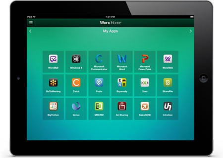
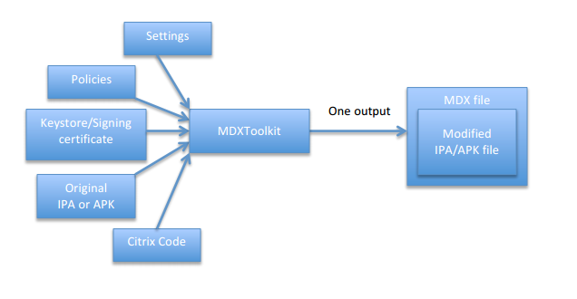
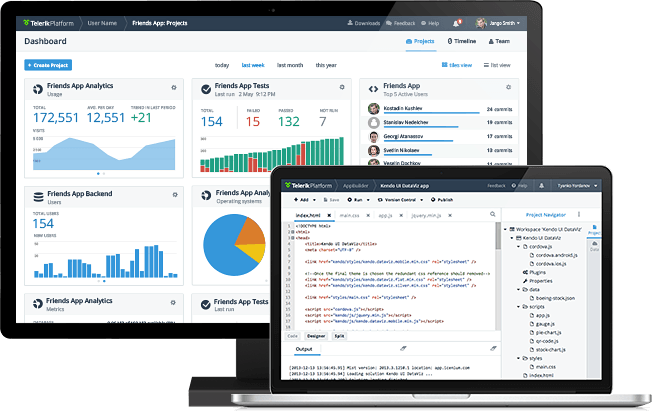

## Telerik Platform Verified with Citrix XenMobile

Security is an ever-present, and growing, concern in the new "bring your own device" (BYOD) era of mobile computing. One of the leaders in this Mobile Application Management (MAM) space is [Citrix XenMobile](https://www.citrix.com/products/xenmobile/overview.html) - and we are proud to announce that apps created with the [Telerik Platform](http://www.telerik.com/platform) are now fully verified and considered "Citrix Ready Worx Verified"!

### What is Citrix XenMobile?

It's no longer a reality to expect that you will provide your employees with fully secured and managed mobile devices. Today your employees are bringing their own devices to work, whether they are iOS or Android, phones or tablets. Citrix XenMobile provides a complete solution for managing and securing apps, data in those apps, and the devices themselves.

With XenMobile, Citrix provides a one stop shop for you to manage your internal app deployments (similar to [Telerik AppManager](http://www.telerik.com/appmanager)). And it gets even better as Citrix provides two ways to secure your app before they get loaded onto your employees' devices.

### App Wrapping and the Worx SDK

Depending on your security needs, Citrix allows you to take advantage of two different ways of securing your apps. The first is via "app wrapping". This is a code-free method by which your apps are "wrapped" with security and management policies (using their MDX Toolkit). The MDX Toolkit works via a command line interface (CLI) or a GUI tool.

App wrapping performs three tasks for you:

- Code is injected into the existing app, implementing security features that you desire. This task outputs a new app file.
- Next, the new app file is signed with a security certificate.
- Lastly, an MDX file is created - this contains policy information and other management settings.

*This is the recommended way to integrate your Telerik Platform app with Citrix XenMobile!*

The second method for securing your apps is by using the Worx SDK. This allows you even more power and control over the security and management needs of your mobile apps.

The Worx SDK exposes a set of APIs for you to use within your apps. These APIs give you intimate knowledge of what is going on with your app, and allows you to add custom security and management functionality.

> You can read more about the detailed instructions for using app wrapping and the Worx SDK in [this help doc](http://support.citrix.com/servlet/KbServlet/download/37957-102-712879/MDXToolkit%20Documentation%20XenMobile%209.0.2.pdf).

### Using the Telerik Platform with Citrix XenMobile

**When it comes to using the Telerik Platform, apps you create are 100% compatible with Citrix XenMobile.** There is nothing special you need to do, no app changes, no settings changes, nothing - simply create a build of your iOS or Android app and then utilize the tooling supplied by Citrix to secure your mobile app!

The advantages of the Telerik Platform are endless - from cloud-based builds for iOS/Android/Windows Phone, to a robust set of debugging and testing tools, to ways to measure app performance and feedback. If you need to extend your Telerik Platform app with the additional security and management policies provided by Citrix XenMobile, you can rest assured your app will perform exactly as you would expect!