# Creating Your First Native Mobile App with Visual Studio (Part 1)

Visual Studio is quite possibly the most adored IDE of all time. For years .NET developers have relied on the myriad robust features and integrations in Visual Studio to make them more productive creating desktop apps, web apps, and now (increasingly) mobile apps.

In the early days of the mobile revolution, a subset of developers leveraged Visual Studio to create native Windows Phone apps. These .NET developers were left out of any true cross-platform development opportunities though - until [Apache Cordova](http://cordova.apache.org/) and [Xamarin.Forms](https://www.xamarin.com/forms) came about.

Cordova presented an opportunity for web developers to create [hybrid mobile apps](http://developer.telerik.com/featured/what-is-a-hybrid-mobile-app/) for virtually every platform. And [Telerik Platform](http://www.telerik.com/platform#overview) was one of the first mobile app development platforms to embrace the hybrid model. But the knock on hybrid apps is usually performance - issues that truly native apps don't generally experience.

With Xamarin.Forms, .NET developers can leverage their existing knowledge of C# to build cross-compiled native apps for iOS, Android, and Windows. Combining the cross-platform capabilities of Xamarin.Forms with [Telerik UI for Xamarin](http://www.telerik.com/xamarin-ui) for instance, C# developers are now empowered to build native apps while sharing a fair amount of code.

## Enter NativeScript

While Xamarin is a big win for C# developers, Visual Studio has always been about more than just C#! Visual Studio considers JavaScript a [first class citizen](https://msdn.microsoft.com/en-us/library/hh334522.aspx) and Microsoft's own [TypeScript](http://www.typescriptlang.org/) was created to effectively give a C# feel to the JavaScript language. Many .NET developers are also leveraging JavaScript and [Angular](https://angular.io/) for client-side development.

If you want to keep leveraging your favorite IDE, while creating truly native cross-platform apps with JavaScript or TypeScript (and optionally Angular) NativeScript may be just the thing for you!

> For more information, read [NativeScript for the .NET Developer](http://developer.telerik.com/featured/nativescript-for-the-net-developer/).

[NativeScript](https://www.nativescript.org/) is a free and open source framework (with [enterprise support](https://www.nativescript.org/enterprise)) that allows you to build native cross-platform mobile apps using the skills you know and love:

- **XAML-like XML** for your UI markup;
- **CSS** for styling your UI;
- and **JavaScript/TypeScript** for your app logic.

NativeScript also allows for nearly 100% code sharing across platforms, dramatically decreasing development time and getting you to market faster than ever before.

Add [Telerik AppBuilder](http://www.telerik.com/platform/appbuilder) (part of Telerik Platform) to the mix, and you can also **build your apps for iOS without owning a Mac** and avoid dealing with dependencies like Xcode and command line tooling.

So now that you're here, let's build a cross-platform native app together with NativeScript and Visual Studio!

## Your First Native Mobile App

In this series we are going to cover literally every part of building a fully functional cross-platform iOS/Android app using a combination of Visual Studio, NativeScript, TypeScript, and AppBuilder. Our supporting backend will be created with C# and SQL Server.

The app we are going to build is...wait for it...a Bill Murray app! Who doesn't love Bill? Our app will feature the following capabilities that are common in app development:

- Tab-based navigation;
- Custom UI layouts;
- Remote data access with SQL Server and ASP.NET Web API;
- Theming with CSS;
- Custom font icons, images, and animations.

Just so we know what the end result will look like, here is a quick example of our soon-to-be-created app on iOS and Android:

 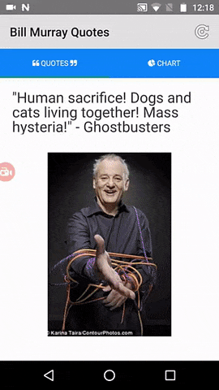

> You can find the complete source code for this NativeScript app in [this Github repository](https://github.com/rdlauer/tns-bill-murray).

## Initial Setup

Let's make sure our environment is set up for us. We will need to:

1. Download and install [Visual Studio](https://www.visualstudio.com/downloads/). Yes, the free Visual Studio Community edition works just fine!
2. [Start a free 30 day trial](https://platform.telerik.com/#register) of Telerik Platform (which includes AppBuilder).
3. Download and install the [AppBuilder extension for Visual Studio](http://cdn.icenium.com/live/vs/AppBuilder.vsix).

With these brief installations done (well, brief if you didn't have to install Visual Studio!) you are all set. There are no other dependencies you have to manage to build an app for iOS or Android!

## Initialize an App

Open Visual Studio and log in to your newly created Telerik Platform account. On the Telerik Platform Start Page, you'll see that you have numerous options to create a new hybrid app with Cordova, a new native app with NativeScript, get sample code, view documentation, or take a spin through our quick start tutorial. All good things to do! However, today let's go directly to creating a new NativeScript app:

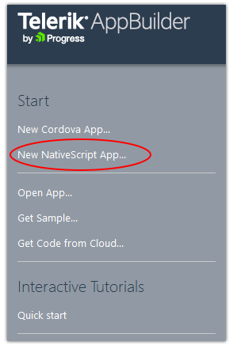

> If the Telerik Platform Start Page isn't visible, you can open the **APPBUILDER** menu and choose **View Start Page**.

There are a lot of templates to choose from when starting an app. Whether you want to use JavaScript, TypeScript, or Angular templates, you have options. Since we are building a tabbed interface with TypeScript, let's start with the TypeScript "TabbedApp":

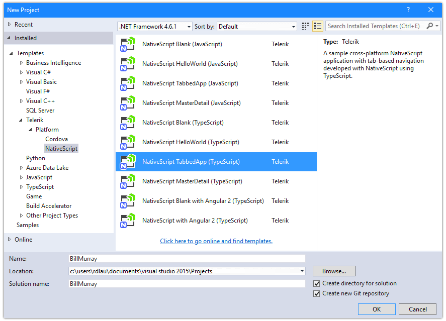

Once the project is created, take a quick look at the assets that are part of this template in the solution explorer:

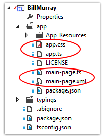

I'm highlighting two important groups of assets: the `app` and `main-page` file bundles. In NativeScript, `app.ts` is the very first file executed and effectively bootstraps your app. In `app.ts` you'll see some pretty straightforward code:

	import application = require("application");
	application.cssFile = "./app.css"
	application.start({ moduleName: "main-page" });

On the first line we are requiring the `application` module (essential for NativeScript to work). We are then setting a global CSS file *for the entire app*. And finally we are specifying the first module, or view, that we should start with. In this case, it's called `main-page`.

Before we look at our `main-page` assets, let's look at the `app.css` file in detail:

	.tab-content {
	    vertical-align: center;
	    color: #808080;
	    font-size: 24;
	    padding: 20;
	}
	
	.title {
	    margin: 0 0 10 0;
	    font-size: 32;
	    color: #3c3c3c;
	}

The first thing you might notice is that **NativeScript uses the same class selectors as the CSS you use on the web** (you can use id and element selectors too). You'll also notice that there aren't any `pt` or `px` units, because NativeScript uses device-independent units to avoid differences in device pixel densities.

Remember that styles in this CSS file will get applied to all pages, or views, of our entire app. If you want to create a CSS file for an individual page, you can do that as well. For instance, if we wanted a custom CSS file for our `main-page` only, we would simply call it `main-page.css`. Easy enough!

> Tip: NativeScript's file name syntax also makes it easy to use [platform-specific assets](http://developer.telerik.com/products/nativescript/platform-specific-development-nativescript/) in your app. For example, `main-page.ios.css` would only be visible on iOS and `main-page.android.css` only on Android.

Let's next look at what we were given for our `main-page` assets: `main-page.xml` and `main-page.ts`. This `main-page.xml` view is the first (and only) view of our app and this is where our truly native UI comes in.

NativeScript uses a simple XAML-like syntax for defining native UI elements. For example, to stack two labels on top of each other, we'd do something like this:

	<StackLayout>
		<Label text="Hello" />
		<Label text="World" />
	</StackLayout>

> Tip: Read more about layouts in this article on ["Demystifying NativeScript Layouts"](http://developer.telerik.com/featured/demystifying-nativescript-layouts/)

The layout provided in `main-page.xml` is a little more complicated, but not much:

	<Page xmlns="http://schemas.nativescript.org/tns.xsd" loaded="pageLoaded">
	  <TabView>
	    <TabView.items>
	      <TabViewItem title="First">
	        <TabViewItem.view>
	          <StackLayout class="tab-content">
	            <Label text="First View" class="title"/>
	            <Label text="This is the content of the first tab." textWrap="true"/>
	          </StackLayout>
	        </TabViewItem.view>
	      </TabViewItem>
	      <TabViewItem title="Second">
	        <TabViewItem.view>
	          <StackLayout class="tab-content">
	            <Label text="Second View" class="title"/>
	            <Label text="This is the content of the second tab." textWrap="true"/>
	          </StackLayout>
	        </TabViewItem.view>
	      </TabViewItem>
	    </TabView.items>
	  </TabView>
	</Page>

You'll see we have:

- a `Page` element that encompasses all of our UI;
- a `TabView` element which is the parent of our two `TabViewItem` elements (effectively two separate views);
- each `TabViewItem` contains a view with a `StackLayout` and two `Label` elements.

Finally, the `main-page.ts` file is the code behind of our `main-page.xml` view. All of our business logic will be executed here:

	import observable = require("data/observable");
	import pages = require("ui/page");
	
	export function pageLoaded(args: observable.EventData) {
	    var page = <pages.Page>args.object;
	    var emptyContext = new observable.Observable();
	    page.bindingContext = emptyContext;
	}

Here we are simply importing the `observable` and `pages` NativeScript modules. We also have a `pageLoaded` function which, if you look back at `main-page.xml` is a function called when the page is loaded (`loaded="pageLoaded"`).

> NativeScript modules are cross-platform abstractions of native code. This allows you to just use JavaScript/TypeScript instead of writing code that looks like Objective-C or Java. Yuck!

Many of the TypeScript samples we will use are fully functional, but naively simple! In the real world you'll probably want to utilize [NativeScript with Angular](https://docs.nativescript.org/tutorial/ng-chapter-0) or NativeScript's built-in [MVVM pattern](https://docs.nativescript.org/tutorial/chapter-3) to better structure your app.

## NativeScript Developer App

Before we proceed, let's see what this template looks like on a real device. The fastest and easiest way to do this is by using the Telerik Platform Companion app + the NativeScript Developer App. Both are available for free:

- Telerik Platform Companion App ([iOS](https://itunes.apple.com/us/app/platform-companion-by-progress/id1083895251?mt=8) and [Android](https://play.google.com/store/apps/details?id=com.telerik.PlatformCompanion&hl=en))
- NativeScript Developer App ([iOS](https://itunes.apple.com/us/app/nativescript-developer-app/id882561588?mt=8) and [Android](https://play.google.com/store/apps/details?id=com.telerik.NativeScript&hl=en))

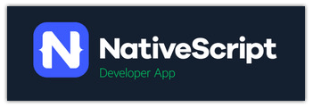

The Telerik Platform Companion App is where you will discover and open apps up for viewing. The NativeScript Developer App is effectively a native container for your app, making it super easy for the Companion App to deliver an app to your device.

These apps work with Visual Studio by syncing your local project files with the cloud and pushing them to your device. This happens without a lengthy app build, so your app is almost instantly available.

Go ahead and open up the Telerik Platform Companion App. Log in with your Telerik Platform credentials and tap on **My Apps**. You'll probably get a screen that looks like this:

That's fine, since your project files are only on your PC, your Companion App knows nothing about your Visual Studio project. Let's change that.

Back in Visual Studio, use the **APPBUILDER** menu and choose **Build {app name} in Cloud**:

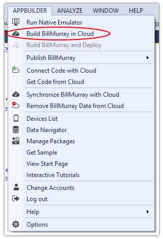

From the dialog provided, choose the OS of your device (iOS or Android) and then make sure you choose "NativeScript Developer App" as your target. We don't want to do a full app build here, we just want to prepare the app for deployment within the Developer App.

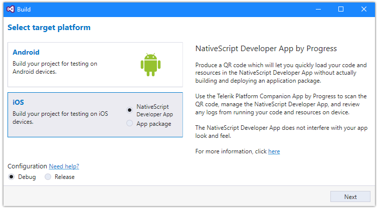

Click the **Next** button and you'll be presented with a QR code. Back in the Telerik Platform Companion App, tap on the little QR code button that you saw on the home screen or your **My Apps** screen. Scan the QR code provided - and voila, there is your app!

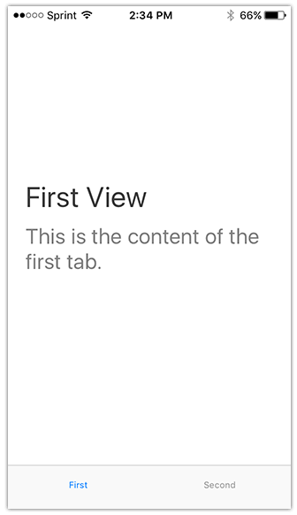 

> Tip: If you want to share your Visual Studio project with other AppBuilder IDEs (like the [web-based IDE](http://www.telerik.com/platform/appbuilder/in-browser-client)), you can use the **APPBUILDER** menu and choose **Connect Code with Cloud**.

## AppBuilder LiveSync

Before we start writing code, let's take a quick look at one of the biggest productivity boosters you get from AppBuilder, and that is LiveSync.

LiveSync allows you to see changes in your app as you make them. No waiting for a full rebuild/deployment to your device, LiveSync works behind the scenes to make sure you always have the latest code changes on your device. LiveSync is available in two scenarios:

1. **Did you build your app in the cloud and deploy to a connected (real) device?** LiveSync works automatically when files are saved, as long as you keep your device tethered to your PC.
2. **Did you use the Telerik Platform Companion App to deploy your app?** (Yes, that's what we did.) LiveSync syncs your files when you do a three-finger tap within the app (iOS) or when you use the "sync" function in the notification menu (Android).

Let's quickly try it out!

In Visual Studio, open your `main-page.xml` file and change one of the labels. Let's change the "First View" text property of one of our labels to "Hello NativeScript!". The first `<Label>` element should now look like this:

	<Label text="Hello NativeScript!" class="title"/>

Save the file and go to the **APPBUILDER** menu and choose **Synchronize {app name} with Cloud**. This tells Visual Studio to sync your updated app files with the cloud.

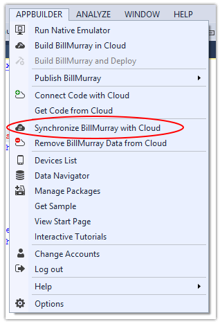

Back on your device, **tap and hold three fingers** with your app running (iOS) or **tap the "sync" function in the notification menu** (Android). You'll get a notification that the the Companion App is downloading and extracting the package. And finally:

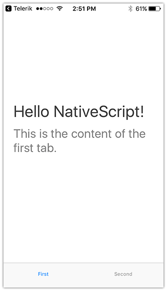 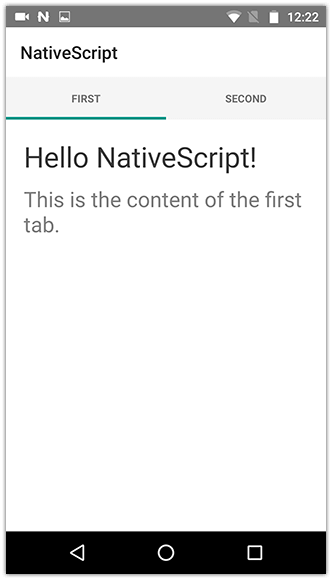

All without having to do a complete re-build and re-deployment of the app!

## What's Next?

You've come a long way and we've covered A LOT of new concepts!

In the next article in this series, we are going to write some code! We will build the structure of our app using NativeScript layouts, native UI elements, and mock in some data. We will also look at debugging our app with the built-in debugging capabilities of Visual Studio. After that we are going to dive into creating a simple ASP.NET Web API backend and look at how we can style our app with CSS and native animations!

[**Read Part 2 --&gt;**](#)