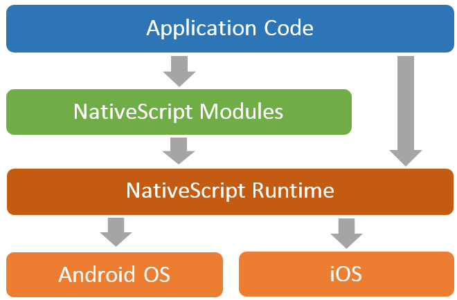

## Hybrid or Native Mobile App? Use the Right Tool for the Job

The toolbox for the mobile app developer has grown larger and more diverse than anyone ever anticipated. From pure native solutions like Xcode and Android Studio, to native JavaScript options like [Telerik NativeScript](https://www.nativescript.org/) and React Native, to web-based frameworks like [Kendo UI](http://www.telerik.com/kendo-ui) and Ionic, it's easier than ever to get started with app development. But with increased options comes a "paradox of choice" - we freeze and get frustrated when we have *too many* options to choose from. What we really want are fewer choices with clear guidance. In this article I hope to shed some light on your choices and provide a friction-free path towards mobile app success!

When we talk about leveraging mobile app development tooling and services such as those provided with [Telerik Platform by Progress](http://www.telerik.com/platform), your choices become much more succinct:

- **Want to go hybrid?** We support [Cordova/PhoneGap](https://cordova.apache.org/) development with any mobile JavaScript framework.
- **Want to go native?** We support [NativeScript](https://www.nativescript.org/) development (with its optional [Angular 2 integration](https://www.nativescript.org/nativescript-is-how-you-build-native-mobile-apps-with-angular)).

> When you use the Telerik Platform, you don't need a Mac nor do you need to manage proprietary SDKs. You gain access to best-of-breed simulation, debugging, and mobile services like push notifications, LiveSync, app store publishing, and much more.

### What Exactly is a Hybrid Mobile App?

My colleague John Bristowe nailed it [with this blog post](http://developer.telerik.com/featured/what-is-a-hybrid-mobile-app/) which contains a full explanation of what a hybrid app is all about. To be clear, a hybrid mobile app is NOT a mobile website! It is an app that is natively installed on your device, but coded with web technologies (HTML5, CSS, JavaScript) and runs inside of what is called a WebView. A WebView is effectively a chromeless browser bundled with a mobile app.

A hybrid mobile app looks, feels, and acts like a native app (most of the time...see below). It can also interact with native device functions like geolocation, camera, contacts, and so on. Any gaps in accessing native features can usually be filled with a variety of [Cordova plugins](http://plugins.telerik.com/cordova).

**Sounds pretty good, right?** Let's look at some more detailed strengths and weaknesses of hybrid:

#### Hybrid Strengths

- **Fully cross-platform:** You write code once and then build it for iOS, Android, and/or Windows Phone.
- **Code reuse:** You can take most of an existing web app code and transform it into a mobile app.
- **Skill reuse with small learning curve:** If you have JavaScript, HTML, and CSS knowledge, you can quickly develop an app with Cordova and a mobile JavaScript framework.
- **Reduced development time and cost:** Because of the above strengths, you can deliver a finished mobile app relatively quickly.
- **Established ecosystem:** Cordova is a mature open-source framework and [Kendo UI](http://www.telerik.com/kendo-ui) includes a well known (and open source) [mobile framework](http://docs.telerik.com/kendo-ui/controls/hybrid/introduction).

#### Hybrid Weaknesses

- **Perceived performance issues:** Since your hybrid app runs in a WebView, you are limited to the performance of that WebView on the device (Android especially has known its share of troubles).
- **Differences in behavior across devices:** Because WebViews differ from platform to platform (and even from version to version), you might need to apply additional tweaks and optimize your code to ensure that your app runs as expected on all devices.
- **Performance issues with heavy graphics and transitions:** WebViews definitely have issues when processing demanding graphics and transitions (typical of games and other UI-heavy apps).
- **Additional development required for platform-specific UI or features:** To tap into unique platform features, you usually need to write additional code or use a plugin. In some cases, you might even need to create the plugin yourself.
- **Slow adoption of new platform versions:** When a new mobile platform version becomes available, you need to wait up to a few months before Cordova introduces verified support for the new version and its features.

### And What Exactly is a Native Mobile App?

A native mobile app is an app that runs natively on your device with truly native UI elements. Unlike a hybrid app, a native app does not sacrifice performance because, well, it's running natively on the device! **There is no WebView getting in the way on native.** A native app also has full access to every API available on each platform it runs on (so there isn't necessarily the need to use plugins to fill any gaps, though they can help).

**When we talk about native, we think the best and easiest way for you to go native is by using our free and open source framework called [NativeScript](https://www.nativescript.org/).**

Why NativeScript? Well, like hybrid, it lets you utilize the web skills you know and love (CSS and JavaScript/TypeScript) while providing a seamless and engaging user experience with our add-ons like [Telerik UI for NativeScript](http://www.telerik.com/nativescript-ui).

**Again, sounds good right?** Let's again look at some more detailed strengths and weaknesses of native:

#### Native Strengths

- **Cross-platform:** Like with hybrid, apps you create with NativeScript run on both iOS and Android with one codebase.
- **Code reuse:** Again, like hybrid, you can copy a lot of your JavaScript business logic into a NativeScript app (depending on the situation of course).
- **Skill reuse:** Do you know JavaScript and CSS? Do you understand the concept of XML (for UI markup)? If so then you already have the basics needed to understand NativeScript.
- **Native UI and performance across all platforms and devices:** Because your apps use native components, they look and run natively everywhere.
- **Leverage existing native libraries:** NativeScript provides out-of-the-box support for native libraries, including [CocoaPods](https://cocoapods.org/).
- **Day zero support for new mobile features:** When a new mobile OS version becomes available, NativeScript immediately provides support for the new version and its features.

#### Native Weaknesses

- **Relatively new:** [JavaScript Native](http://developer.telerik.com/featured/defining-a-new-breed-of-cross-platform-mobile-apps/) frameworks are relatively new to the game, therefore the community is still building resources and extended documentation for you.
- **Steeper learning curve:** While hybrid lets you use HTML, NativeScript forces you to use more native app concepts like native UI elements. Sorry, no more divs, but the NativeScript layout engine is [pretty easy to understand](http://developer.telerik.com/featured/demystifying-nativescript-layouts/).

### When Would I use Hybrid vs Native?

**THIS is the key question, isn't it?** If you know that you want to develop a mobile app AND you know now that you have choices AND you also know that the [Telerik Platform](http://www.telerik.com/platform) supports both methods, what do you do? Here are some common issues we hear people talking about when choosing between hybrid and native development:

**Performance is critical for me - my customers will drop my app if it doesn't feel right!** If performance is key (and it usually is), then going native with NativeScript is a great way to start.

**I just need to put an app together as quickly as possible. It doesn't have to be perfect or feel 100% native.** Need to quickly develop a proof-of-concept app? Then hybrid is probably your best choice to get something quick out there. The cool thing about NativeScript is that you may even be able to copy most of your business logic from your POC app into a NativeScript app (since they both run on JavaScript!).

**I want to future-proof my app. I can't wait for someone else to write a plugin or update a framework.** Staying up to date with the latest mobile platforms is critical, which is why NativeScript provides zero day support for all new OS releases and API updates.

**I *need* to create a Windows Phone version of my app!** As of today, Windows Phone is only supported with hybrid (although the NativeScript team is working on it).

### Next Steps

**[Set up a free trial](https://platform.telerik.com/) for the Telerik Platform today.** Once you start your trial, we provide you with an instantly-available development experience with numerous step-by-step quick start tutorials for both hybrid and native. Best of luck with your app development!