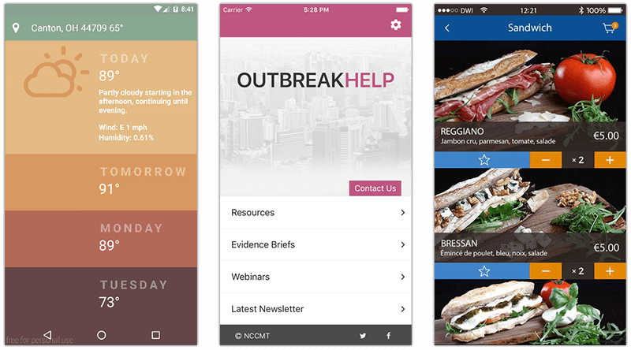

# Resources for Upgrading Your Hybrid Apps to NativeScript

Yes, in fact, there *is* life after Telerik Platform! While the recent news that [Telerik Platform is set to retire](https://www.telerik.com/platform-next-level) in May 2018 elicits mixed emotions, the good news is that **Progress is in no way abandoning our mobility customers!** Over the past year the NativeScript team has been working hard to release new tools and improve the core framework that allows you to create truly native, cross-platform, apps **using the same web skills** you've been using to create hybrid apps.

> The future of mobile app development is NativeScript, and we will help you get there!

**Make no mistake: NativeScript is at the core of the Progress mobility strategy going forward.** Progress is dedicating significant resources to make sure your transition from hybrid (i.e. Cordova/PhoneGap) to native (NativeScript) is as seamless as possible.

With that being said, let's make sure we are aware of all the resources available today, for free, to help us migrate from hybrid to native:

## HybridToNative.com

With the online resource [hybridtonative.com](http://www.hybridtonative.com/), we've partnered with the community to provide a guide on upgrading your existing Angular-based hybrid apps to NativeScript.

This extensive guide contains everything you need to know when upgrading your hybrid app. From a comparison of hybrid and native technologies, to a look at using the Ionic CLI vs the NativeScript CLI, to comparing UI implementations, and more, [hybridtonative.com](http://www.hybridtonative.com/) should be your first stop on your upgrade path.

## Migrating from Cordova to NativeScript

In the article, [*Migrating from Cordova to NativeScript*](https://developer.telerik.com/content-types/tutorials/migrating-cordova-nativescript/), we take a high level look at an existing hybrid app and what it takes to upgrade it to NativeScript.

By breaking down an existing hybrid app and looking at the views/layouts, JavaScript business logic, and CSS styling, we see how a transition from hybrid to native isn't nearly as difficult as one might think.

For example, we can take this HTML from a hybrid app:

	<header class="header">
	    <h1>todos</h1>
	    <input class="new-todo" placeholder="What needs to be done?">
	</header>
	<section class="main">
	    <ul class="todo-list">
	        <!-- item template goes here -->
	    </ul>
	</section>

...and convert it to a truly native view with NativeScript-flavored markup:

	<StackLayout>
	    <Label text="todos" class="title" />
	    <TextField class="new-item" text="{{ newTodo }}" hint="What needs to be done?" />
	    <Repeater items="{{ todos }}">
	        <!-- item template goes here -->
	    </Repeater>
	</StackLayout>

Take a closer look by reading [*Migrating from Cordova to NativeScript*](https://developer.telerik.com/content-types/tutorials/migrating-cordova-nativescript/).

## Modernizing One Hybrid App at a Time

The NativeScript Developer Relations team put together an online webinar on *Modernizing One Hybrid App at a Time*. This hour-long video contains a wealth of information on the latest in NativeScript tooling, strategies on sharing code between web and mobile, and how to create an engaging user interface with NativeScript.

Watch *Modernizing One Hybrid App at a Time* on YouTube now:

iframe width="560" height="315" src="https://www.youtube.com/embed/US-eudM3gJw" frameborder="0" allowfullscreen></iframe>

## Migration Guides

Progress is also providing an extensive set of **migration guides** to ease your transition from Telerik Platform to third party tooling and service offerings:

- For Analytics, we recommend [Google Analytics](https://analytics.google.com/) or [Count.ly](https://count.ly/) (more info in the [FAQ](https://docs.telerik.com/platform/analytics/discontinuation));
- For AppBuilder (Cordova/PhoneGap apps), consult our [migration guide](https://docs.telerik.com/platform/appbuilder/cordova/migration-guide) to make the most of leveraging the Cordova CLI;
- For AppManager, you may want to look at [Applivery](https://www.applivery.com/), [Microsoft HockeyApp](https://hockeyapp.net/), and/or [Apple TestFlight](https://developer.apple.com/testflight/) (more details in the [FAQ](https://docs.telerik.com/platform/appmanager/discontinuation));
- For Backend Services, [Kinvey](https://www.kinvey.com/?utm_medium=telerikdotcom&utm_campaign=tp-shutdown&utm_source=website) is a fantastic substitute. Read the [migration guide](https://docs.telerik.com/platform/backend-services/javascript/migration/migration-guide) and [feature comparison](https://docs.telerik.com/platform/backend-services/javascript/migration/feature-comparison).

## Other NativeScript Resources

There are plenty of places you can go next to learn more about NativeScript and the new NativeScript tooling options:

- Getting started with NativeScript ([using JavaScript](http://docs.nativescript.org/tutorial/chapter-0) or [using Angular/TypeScript](http://docs.nativescript.org/angular/tutorial/ng-chapter-0));
- Try NativeScript in the browser with the [NativeScript Playground](https://play.nativescript.org/);
- Download [NativeScript Sidekick](https://www.nativescript.org/nativescript-sidekick) and see how easy it can be to bootstrap an app and build in the cloud (all without needing a Mac!).

