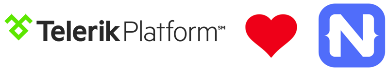
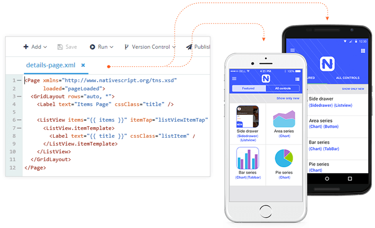

## Enabling Native App Development in Telerik Platform

At the end of March we unveiled the first major Telerik Platform release of 2016. Focusing on the theme of native app development, the Telerik Platform team had a laser focus on making the [NativeScript](https://www.nativescript.org/) development experience second to none.

The Telerik Platform has its roots in the hybrid app development model (using a framework called Cordova, a.k.a. PhoneGap). While we still provide outstanding tooling and services for hybrid development, we have seen the rising tides of ["JavaScript native"](http://developer.telerik.com/featured/defining-a-new-breed-of-cross-platform-mobile-apps/) frameworks and felt that now was the time to expand the reach of our beloved Platform. What better way to do so than use our own NativeScript framework for building native cross-platform apps with JavaScript and CSS.

**So today, we are enabling developers from all over the world to create truly native mobile apps for iOS and Android.** How are we accomplishing this? By providing the following robust enhancements to our offering:

1. Improvements to the code writing experience with improved intellisense and XML syntax verification
2. Enhanced debugging features to expose code defects before they hit the device
3. A new set of Companion Apps to make it even easier to test your app on a device
4. Upgrades to the latest version of NativeScript (1.7)
5. Full support in Screen Builder and our other runtime services such as Telerik Analytics

We have big plans for Q2 with even more enhancements to our Companion Apps and a vastly improved way to simulate iOS and Android devices in the cloud. At the same time, we aren't losing focus on our customer base who relies on us for top-of-the-line tooling and services for hybrid app development!