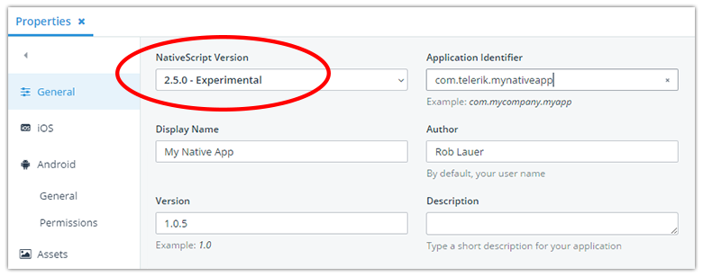
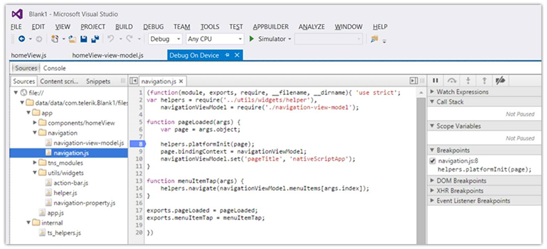

# Telerik Platform Improvements for NativeScript Developers

In terms of SaaS products, [Telerik Platform](http://www.telerik.com/platform) has been around for a long time. What started in 2014 as the merging of disparate Telerik services (such as [Icenium](http://www.telerik.com/platform/appbuilder) and [Everlive](http://www.telerik.com/platform/backend-services)) soon became a full-fledged hybrid app development environment. Times change of course, and we've noticed a sea-change in mobile app development needs; where individuals and organizations are more focused on providing even more engaging mobile experiences. Something certainly doable with hybrid, but far easier with performant native UI.

This is why [NativeScript](https://www.nativescript.org/) is becoming more and more critical for Telerik Platform's success. The ability to leverage this robust (and open source) framework for creating truly native, cross-platform, mobile apps is important for the success of the native JavaScript developer.

Today we have a few tidbits to share regarding NativeScript and Telerik Platform, with a bonus for our Cordova developers as well!

## Faster NativeScript Updates

Up until recently, there was almost always some delay between a NativeScript release and being able to use that release within [AppBuilder](http://www.telerik.com/platform/appbuilder). However, now all NativeScript builds (and project templates) will be updated right after the NativeScript team releases framework updates to the public.

This means no more waiting for improvements and bug fixes, you'll have the advantage of choosing a new version to build with immediately!

Now occasionally there are changes to the framework that require updates to the AppBuilder tooling. In these situations there will be a slight delay as those changes are implemented, but generally should be no more than one release cycle.

## Debugging in Visual Studio

We know that many of you leverage the AppBuilder services via our [extension for Visual Studio](http://www.telerik.com/platform/appbuilder/visual-studio-extension). **This is why we are happy to announce that the Visual Studio extension now supports the new NativeScript debugger interface!**

This is just another example of an amazing joint effort internally with the NativeScript and AppBuilder engineering teams. The debugging UI in Visual Studio brings with it tremendous productivity improvement possibilities.

## Cordova Version Clarifications

As with the NativeScript framework, we are always on top of the latest updates from [Cordova](http://cordova.apache.org/). Historically we have used the platform-specific versioning to show which version of Cordova we are on. This unfortunately led to confusing versions like "Cordova-iOS 4.3.1" and "Cordova-Android 6.0.1". Our customers are more used to the *Cordova CLI* versioning, which wraps up the platform-specific bits into one version number.

**Therefore, we are now leveraging the Cordova CLI versioning syntax** to make it clear that we are staying up to date with Cordova as well!

The latest release of AppBuilder **includes support for Cordova 6.4**, which includes:

- Cordova-iOS 4.3.1
- Cordova-Android 6.1.0
- Cordova-WP8 3.8.2

## Connect With Us!

We are always eager to hear what you need to be more successful as a mobile developer. Connect with us via any of these resources:

- [Telerik Platform Forums](http://www.telerik.com/forums/platform) (for support questions)
- [Telerik Platform Feedback Portal](https://feedback.telerik.com/Project/129) (for feedback on future plans)
- [Twitter](https://twitter.com/telerik) (to get the latest news)

**Start your free [Telerik Platform trial](https://platform.telerik.com/#register) today!**