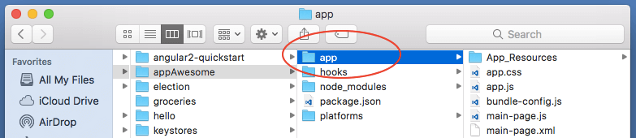
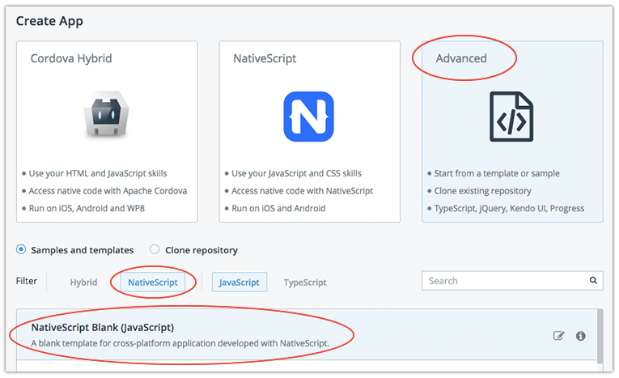
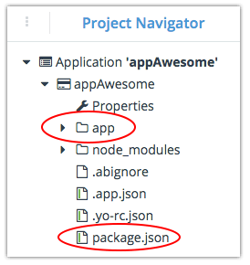
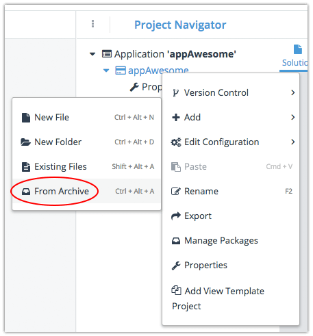
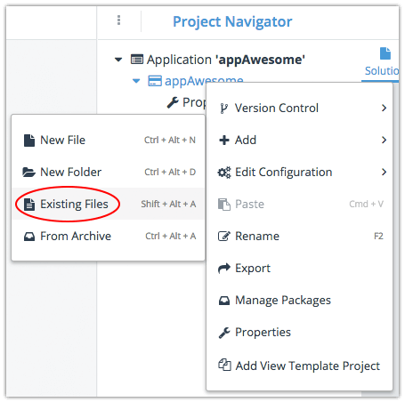
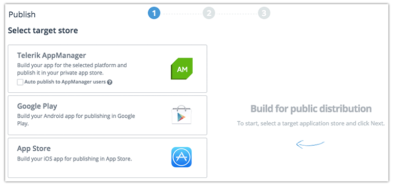
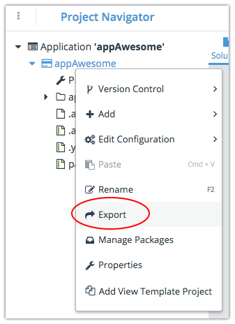

# NativeScript CLI to Telerik Platform - There and Back Again

Far and away the most common place for people to start developing [NativeScript](https://www.nativescript.org/) apps is with the NativeScript CLI. It just makes sense - NativeScript is completely free, open source, and provides everything you need out of the box to create truly native cross-platform apps with JavaScript.

However, we regularly hear from many of these same people that they want to take a project started with the NativeScript CLI and move it to [Telerik AppBuilder](http://www.telerik.com/platform/appbuilder) (part of [Telerik Platform](http://www.telerik.com/platform#overview)). **Why? Well, with AppBuilder you get access to:**

- Cloud builds (no need for a Mac and no need to manage SDKs);
- App store deployment;
- Icon and splashscreen creation;
- Plugins management;
- Configuration/settings management.

...the list goes on and on. So clearly there is value in moving a project from the NativeScript CLI to AppBuilder, but how do you do it? That's what this guide is all about.

## Migrating Project from NativeScript CLI

If you have an existing NativeScript project created with the NativeScript CLI, let's go through the steps to move this project to AppBuilder.

> Note that these instructions work equally well on Mac and Windows!

Locate your NativeScript project in your file system and compress/zip the `app` directory:

Next, log in to your [Telerik Platform account](https://platform.telerik.com). Create a brand new NativeScript app by choosing **Advanced > NativeScript > Blank Template**:

Once your project is created in AppBuilder, use the **Code** menu option to navigate to the code editor.

You'll now need to **delete** the `app` directory and the `package.json` file in the **Project Navigator** pane:

Next, right click on the project name and choose **Add > From Archive**. Choose the archive that you created from your existing NativeScript app directory:

Finally, right click again on the project name and choose **Add > Existing Files**. Choose the `package.json` file from the root directory of your existing NativeScript project:

**And you are done!**

From here you can build in the cloud for iOS and Android, test the app with the NativeScript Developer app (available for [iOS](https://itunes.apple.com/us/app/nativescript-developer-app/id882561588?mt=8) and [Android](https://play.google.com/store/apps/details?id=com.telerik.NativeScript&hl=en)), and even deploy your app to both app stores!

## Migrating Project from AppBuilder

If you have an existing Telerik AppBuilder project, you can also export it and continue development with the NativeScript CLI!

It's incredibly easy to take your AppBuilder project and open it up with the NativeScript CLI. Simply right click on your project and choose **Export**:

Unzip the downloaded archive, open up a terminal window, navigate to the project directory, and run:

`tns platform add ios|android`

...and finally:

`tns run ios|android`

...to see your app running in a simulator/emulator.

> Alternatively, you can use [AppBuilder's built-in Github integration](http://docs.telerik.com/platform/appbuilder/development-tools/version-control/third-party-vc/configuring-third-party-vc/configuring-third-party-vc) to maintain one repository that can be edited via AppBuilder or your local file system!

## Summary

You've seen how incredibly easy it can be to move back and forth between the NativeScript CLI and Telerik Platform. If you haven't already, set up your [free 30 day trial of Telerik Platform](https://platform.telerik.com) today!

