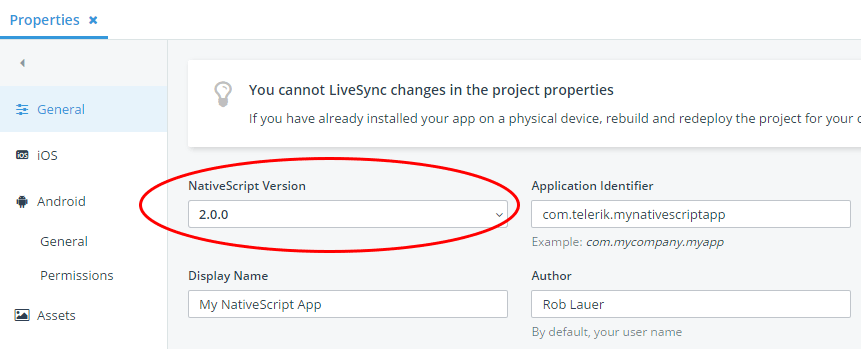
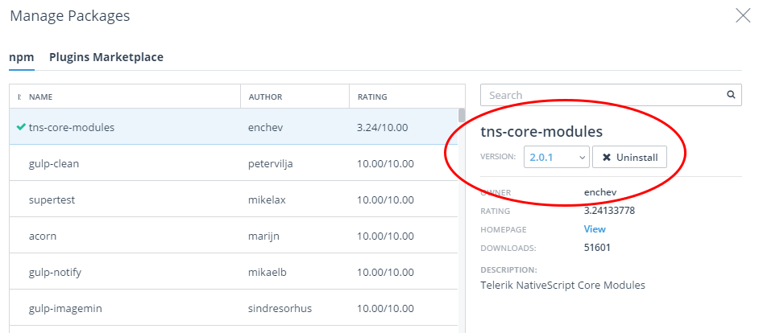
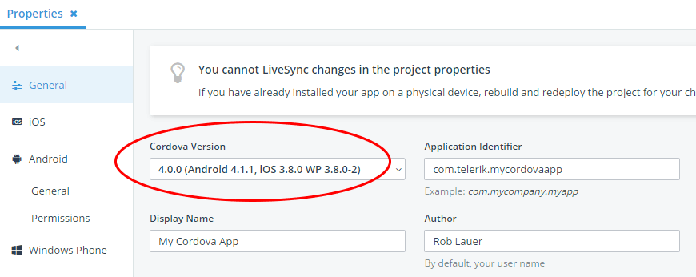
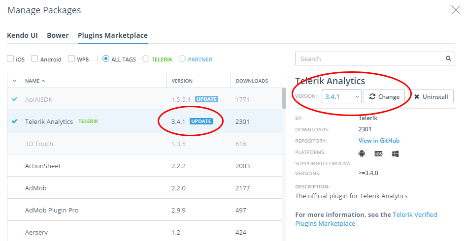

## Updating Core Framework Components in Telerik Platform

Whether you are creating a hybrid mobile app with [Apache Cordova](https://cordova.apache.org/) or a native mobile app with [Telerik NativeScript](https://www.nativescript.org/), you always want to make sure you're on the ball with the latest framework updates. Luckily for you, [Telerik Platform by Progress](http://www.telerik.com/platform) makes it easy by providing a clear UI to switch between versions of the frameworks - and even to update individual components as needed.

### Updating the NativeScript Framework

In Telerik Platform, we strive to provide you the latest and greatest NativeScript framework versions. While NativeScript has stabilized, and is more than ready for your production-level app development, you still probably want to stay up to date with the most recent release. To do so, open up your NativeScript project's **Properties** window and, in the **General** tab, find the **NativeScript Version** dropdown:

Easy enough, right?

You'll find the latest versions of NativeScript here along with occasionally finding bleeding-edge versions of NativeScript that are marked "experimental". What does "experimental" mean? It means that we haven't fully vetted that version of NativeScript to work with *every* part of the Telerik Platform, but do want to provide it for our users who need the very latest.

### Updating Core NativeScript Modules

If for some reason you need to update one or more core NativeScript modules before a big framework release includes them (maybe there are bug fixes or updated functionality), it's an easy process:

First, navigate to the package manager dialog by right-clicking on your project name and choosing **Manage Packages**. Next, make sure the **npm** tab is highlighted, and, if not already selected, search for "tns-core-modules". This will bring up the following:

From the dropdown provided, choose the version of the core modules you need to use.

### Updating the Cordova Framework

Developing a hybrid mobile app with Apache Cordova? No problem - it's just as easy to update to the latest Cordova bits. Just as you learned how to update to the latest version of NativeScript, you can do the same with Cordova. In your project's **Properties** window and **General** tab, choose the appropriate Cordova version from the dropdown provided:

Again, you may sometimes find a version of Cordova labeled "experimental". Like with experimental NativeScript versions, it just means we haven't fully vetted this version of Cordova, but wanted to make it available as early as possible.

### Updating Core Cordova Plugins

Now there do come times when you need to update [one of the many core Cordova plugins](http://docs.telerik.com/platform/appbuilder/cordova/using-plugins/using-core-plugins/using-core-plugins) you are using. Just as with updated NativeScript modules, if there are bug fixes or improvements that you rely on, you probably don't want to wait for the next big Cordova release!

To update your core Cordova plugins, you have to upload them as custom plugins, which is super easy to do:

1. Download the plugin zip archive from its GitHub repository ([search the Apache org on GitHub](https://github.com/apache?utf8=%E2%9C%93&query=cordova-plugin) to find them).
2. Open up your project's **Properties** window.
3. Choose the **Plugins** tab.
4. In the **Core Plugins** section, uncheck the box for the plugin that you want to update.
5. In the **Custom Plugins** section at the top, click **Import**.
6. Drag and drop the plugin archive you downloaded in step 1 and click **Upload**.
7. When the upload is complete, make sure that the plugin files are nested in a folder in the **Plugins** node in your solution explorer.

And you're done!

### Bonus: Updating Third-Party Plugins and Kendo UI

Another common activity is updating other custom NativeScript or Cordova plugins you've previously included in your app. If you need to update a previously uploaded custom plugin, you can update to a newer version by following the same instructions as provided to update core Cordova plugins in the previous section.

If, however, you've added plugins from the [Telerik Verified Plugins Marketplace](http://plugins.telerik.com/), we make it even simpler. From the **Manage Packages** dialog, search for the plugin you would like to update:

If an update is available, you'll see the **update** badge notification along with a **change** button that appears after you choose a new version of the plugin from the dropdown provided.

Finally, if you'd like to do the same for an updated version of [Kendo UI](http://www.telerik.com/kendo-ui), you can do so by selecting the **Kendo UI** tab provided and walking through the same steps!

### Next Steps

**[Set up a free trial](https://platform.telerik.com/) of the Telerik Platform today.** Once you start your trial, we provide you with an instantly-available development experience with numerous step-by-step quick start tutorials for both hybrid and native. Best of luck with your app development!