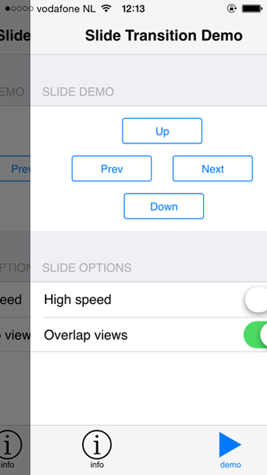
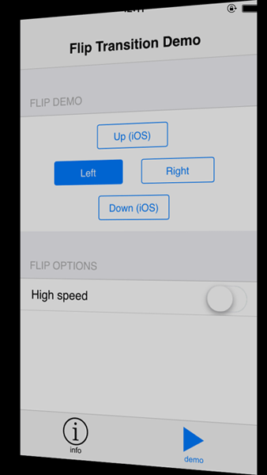

## Native Performance in a Hybrid App with Native Page Transitions

The amount of fear, uncertainty, and doubt surrounding performance in hybrid mobile apps is astounding, but some of it is legitimate. Mobile apps developed with web technologies aren't as performant as native - we all know that - but we also know that it's possible to reach near-native performance with the right tools. Today I'm proud to announce the availability of a new tool that brings us even closer to the native performance ideal, and that is our "Native Page Transitions" Cordova plugin.

Available today for free from the [Verified Plugins Marketplace](http://plugins.telerik.com/), the [Native Page Transitions](http://plugins.telerik.com/plugin/native-page-transitions) plugin allows you to tap into your device's native animations and move from view to view with full 60fps jank-free animations! This one plugin removes a huge performance bottleneck when it comes to hybrid apps, since the one place you are most likely to differentiate between hybrid and native is during view transitions.

### Good: jQuery Mobile, Better: Kendo UI Mobile, Best: Native

Developing a performant hybrid mobile app starts with selecting a modern JavaScript framework. The early jQuery Mobile days did hybrid a disservice due to horrifically slow animations, and we're still paying for that today. However, with updates to jQuery Mobile and especially when Kendo UI Mobile hit the scene a couple of years ago, we were finally able to rely on JavaScript frameworks that don't suck. Add to this modern hardware and that uncanny valley effect of hybrid mobile apps has been disappearing.

That all being said, we are still living in an age where most of our users are not on the latest hardware and/or are on older versions of Android, which is a notoriously poor performer when it comes to hybrid (pre-4.4 Android that is).

This is why using the Native Page Transitions plugin is important even today. When your customers download your app, they expect fully native performance regardless of the platform and device they are using. Better performance = better reviews = more revenue and full customer acceptance.

**Let's not forget the cool factor: this plugin helps to make your app feel native!**

  

### Sample Usage

One of our goals is to make this plugin as easy to use as possible. And, while this is still an early release, you'll get up and running by following some simple instructions. You may install the plugin using any Telerik AppBuilder IDE ([In-Browser client](http://www.telerik.com/appbuilder/in-browser-client), [Windows client](http://www.telerik.com/appbuilder/windows-client), [Visual Studio extension](http://www.telerik.com/appbuilder/visual-studio-extension)), the [AppBuilder CLI](http://www.telerik.com/appbuilder/command-line-interface), or the Cordova CLI.

### Installing the Plugin with an AppBuilder IDE

Open up any Telerik AppBuilder client and follow these simple instructions:

1. In the **Project Navigator/Solution Explorer**, right click your project and choose **Manage Packages**.
2. Choose the **Plugins Marketplace** tab.
3. Search for "Native Page Transitions" and click **Install**.

<video width="850" height="584" controls><source src="/images/default-source/appbuilder/nativetransitions_ab.mp4" type="video/mp4"></video>

### Installing the Plugin with the Cordova CLI or AppBuilder CLI

You may also install this plugin using the Cordova CLI by issuing this command:

`cordova plugin add https://github.com/Telerik-Verified-Plugins/NativePageTransitions`

...or by using the AppBuilder CLI with this command:

`appbuilder plugin fetch https://github.com/Telerik-Verified-Plugins/NativePageTransitions`

### Using the Native Page Transition Plugin

Once the plugin is installed, you invoke the page transitions by calling `window.plugins.pagetransitions.[transition type]` where "transition type" is currently either `slide`, `flip`, or `drawer` (currently iOS only for drawer). The simplest possible example to do a slide transition from one view to the next would be calling a function such as:

    
    function slide(href) {
    	window.plugins.nativepagetransitions.slide({
    		"href" : href
    	});
    }

Your markup could reference this code like: `<button onclick="slide('right', '#my_view_id')">Press Me</button>`, where `#my_view_id` is the id of the view you are transitioning to OR the name of an HTML file if you are navigating to a new page entirely.

This same transition with all of the options laid out looks something like this:

	var options = {
		"direction"      : "up", // 'left|right|up|down', default 'left' (which is like 'next')
		"duration"       :  500, // in milliseconds (ms), default 400
		"slowdownfactor" :    4, // overlap views (higher number is more) or no overlap (1), default 3
		"iosdelay"       :  100, // ms to wait for the iOS webview to update before animation kicks in, default 50
		"androiddelay"   :  150  // same as above but for Android, default 50
	};
	
	window.plugins.nativepagetransitions.slide(
		options,
		function (msg) {console.log("success: " + msg)}, // called when the animation has finished
		function (msg) {alert("error: " + msg)} // called in case you pass in weird values
	);

For an even better way of learning about how to use the code, be sure to look at the [sample app](https://github.com/Telerik-Verified-Plugins/NativePageTransitions-DemoApp) we have created for this plugin.

### Proof is in the Pudding

Don't just take our word for it, watch this quick video that shows the plugin in action on an iPhone 5 (and keep in mind the transitions look even smoother in person).

<video width="510" height="1080" controls><source src="/images/default-source/appbuilder/nativetransitions_demo.mp4" type="video/mp4"></video>

Now consider this plugin in action on an older Android device and it's pretty easy to see the value!

### What's Next?

Try out the [Native Page Transitions](http://plugins.telerik.com/plugin/native-page-transitions) plugin today and let us know what you think. This is a preview release and we plan on improving performance and adding features as time goes on. In due time we will be adding:

- Support for the drawer animation in Android.
- Windows Phone 8 support.
- Additional animation options such as curl and fade.
- Helper libraries for Kendo UI and jQuery Mobile that add the transitions for you, without coding!