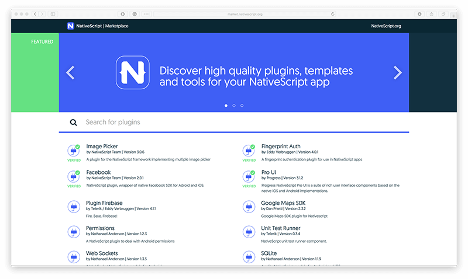
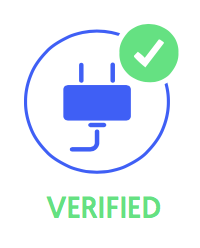
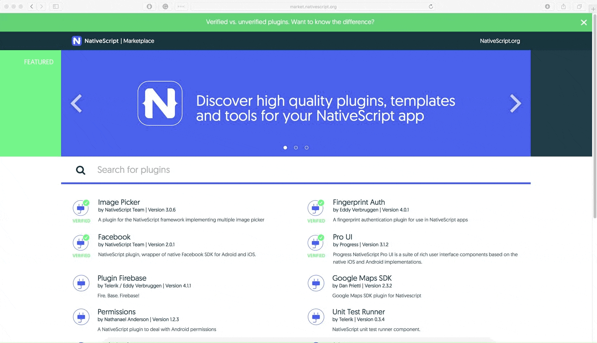
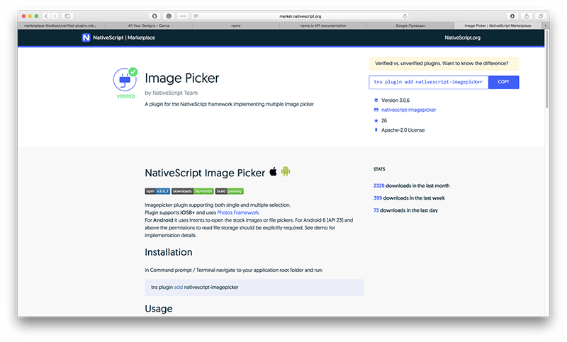

# NativeScript Marketplace - Discover High Quality Plugins, Templates, and Tools

As we've seen a huge increase in NativeScript development, we've also seen a huge demand for high-quality plugins NativeScript developers need to build top-notch experiences their users expect.

We believe that mobile development with NativeScript should be fast and easy. Imagine you've got all needed functionality for your next app, nicely packed as NativeScript plugins, including beautiful application templates that dramatically decrease the time for bootstrapping your app UI/UX. We believe this will provide tremendous value to developers, saving weeks of time and making them more productive.

In order to make this dream come true, our goal was to do the following:

- Make high-quality assets more visible;
- Support plugin authors for their hard work and amplify their success;
- Incorporate community assessment as a key metric.

**Today I am thrilled to announce the [NativeScript Marketplace](http://market.nativescript.org/) – the central repository for NativeScript plugins, templates, and tools.**

**Clean and simple, a developer-friendly portal you are going to love.**

With the first release of the NativeScript Marketplace, our goal is to organize the plugins ecosystem in a way that high-quality plugins are more visible.

## New "Verified" Plugins Categorization

A few weeks ago, we introduced the concept of Verified Plugins. The NativeScript team guarantees that every plugin marked as *Verified* is a high-quality plugin that is safe to use in your app. These plugins will be easily discoverable in the marketplace, as Verified Plugins are always on top.

> [Learn the difference between verified and unverified plugins.](https://github.com/NativeScript/marketplace-feedback/blob/master/docs/verified-plugins.md)

We've prepared an article, ["Ensure Plugins Quality"](https://docs.nativescript.org/plugins/ensure-plugins-quality), as a guideline that explains how to make your plugin verified.

If your plugin ticks all the boxes, go ahead and send us your plugin repository URL at nativescriptplugins@progress.com.

## Plugin Display Order - High Quality on Top

The NativeScript Marketplace orders plugins in a way that the Verified Plugins are always on top, followed by the rest of the plugins ordered by quality. The way we measure quality is complex, taking into account the GitHub and npm stats of the plugins, as well as collected data from the marketplace. 

Whenever you search for NativeScript plugins, the marketplace will present the best choices for you on top.

## Instant Search

We know that search is a must have and core feature for any solution like the NativeScript Marketplace. We've made our search fast so you can quickly find the plugin you're looking for:

Anytime you try to search, the NativeScript marketplace searches for your search term in both the plugin's name and keywords.

## Plugin Details

The NativeScript Marketplace retrieves information about each plugin from GitHub and npm - and presents that information on the Plugin Details page:

- **Display Name** - Each plugin is presented with its friendly display name. If the plugin name is `nativescript-google-maps-sdk` – its friendly display name will be *Google Maps SDK*. All dashes are replaced with spaces, `nativescript-` is replaced and all words are capitalized. Most abbreviations will also be handled properly;
- **Author** – Comes from the author property of the `package.json` file of the plugin. If author is not presented, the package publisher’s username is displayed instead;
- **Short Description** - Comes from the description property of the `package.json` file of the plugin;
- **Description** - This is the package's entire `README.md` file;
- **Version** - The npm version of the package;
- **COPY button** – A button that adds the plugin's installation command directly to your clipboard;
- **License** – Comes from the license property of the package.json file;
- **Link to repository** - A link to the plugin's GitHub repository;
- **Number of downloads** – npm downloads for the plugin for the last month, last week, and last day.

We hope you're going to love the [NativeScript Marketplace](http://market.nativescript.org/)! Be aware that anytime you face any issue, you can reach us at nativescriptplugins@progress.com or in our community Slack channels [#marketplace](https://nativescriptcommunity.slack.com/messages/C6SCWGARY) and [#plugins](https://nativescriptcommunity.slack.com/messages/C0MMJ8MQR).