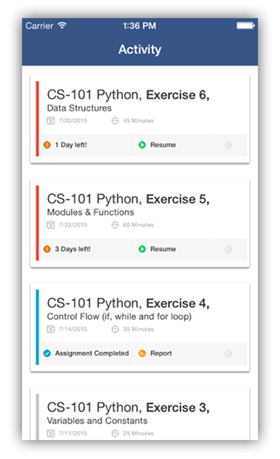
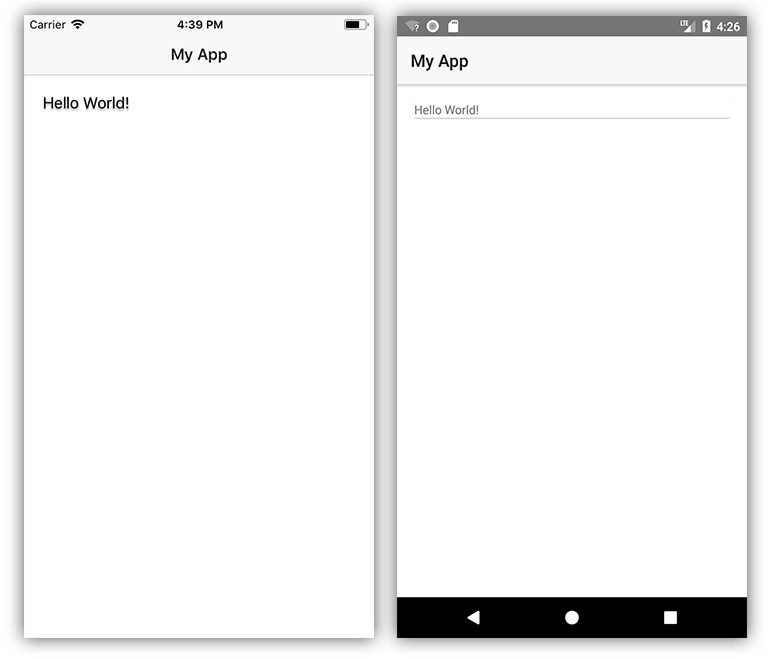
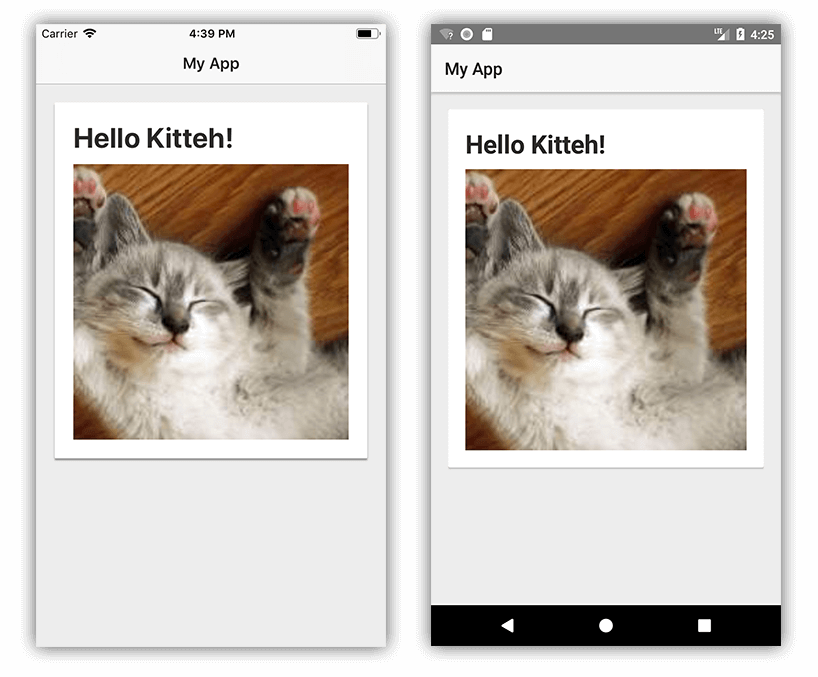

# Adding a Material Design CardView to a NativeScript App

One of the most popular mobile user interface components today is the card (a.k.a. CardView).

Individual cards are typically used to display information about a single component or subject in a visually distinctive manner. The [Material Design](https://material.io/design/) system from Google has become a gold standard for engaging UI, so being able to leverage these components in your NativeScript app is more in demand than ever.

While the NativeScript team (and our community) work towards full Material Design support, it's awfully handy that other folks are starting to fill this gap with a variety of NativeScript plugins. Take for example, the [nativescript-cardview plugin](https://market.nativescript.org/plugins/nativescript-cardview) from Brad Martin. This plugin implements the Material Design CardView component for *both* Android and iOS.

> 🤫 Yes, we will soon have a much bigger announcement around Material Design support in NativeScript!

## Show Me Some Code

Like any other NativeScript plugin, you install it with a simple command:

	tns plugin add nativescript-cardview

If you are developing a plain JavaScript or plain TypeScript (as opposed to [Angular](https://www.nativescript.org/nativescript-is-how-you-build-native-mobile-apps-with-angular) or [Vue.js](https://www.nativescript.org/vue)), make sure you add the appropriate namespace to your `<Page>` element like so:

	<Page xmlns:Card="nativescript-cardview">
	
Your markup should then include a layout container and the `CardView` component. Something like this:

    <StackLayout class="p-20">
		<Card:CardView>
			<StackLayout>
				<Label text="Hello World!" />
			</StackLayout>
		</Card:CardView>
    </StackLayout>
	
> **TIP:** If you're using Angular, you can see some similar sample code [here](https://github.com/bradmartin/nativescript-cardview#nativescript--angular).

This will lead to a UI that looks like:

Wait a minute. Doesn't look so *cardy* to me. Looks like we need to add some CSS to spice things up. 💃

Let's throw some `class` properties on our `<CardView>` and `<StackLayout>` elements:

	<Card:CardView class="cardStyle">
		<StackLayout class="cardContent">
		
And follow it up with the associated styles in our `app.css` file:

	.page {
		background-color: rgb(237, 237, 237);
	}
	
	.cardStyle {
		background-color: #fff;
		color: rgb(43, 43, 43);
	}
	
	.cardContent {
		padding: 20;
		font-weight: bold;
		font-size: 30;
	}
	
Alter our text a little and throw a cute kitteh picture in 🐈:

	<Label text="Hello Kitteh!" class="m-b-10" />
	<Image src="https://placekitten.com/200/200" />

...and we get something that looks like the card UI we were expecting all along!

## Custom Attributes

A tricky aspect about the [nativescript-cardview plugin](https://market.nativescript.org/plugins/nativescript-cardview) is that there are separate unique attributes for both iOS and Android implementations.

You can apply a `radius` to an element to customize the `border-radius`. (This actually works the same on both platforms).

Shamelessly ripped from the plugin documentation, here are the platform-specific attributes (all are optional):

### Android-Specific

`elevation` *int* (consider this the intensity of the "drop shadow" behind the card)

`ripple` *bool* (set this to "true" to show a ripple action when you tap the card)

### iOS-Specific

`shadowOffsetWidth` *int* (set the x position of the shadow)

`shadowOffsetHeight` *int* (set the y position of the shadow)

`shadowColor` *string* (set the color of the shadow)

`shadowOpacity` *int* (set the opacity of the shadow)

`shadowRadius` *int* (set the radius of the shadow - different from the radius of the card itself)

## {N} Plugins FTW 🔌

You can [discover a plugin](https://market.nativescript.org/) for virtually any scenario (not to mention [app templates](https://market.nativescript.org/?tab=templates&category=all_templates) and [code samples](https://market.nativescript.org/?tab=samples&framework=all_frameworks&category=all_samples)!) on the NativeScript Marketplace.