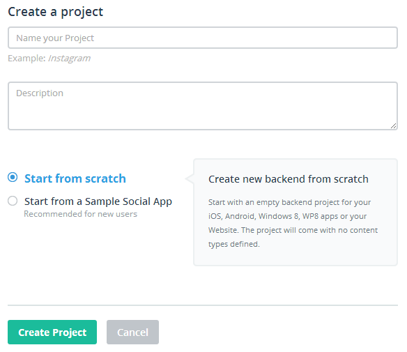
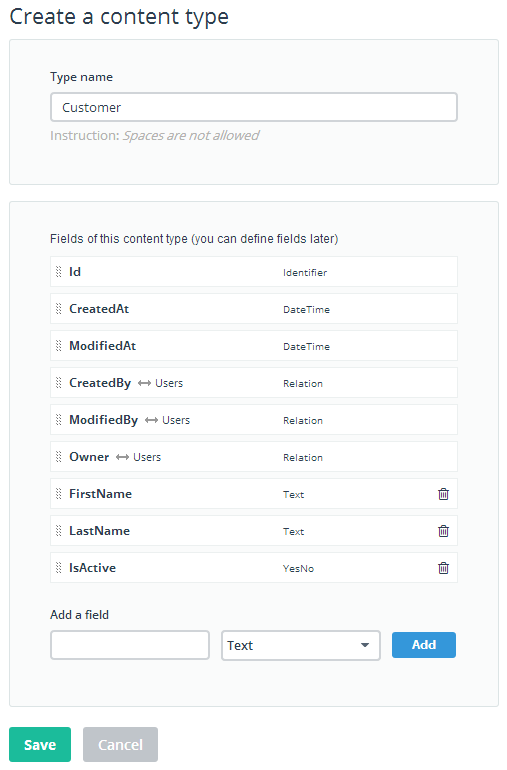
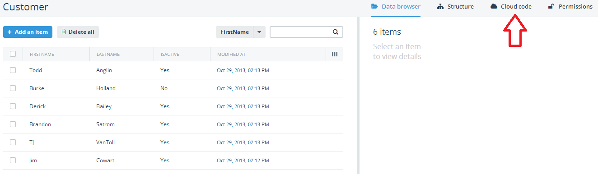

## Getting Started with Telerik Everlive - Your Cloud-Based Backend Service

Imagine yourself developing a new web or hybrid mobile application. One of your first major considerations is probably going to be your application's backend data. Are you leveraging an existing database server? Are you writing your own services layer on top of that database? Or do you have to start even further back and provision hardware or a VM, setup a database, create tables and views, and write stored procedures? The complexity of the backend can be overwhelming to many developers, especially those who have been solely focused on frontend development for some time now. Well today I'd like to walk you through a relatively new offering from Telerik - and that is Telerik Everlive. Telerik Everlive is your "Backend as a Service" (BaaS) which allows you to move your database into the cloud with an automatically generated RESTful service layer, file storage, user management, and notifications all bundled together. Fear the database no more, with Telerik Everlive we handle the heavy lifting for you - all you need to do is write your code!

### Say "Cloud" One More Time...

I know. While "the cloud" is one of the more overused phrases in IT these days, it is useful to think of Telerik Everlive as helping organizations to move away from the hardware/software provisioning headaches of the past to a reliable service that requires very little oversight. And yes Telerik Everlive does live in "the cloud" - which really means that we have a lot of servers with a lot of redundancy to give you the uptime that your application's backend requires.

This also means speed and scalability. Gone are the days when you have to add more hardware or tweak your own server settings to account for spikes in traffic. Telerik Everlive's infrastruture was built from the ground up to accommodate such heavy usage.

### But What is Telerik Everlive, Really?

I have only emphasized one aspect of Telerik Everlive so far: data storage and management (essentially replacing your traditional database server). However, Telerik Everlive is really a set of other services, which can best be broken down into the following:

- Data and File Storage
- User Management
- Cloud Code
- Backend Portal
- Notifications

While today we are going to focus on the "data" aspect of Telerik Everlive, it's important to acknowledge these other services to point out the value that they can bring to your application development.

**User Management** - Telerik Everlive allows you to easily add user authentication, user authorization, and user management to your app - starting with using popular [oAuth](http://oauth.net/) providers such as Google, Facebook, and Microsoft.

**Cloud Code** - With Telerik Everlive's Cloud Code, you have the ability to add custom business logic and validators in JavaScript that run on the server. You don't have to replicate server-side code on the client and you don't have to worry about exposing business logic to prying client eyes either.

**Backend Portal** - Telerik Everlive comes with a complete web-based interface for managing all aspects of your app data. You can create new objects (think of them as database tables or views) and manage your users all from one consistent interface.

**Notifications** - Telerik Everlive makes it easy to deliver email notifications to your users using Cloud Code. You can also send push notifications if you are developing a native or hybrid mobile app on the iOS, Android, or Windows Phone platforms.

### And Who Can Use Telerik Everlive?

Let me be clear: Telerik Everlive is for everyone. Today Telerik Everlive supports the following development platforms through our SDKs:

- .NET
- iOS
- Windows Phone 7/8
- Web (JavaScript)
- Hybrid Mobile (PhoneGap/Cordova)

And yes, the Android SDK is coming soon! So, whatever your flavor of application development, we have you covered (or will shortly).

Enough of the chatter. Let's get into Telerik Everlive to see how easy it is to get up and running with a simple backend and a frontend that consumes that data. IMHO, the easiest way to get up and running is by using [Icenium](http://www.icenium.com) - since Telerik Everlive is fully integrated with the [Graphite](http://www.icenium.com/product/graphite) and [Mist](http://www.icenium.com/product/mist) IDEs. We're going to go a different route today and do everything from scratch.

### Step 1: Creating a Telerik Everlive Account

The first step, of course, is to create your Telerik Everlive account. Go ahead and navigate to the [Telerik Everlive pricing page](http://www.telerik.com/everlive/pricing) which is where you'll see the pricing options and set up a FREE (no strings attached!) developer account. You'll see that the free account comes with very generous options for bandwidth (5GB), file storage (1GB), and database storage (100MB). If you ever need more space, it's easy to upgrade to one of the paid accounts.

Once your account is created, head on over to [everlive.com](http://everlive.com) which is the backend portal you will use to manage your Telerik Everlive project.

### Step 2: Creating Your First Telerik Everlive Project

After you log in to Telerik Everlive, you'll want to create a project. This is the first example you'll get of the elegant and easy to use Telerik Everlive interface.

Go ahead and enter any project name and description you like. We're also going to go ahead and "start from scratch" as well.

Now that you have a blank project created, you can take some time to look around a bit. There is SO MUCH that you can do with the administrative interface for Telerik Everlive (and you'll see a lot more content from us as time goes on). I'd like to point out a couple of things you shouldn't miss:

- **Permissions** are pervasive throughout your Telerik Everlive project. Therefore, take a good look at the **Users** and **Roles** sections as a precursor to seeing what you can do whenever you see **Permissions** as an option.
- **Settings** - make sure you go through the settings to be sure you are comfortable with all of the options available to your project.

It's a shame that I have to gloss over so much, but we are focused on getting up and running quickly here, so let's maintain our momentum!

### Step 3: Content Types

From the main Telerik Everlive menu, choose the **Types** section. This is where you create your content types (or you can consider these your database tables if that makes more sense). I'm going to choose **Create a Content Type** to generate my first object. You'll see that Telerik Everlive populates your content type with some standard fields:

- **Id** - the guid identifier (primary key) of your record.
- **CreatedAt** - an auto-populating date/time stamp of when the record was created.
- **ModifiedAt** - an auto-populating date/time stamp of when the record was last modified.
- **CreatedBy** and **ModifiedBy** and **Owner** - are all foreign keys (relations) to your **Users**.

I'm going to set up a simple content type of "Customer". My customer object is going to keep all of these default fields, and then add a few more:

- **FirstName** and **LastName** - hopefully you know that those stand for!
- **IsActive** which is a boolean (YesNo) to tell us if this customer record is active or not.

Let's see how we get data into this content type within the administrative interface.

### Step 4: Manually Adding Records

After you save your new content type, you'll be redirected to the administrative interface - which you can use to manually interact with your data. Go ahead and click the **Add an item** button which will bring up an interface that only contains the fields we added. Why is that? Well everything else is auto-populated, so there is nothing for us to manually add there.

I went ahead and added a bunch of records to my customer content type, to end up with a data set that looks like this:

A few things of note on this screen:

- You may add/modify/delete records as needed.
- You may filter your records based on any of the fields provided.
- You may sort any of the visible columns.
- You may choose which columns are visible in this view.

Now that we have data in there, what are we going to do with it?

### Step 5: Consuming Our Data

Before we write any code, we need to download the Telerik Everlive SDK. Since for the purposes of this example we are creating a web site, go ahead and click the **Download** menu option. On the provided downloads screen, choose **Hybrid & Web**, your project name, and download the JavaScript SDK.

Once you have unzipped the SDK archive, go ahead and add a reference to Telerik Everlive to a new HTML doc:

	

The first thing we'll want to do is initialize the Telerik Everlive SDK. We do so with the following one line of code:

	var el = new Everlive('YOUR_API_KEY');

Now, where to get your API key? Easy. From your project in Telerik Everlive, choose the **API Keys** menu option. The key you should use is the one labeled, "API Key".

Now we are ready to grab our data. It's important to note that every CRUD operation in Telerik Everlive can be performed with either callbacks or [promises](http://www.icenium.com/blog/icenium-team-blog/2013/10/07/cleaning-up-nested-callbacks-with-promises). This allows us to apply user account credentials to every transaction and take advantage of the comprehensive use of permissions within Telerik Everlive. (And no, you don't have to authenticate your users with **every** transaction, you can [pass a token](http://docs.everlive.com/development/javascript-sdk/introduction) to the constructor as well.)

	Everlive.$.Users.login('jsmith', // username
	    'password') // password
	    .then(function (data) { // success callback, this returns the token that we can store to avoid re-authenticating this user!
	        alert(JSON.stringify(data));
	    },
	    function(error) { // error callback
	        alert(JSON.stringify(error));
	    });

Once we have successfully authenticated a user, we can grab all of our data from the **Customer** object:

    var data = Everlive.$.data('Customer');
    data.get()
        .then(function (data) {
            alert(JSON.stringify(data));
        },
        function (error) {
            alert(JSON.stringify(error));
        });

Now obviously this code doesn't really DO anything (UI-wise), but it does show you how incredibly simple it can be to pull some data from Telerik Everlive. You can also access data via [ajax requests with jQuery](http://docs.everlive.com/development/rest-api/content/retrieve-items), if that floats your boat.

From here you'll probably want to use a framework such as [Kendo UI](http://www.kendoui.com/) to really take advantage of filtering, grouping, sorting, and displaying your data (take a look at the [Everlive docs](http://docs.everlive.com/development/javascript-sdk/kendoui/kendo-uiintegration) for more detailed information).

### (Bonus) Step 6: Cloud Code

We have seen how easy it is to just consume data from Everlive. In a real-world application we'll need to insert, modify, and delete data as well. Part of inserting and modifying is validating our form data, right? This is where the power of Telerik Everlive's Cloud Code comes into play. Take for example, the idea of required field validation. Yes you can (and should) validate these fields on the client. However, you should know by now that you can NEVER trust the client browser! If you use Cloud Code to do your validation as well, you can trust that the data has been validated on the server. How is this done you ask?

Before I get too far along, you'll want to be sure to check out Jim Cowart's post on [What is Cloud Code and Why Should You Care?](http://www.telerik.com/everlive/blog/13-11-07/what-is-cloud-code-and-why-should-you-care-).

Return to the administrative interface of Telerik Everlive, choose your **Customer** content type, and click on the **Cloud Code** menu option:

This will bring you to an integrated code editor which allows you to write code that is executed at different points of the Telerik Everlive data life cycle. The methods have an intuitive syntax like **before[EVENT]** and **after[EVENT]**.

In our case we want to simply verify that the **FirstName** and **LastName** fields have at least something entered in them before we actually insert the data. This is done with the following Cloud Code:

	Everlive.Events.beforeCreate(function(request, context, done) {
	    var firstName = request.data.FirstName;
	  	var lastName = request.data.LastName;
	    var isValid = firstName && lastName && firstName.length > 0 && lastName.length > 0;
	
	    if (!isValid) {
	        Everlive.Response.setErrorResult('The First Name and Last Name fields are required!', 131, 500);
	    }
		done();
	});

You'll see that I'm utilizing the **beforeCreate** method which is executed, well, before the record is created! If the data doesn't pass validation, we return an error to the user. Super simple. Be sure to read over the [Telerik Everlive docs](http://docs.everlive.com/) for a taste of what else you can do with Cloud Code (we haven't even scratched the surface here!).

### What's Next?

I hope you've seen how easy and convenient it can be to start using a "Backend as a Service" like Telerik Everlive. The days of provisioning servers and writing service layers (not to mention paying someone to monitor that expensive hardware and software) are coming to an end. Get started today ([for free](http://www.telerik.com/everlive/pricing)) and let us know if you have any comments or suggestions on our [feedback portal](http://feedback.telerik.com/Project/121). Enjoy!

